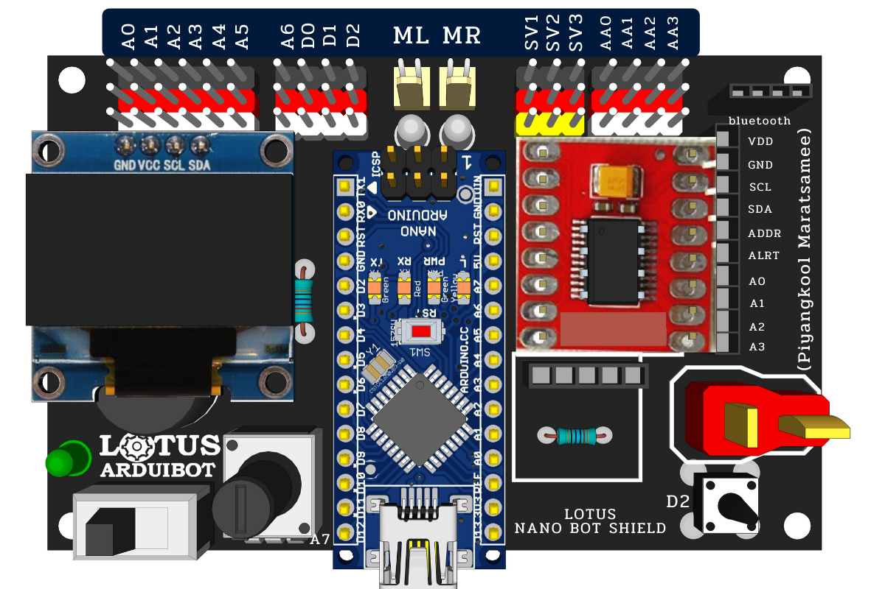
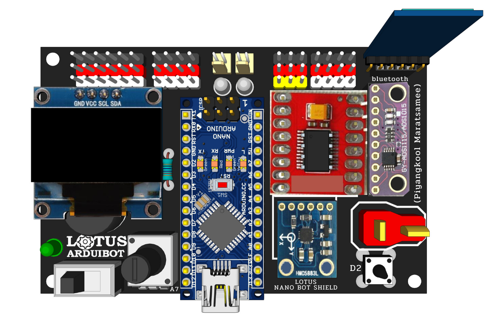
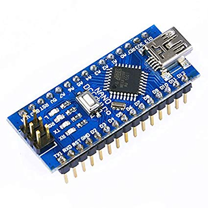
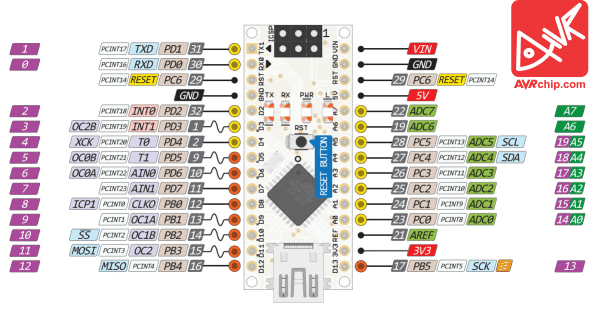
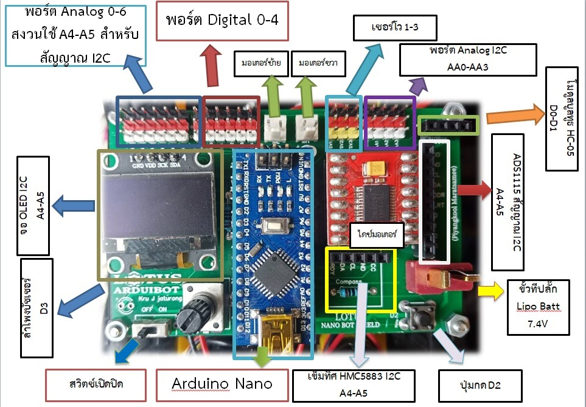

# Arduino-Lab

เอกสารและโครงสร้างสำหรับการทดลอง Arduino Sensors & Modules บน **Lotus Nano Bot**

## รายละเอียดบอร์ด Lotus Nano Bot

Lotus Nano Bot เป็นบอร์ดหุ่นยนต์อัจฉริยะที่ใช้ **Arduino Nano** เป็นตัวควบคุมหลัก พร้อมอุปกรณ์เสริมในตัว เช่น มอเตอร์ DC, เซอร์โวมอเตอร์, จอ OLED, เข็มทิศ, และบัซเซอร์





### สเปคเครื่อง

| รายการ | รายละเอียด |
|--------|-----------|
| Microcontroller | ATmega328P |
| Operating Voltage | 5V |
| Input Voltage | 7.4V - 9V (LiPo Battery via T-Plug) |
| Digital I/O Pins | 14 (6 ขา PWM) |
| Analog Input Pins | 8 |
| Flash Memory | 32 KB (2 KB bootloader) |
| SRAM | 2 KB |
| EEPROM | 1 KB |
| Clock Speed | 16 MHz |

### ภาพบอร์ด Arduino Nano



### พอร์ตที่ใช้งานกับอุปกรณ์ภายนอกได้

#### พอร์ต Digital (ภายนอก)
- **D3** - พอร์ต Digital หลักสำหรับอุปกรณ์ภายนอก
- **D0 (Rx)** / **D1 (Tx)** - ใช้สำหรับ Serial / Bluetooth Module (HC-05)
- **A0-A3** สามารถใช้เป็น Digital ได้ (A0=Pin14, A1=Pin15, A2=Pin16, A3=Pin17)

> **⚠️ หมายเหตุ:** D2 เป็นปุ่มกดในตัวของบอร์ด (Button OK)

#### พอร์ต Analog (ภายนอก)
- **A0, A1, A2, A3** - ใช้กับอุปกรณ์ภายนอก
- **A6** - ใช้กับอุปกรณ์ภายนอก (Analog only, ไม่สามารถเป็น Digital ได้)
- **A7** - ใช้กับ Potentiometer (K-Nob) ในตัวของบอร์ด

> **⚠️ หมายเหตุ:** A4 (SDA) และ A5 (SCL) ใช้สำหรับ I2C ร่วมกับจอ OLED, ADS1115, และ HMC5883 Compass ที่ติดตั้งบนบอร์ดอยู่แล้ว หากไม่ใช้จอ OLED สามารถใช้ A4, A5 เป็น Analog ได้

### แผนผังขา Arduino Nano



### อุปกรณ์ในตัวของบอร์ด

| อุปกรณ์ | พอร์ต |
|---------|--------|
| Buzzer (บัซเซอร์) | D3 |
| Button OK (ปุ่มกด) | D2 |
| Potentiometer / K-Nob | A7 |
| มอเตอร์ DC ซ้าย (ML) | D9 (In1), D4 (In2), D5 (PWM) |
| มอเตอร์ DC ขวา (MR) | D7 (In1), D8 (In2), D6 (PWM) |
| Servo 1 (SV1) | D10 |
| Servo 2 (SV2) | D11 |
| Servo 3 (SV3) | D12 |
| OLED Display (I2C) | A4 (SDA), A5 (SCL) |
| ADS1115 Analog I2C | A4 (SDA), A5 (SCL) |
| HMC5883 Compass | A4 (SDA), A5 (SCL) |
| Bluetooth Module | D0 (Rx), D1 (Tx) |

### ภาพรวมข้อมูลบอร์ด Lotus Nano Bot



### แผนผังการต่อสายภายในบอร์ด

```
┌─────────────────────────────────────────────────────┐
│                    Lotus Nano Bot                   │
├─────────────────────────────────────────────────────┤
│  Analog Ext: A0 A1 A2 A3 A6                          │
│  Digital Ext: D0 D1 D3                               │
│                                                      │
│  ┌──────────┐  ┌──────────┐  ┌──────────┐           │
│  │  Motor L │  │ Arduino  │  │  Motor R │           │
│  │  D9/D4/5 │  │   Nano   │  │  D7/D8/6 │           │
│  └──────────┘  └──────────┘  └──────────┘           │
│                                                      │
│  Servo: D10 (SV1), D11 (SV2), D12 (SV3)             │
│  Buzzer: D3, Button: D2, Knob: A7                   │
│  I2C: A4 (SDA), A5 (SCL)                            │
└─────────────────────────────────────────────────────┘
```

## โครงสร้างไฟล์

```
arduino-lab/
├── sensors/                    # เซนเซอร์ต่างๆ
│   ├── avoidance-sensor/
│   ├── rotary-encoder/
│   ├── tracking-sensor/
│   ├── temperature-humidity-sensor/
│   ├── hall-magnetic-sensor/
│   ├── light-cup-module/
│   ├── heartbeat-sensor/
│   ├── mercury-switch/
│   ├── ds18b20-temperature-sensor/
│   ├── tilt-switch/
│   ├── analog-temperature-sensor/
│   ├── photoresistor/
│   ├── ir-receiver/
│   ├── vibration-sensor/
│   ├── passive-buzzer/
│   ├── reed-switch/
│   ├── analog-hall-sensor/
│   ├── magnetic-spring-sensor/
│   ├── digital-temperature-sensor/
│   ├── tap-module/
│   ├── light-blocking-sensor/
│   ├── small-sound-sensor/
│   ├── touch-sensor/
│   ├── big-sound-sensor/
│   ├── linear-hall-sensor/
│   └── flame-sensor/
│
├── modules/                    # โมดูลและ Actuators
│   ├── relay-module/
│   ├── joystick-module/
│   ├── 7-color-flash-led/
│   ├── rgb-led/
│   ├── smd-rgb-led/
│   ├── two-color-led/
│   ├── mini-two-color-led/
│   ├── laser-module/
│   ├── button-module/
│   ├── ir-emission-module/
│   └── active-buzzer/
│
├── projects/                   # โปรเจกต์ตัวอย่าง
│   └── robot-rc-car/
│
├── assets/
│   ├── images/                 # รูปภาพเซนเซอร์/โมดูล
│   └── diagrams/               # แผนผังการต่อสาย
│
└── README.md                   # ไฟล์นี้
```

## รายการเซนเซอร์ (37-in-1 Sensor Kit)

| รหัส | เซนเซอร์ | เอาต์พุต | เอกสาร |
|------|----------|---------|--------|
| KY-001 | DS18B20 Temperature Sensor | Digital (OneWire) | [README](sensors/ds18b20-temperature-sensor/README.md) |
| KY-002 | Shock / Vibration Sensor | Digital + Analog | [README](sensors/vibration-sensor/README.md) |
| KY-003 | Hall Magnetic Sensor | Digital + Analog | [README](sensors/hall-magnetic-sensor/README.md) |
| KY-010 | Light Blocking Sensor | Digital + Analog | [README](sensors/light-blocking-sensor/README.md) |
| KY-013 | Analog Temperature Sensor | Analog + Digital | [README](sensors/analog-temperature-sensor/README.md) |
| KY-015 | DHT11 Temperature & Humidity Sensor | Digital (OneWire) | [README](sensors/temperature-humidity-sensor/README.md) |
| KY-017 | Tilt Switch | Digital (Switch) | [README](sensors/tilt-switch/README.md) |
| KY-018 | Photoresistor / LDR Sensor | Analog + Digital | [README](sensors/photoresistor/README.md) |
| KY-020 | Ball Switch / Mercury Switch | Digital (Switch) | [README](sensors/mercury-switch/README.md) |
| KY-021 | Mini Reed / Magnetic Spring Sensor | Digital (Switch) | [README](sensors/magnetic-spring-sensor/README.md) |
| KY-022 | IR Receiver Module | Digital | [README](sensors/ir-receiver/README.md) |
| KY-024 | Linear Hall Sensor | Analog + Digital | [README](sensors/linear-hall-sensor/README.md) |
| KY-025 | Reed Switch | Digital (Switch) | [README](sensors/reed-switch/README.md) |
| KY-026 | Flame Sensor | Digital + Analog | [README](sensors/flame-sensor/README.md) |
| KY-027 | Magic Light Cup Module | Digital + Analog | [README](sensors/light-cup-module/README.md) |
| KY-028 | Digital Temperature Sensor | Digital + Analog | [README](sensors/digital-temperature-sensor/README.md) |
| KY-031 | Tap Module | Digital + Analog | [README](sensors/tap-module/README.md) |
| KY-032 | Obstacle Avoidance Sensor | Digital | [README](sensors/avoidance-sensor/README.md) |
| KY-033 | Line Tracking Sensor | Digital + Analog | [README](sensors/tracking-sensor/README.md) |
| KY-035 | Analog Hall Sensor | Analog + Digital | [README](sensors/analog-hall-sensor/README.md) |
| KY-036 | Touch Sensor | Digital | [README](sensors/touch-sensor/README.md) |
| KY-037 | Big Sound Sensor | Digital + Analog | [README](sensors/big-sound-sensor/README.md) |
| KY-038 | Small Sound Sensor | Digital + Analog | [README](sensors/small-sound-sensor/README.md) |
| KY-039 | Heartbeat Sensor | Analog + Digital | [README](sensors/heartbeat-sensor/README.md) |
| KY-040 | Rotary Encoder | Digital | [README](sensors/rotary-encoder/README.md) |

## รายการโมดูล (37-in-1 Sensor Kit)

| รหัส | โมดูล | ประเภท | เอกสาร |
|------|-------|--------|--------|
| KY-004 | Push Button Module | Input | [README](modules/button-module/README.md) |
| KY-005 | IR Emitter Module | Output | [README](modules/ir-emission-module/README.md) |
| KY-008 | Laser Transmitter Module | Actuator | [README](modules/laser-module/README.md) |
| KY-009 | SMD RGB LED Module | Actuator | [README](modules/smd-rgb-led/README.md) |
| KY-011 | Two-color LED Module | Actuator | [README](modules/two-color-led/README.md) |
| KY-012 | Active Buzzer | Actuator | [README](modules/active-buzzer/README.md) |
| KY-016 | RGB LED Module | Actuator | [README](modules/rgb-led/README.md) |
| KY-019 | Relay Module | Actuator | [README](modules/relay-module/README.md) |
| KY-023 | Joystick Module | Input | [README](modules/joystick-module/README.md) |
| KY-029 | Mini Two-color LED Module | Actuator | [README](modules/mini-two-color-led/README.md) |
| KY-034 | 7 Color Flash LED | Actuator | [README](modules/7-color-flash-led/README.md) |

## โปรเจกต์ตัวอย่าง

| โปรเจกต์ | คำอธิบาย | เอกสาร |
|---------|---------|--------|
| RC Car (รถบังคับ) | ESP32 + Lotus Nano Bot ควบคุมผ่าน Web UI | [README](projects/robot-rc-car/README.md) |

## การเริ่มต้นใช้งาน

### 1. ติดตั้ง Arduino IDE

ดาวน์โหลดและติดตั้ง [Arduino IDE](https://www.arduino.cc/en/software)

### 2. เลือกบอร์ด

ไปที่ **Tools > Board > Arduino AVR Boards > Arduino Nano**

### 3. เลือก Port

ไปที่ **Tools > Port** และเลือกพอร์ตที่เชื่อมต่อกับ Lotus Nano Bot (COMx บน Windows, /dev/ttyUSB0 บน Linux)

> **Linux:** หากไม่สามารถอัปโหลดได้ ให้รันคำสั่ง `sudo chmod 666 /dev/ttyUSB0`

### 4. ติดตั้งไลบรารีที่จำเป็น

บางเซนเซอร์ต้องการไลบรารีเพิ่มเติม:

- **DHT11/DHT22:** `DHT sensor library` โดย Adafruit
- **DS18B20:** `OneWire` และ `DallasTemperature`
- **IR Receiver:** `IRremote`
- **OLED:** `Adafruit SSD1306` และ `Adafruit GFX`

### 5. เปิดโค้ดตัวอย่าง

เข้าไปที่โฟลเดอร์ของเซนเซอร์/โมดูลที่ต้องการ และเปิดไฟล์ `README.md` เพื่อดูวิธีการต่อสายและโค้ดตัวอย่าง

## โค้ดตัวอย่างพื้นฐานสำหรับ Lotus Nano Bot

```cpp
//////// ผนวกไลบรารี่ ////////////
#include <Wire.h>
#include <SPI.h>
#include <Adafruit_GFX.h>
#include <Adafruit_SSD1306.h>
#include <Servo.h>

Adafruit_SSD1306 OLED(-1);

/////////// ตั้งค่าปุ่มกด /////////////////////
int button = 2;  /// ปุ่มกดสวิตซ์ขา 2 (ในตัว)

/////////// ตั้งค่าเซอร์โว /////////////////////
int ss1 = 10;  // SV1 ที่พอร์ต 10
int ss2 = 11;  // SV2 ที่พอร์ต 11
int ss3 = 12;  // SV3 ที่พอร์ต 12
Servo sv1, sv2, sv3;

//////////// ตั้งค่าพอร์ตมอเตอร์ //////////////////
#define DR1  7   /// มอเตอร์ขวา In1
#define DR2  8   /// มอเตอร์ขวา In2
#define PWMR 6   /// มอเตอร์ขวา PWM
#define DL1  9   /// มอเตอร์ซ้าย In1
#define DL2  4   /// มอเตอร์ซ้าย In2
#define PWML 5   /// มอเตอร์ซ้าย PWM

void setup() {
  OLED.begin(SSD1306_SWITCHCAPVCC, 0x3C);
  pinMode(2, INPUT);
  
  pinMode(DL1, OUTPUT);
  pinMode(DL2, OUTPUT);
  pinMode(PWML, OUTPUT);
  pinMode(DR1, OUTPUT);
  pinMode(DR2, OUTPUT);
  pinMode(PWMR, OUTPUT);
  
  sv1.attach(ss1);
  sv2.attach(ss2);
  sv3.attach(ss3);
  
  Wire.begin();
}

void loop() {
  int sw = digitalRead(button);
  int nob = analogRead(7);
  
  OLED.clearDisplay();
  OLED.setTextColor(WHITE, BLACK);
  OLED.setCursor(0, 0);
  OLED.setTextSize(1);
  OLED.println(" LOTUS ARDUIBOT");
  OLED.print(" Button: "); OLED.println(sw);
  OLED.print(" Knob: "); OLED.println(nob);
  OLED.display();
  
  delay(100);
}
```

## ข้อควรระวัง

- **D3** มีบัซเซอร์ติดตั้งในตัว หากใช้ `tone(3, ...)` จะได้ยินเสียงบัซเซอร์
- **D0, D1** ใช้สำหรับ Serial และ Bluetooth หากต้องการใช้งาน Serial Monitor ต้องถอด Bluetooth Module ออกก่อน
- **A4, A5** ใช้สำหรับ I2C ร่วมกับจอ OLED และเซนเซอร์อื่นๆ บนบอร์ด
- **แบตเตอรี่:** ใช้ LiPo 7.4V - 9V เท่านั้น ผ่าน T-Plug

## แหล่งที่มาของรูปภาพ

รูปภาพเซนเซอร์และโมดูลทั้งหมดมาจาก:
- **Instructables:** [Arduino 37 in 1 Sensors Kit Explained](https://www.instructables.com/Arduino-37-in-1-Sensors-Kit-Explained/)

## ผู้จัดทำ

เอกสารนี้จัดทำขึ้นเพื่อใช้ในการศึกษาและทดลอง Arduino Sensors & Modules บน Lotus Nano Bot

---

**Last Updated:** May 2026
