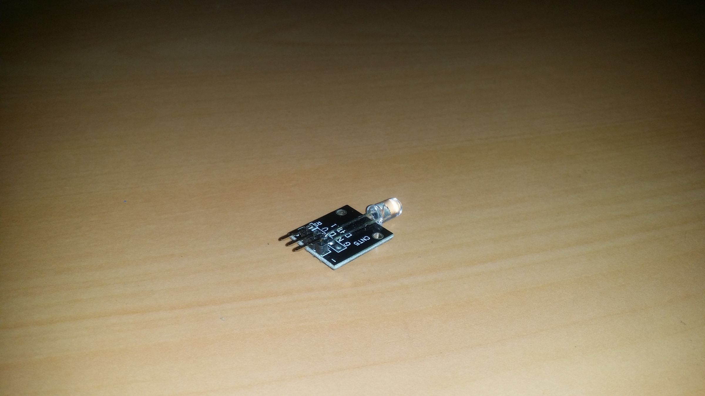
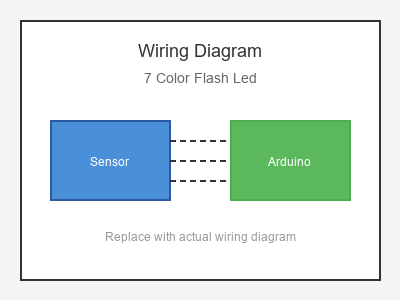

# KY-034 --- 7 Color Flash LED

## รายละเอียด

7 Color Flash LED เป็นโมดูล LED ที่มี LED 7 สีในตัวเดียว (Red, Green, Blue, Yellow, Cyan, Purple, White) สามารถกระพริบเปลี่ยนสีอัตโนมัติหรือควบคุมด้วยสัญญาณ PWM

## คุณสมบัติ

- แรงดันไฟฟ้า: 3.3V - 5V DC
- สี: Red, Green, Blue, Yellow, Cyan, Purple, White
- ควบคุมด้วย Digital (ON/OFF) หรือ PWM
- มีตัวต้านทานจำกัดกระแสในตัว

## ขาของโมดูล

| ขา (Module) | สีสาย | เชื่อมต่อกับ (Lotus Nano Bot) |
|-------------|-------|------------------------------|
| VCC (+)     | แดง   | 5V                           |
| GND (-)     | ดำ/น้ำตาล | GND                       |
| S (Signal)  | เหลือง | D3 หรือ D5/D6/D9 (PWM)     |

## การต่อสายไฟ

```
7 Color Flash LED        Lotus Nano Bot
━━━━━━━━━━━━━━━━━━━━━━━━━━━━━━━━━━━━━━━━
VCC (+) ───────────────► 5V
GND (-) ───────────────► GND
S     ────────────────► D3
```

### ภาพการต่อสาย (Text Diagram)

```
        +------------------+
        | 7 Color Flash    |
        |    LED           |
        |     [*]          |
        |                  |
   +----+----+   +----+----+   +----+----+
   |  VCC    |   |  GND    |   |    S    |
   |   (+)   |   |   (-)   |   | (Sig)   |
   +----+----+   +----+----+   +----+----+
        |             |             |
        |             |             |
   +----+----+   +----+----+   +----+----+
   |   5V    |   |  GND    |   |   D3    |
   |         |   |         |   |         |
   |  Lotus  |   |  Nano   |   |  Bot    |
   +---------+   +---------+   +---------+
```

## โค้ดตัวอย่าง

```cpp
// 7 Color Flash LED Example for Lotus Nano Bot
// S -> D3

#define LED_PIN 3

void setup() {
  Serial.begin(9600);
  pinMode(LED_PIN, OUTPUT);
  Serial.println("7 Color Flash LED Test Started");
}

void loop() {
  // เปิด LED (กระพริบอัตโนมัติภายในตัวโมดูล)
  digitalWrite(LED_PIN, HIGH);
  delay(2000);
  
  // ปิด
  digitalWrite(LED_PIN, LOW);
  delay(2000);
}
```

## โค้ดตัวอย่างกระพริบตามจังหวะ

```cpp
#define LED_PIN 3

void setup() {
  pinMode(LED_PIN, OUTPUT);
}

void loop() {
  // เปิดและปิดอย่างรวดเร็วเพื่อให้ LED เปลี่ยนสี
  for (int i = 0; i < 10; i++) {
    digitalWrite(LED_PIN, HIGH);
    delay(500);
    digitalWrite(LED_PIN, LOW);
    delay(100);
  }
  
  delay(2000);
}
```

## หมายเหตุ

- บางรุ่นมี IC ควบคุมในตัว เปิดปุ๊บก็จะกระพริบเปลี่ยนสีเอง
- บางรุ่นสามารถควบคุมสีได้ด้วย PWM (ใช้ D3, D5, D6, D9, D10, D11)
- D3 บน Lotus Nano Bot ต่อกับบัซเซอร์ในตัว อาจมีเสียงรบกวน
- หากต้องการใช้ PWM ควรใช้ D5, D6, D9, D10, D11 แทน (แต่ต้องระวังเพราะเป็นขามอเตอร์/เซอร์โว)

## รูปภาพ





