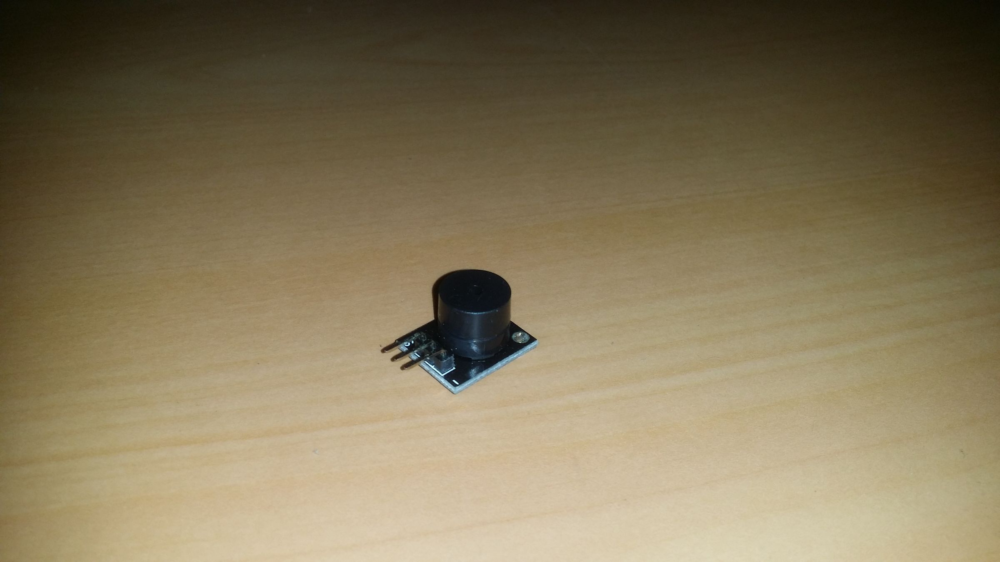
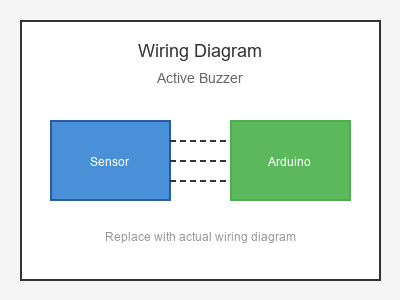

# KY-012 --- Active Buzzer

## รายละเอียด

Active Buzzer เป็นบัซเซอร์แบบมีวงจรสั่นในตัว เมื่อใส่แรงดันไฟฟ้า 5V จะส่งเสียงทันทีโดยไม่ต้องใส่สัญญาณ PWM ใช้งานง่ายกว่า Passive Buzzer แต่ปรับความถี่ไม่ได้

> **สำคัญ:** Lotus Nano Bot มีบัซเซอร์ในตัวเชื่อมต่อที่ D3 แล้ว หากต้องการใช้บัซเซอร์ภายนอกควรใช้พอร์ตอื่น

## คุณสมบัติ

- แรงดันไฟฟ้า: 3.3V - 5V DC
- ความถี่คงที่ (มักเป็น 2 kHz)
- ใช้งานง่าย (ใส่ไฟแล้วส่งเสียงเลย)
- มีขา I/O (Signal), VCC, GND

## ขาของ Active Buzzer

| ขา (Buzzer) | สีสาย | เชื่อมต่อกับ (Lotus Nano Bot) |
|-------------|-------|------------------------------|
| VCC (+)     | แดง   | 5V                           |
| GND (-)     | ดำ   | GND                           |
| I/O (Signal)| เหลือง | D3 หรือ A0 (D14)          |

## การต่อสายไฟ

```
Active Buzzer            Lotus Nano Bot
━━━━━━━━━━━━━━━━━━━━━━━━━━━━━━━━━━━━━━━━
VCC (+) ───────────────► 5V
GND (-) ───────────────► GND
I/O   ────────────────► D3
```

### ภาพการต่อสาย (Text Diagram)

```
        +------------------+
        |  Active Buzzer   |
        |    (+)  (-)      |
        |     |    |       |
        +-----+----+-------+
              |    |
              |    |
        +-----+----+--------+
        |  5V    |  GND     |
        |        |          |
        |  Lotus |  Nano    |
        |  Nano  |  Bot     |
        +--------+----------+
```

## โค้ดตัวอย่าง

```cpp
// Active Buzzer Example for Lotus Nano Bot
// I/O -> D3 (แต่ D3 มีบัซเซอร์ในตัวอยู่แล้ว)
// หากใช้บัซเซอร์ภายนอก ใช้ A0 (D14) แทน

#define BUZZER_PIN 14  // A0 ใช้เป็น Digital Output ได้

void setup() {
  Serial.begin(9600);
  pinMode(BUZZER_PIN, OUTPUT);
  Serial.println("Active Buzzer Test Started");
}

void loop() {
  Serial.println("🔊 Buzzer ON");
  digitalWrite(BUZZER_PIN, HIGH);
  delay(1000);
  
  Serial.println("🔇 Buzzer OFF");
  digitalWrite(BUZZER_PIN, LOW);
  delay(1000);
}
```

## โค้ดตัวอย่างสัญญาณเตือน

```cpp
#define BUZZER_PIN 14  // A0 เป็น Digital

void setup() {
  pinMode(BUZZER_PIN, OUTPUT);
}

void loop() {
  // สัญญาณเตือน 3 ครั้ง
  for (int i = 0; i < 3; i++) {
    digitalWrite(BUZZER_PIN, HIGH);
    delay(200);
    digitalWrite(BUZZER_PIN, LOW);
    delay(200);
  }
  
  delay(2000);
}
```

## หมายเหตุ

- **Lotus Nano Bot มีบัซเซอร์ในตัวที่ D3** ใช้ `tone(3, freq, duration)` ได้เลย
- Active Buzzer ต่างจาก Passive Buzzer: ใส่ไฟแล้วส่งเสียงทันที
- ไม่สามารถปรับความถี่หรือเล่นเพลงได้ (เสียงคงที่)
- หากต้องการใช้บัซเซอร์ภายนอก ใช้ D3 หรือ A0-A3 (เป็น Digital Output) ได้
- บน Lotus Nano Bot หาก D3 ถูกใช้งานอยู่ ใช้ A0 (Pin 14) แทน

## รูปภาพ





