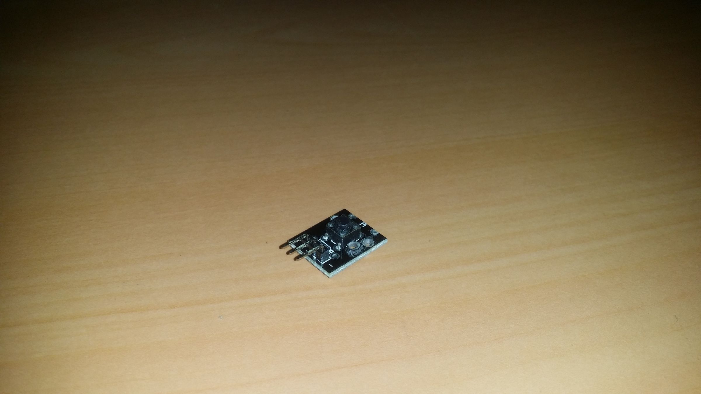
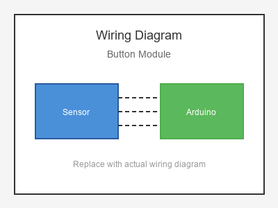

# KY-004 --- Push Button Module

## รายละเอียด

Button Module เป็นโมดูลปุ่มกดพร้อม Pull-up/Pull-down  resistor ในตัว และมี LED แสดงสถานะ ใช้งานง่ายกว่าการต่อปุ่มธรรมดา

## คุณสมบัติ

- แรงดันไฟฟ้า: 3.3V - 5V DC
- เอาต์พุต: Digital (Active High หรือ Low)
- มี Pull-up/Pull-down ในตัว
- มี LED แสดงสถานะ

## ขาของโมดูล

| ขา (Module) | สีสาย | เชื่อมต่อกับ (Lotus Nano Bot) |
|-------------|-------|------------------------------|
| VCC         | แดง   | 5V                           |
| GND         | ดำ/น้ำตาล | GND                       |
| OUT (Signal)| เหลือง | D3 หรือ A0 (D14)          |

> **หมายเหตุ:** Lotus Nano Bot มีปุ่มกดในตัวอยู่แล้วที่ D2 แต่หากต้องการใช้ปุ่มเพิ่มเติมให้ต่อที่ D3

## การต่อสายไฟ

```
Button Module            Lotus Nano Bot
━━━━━━━━━━━━━━━━━━━━━━━━━━━━━━━━━━━━━━━━
VCC  ──────────────────► 5V
GND  ──────────────────► GND
OUT  ──────────────────► D3
```

### ภาพการต่อสาย (Text Diagram)

```
        +------------------+
        |  Button Module   |
        |   [====]         |
        |   (Push)         |
   +----+----+   +----+----+   +----+----+
   |  VCC    |   |  GND    |   |  OUT    |
   |   (+)   |   |   (-)   |   | (Sig)   |
   +----+----+   +----+----+   +----+----+
        |             |             |
        |             |             |
   +----+----+   +----+----+   +----+----+
   |   5V    |   |  GND    |   |   D3    |
   |         |   |         |   |         |
   |  Lotus  |   |  Nano   |   |  Bot    |
   +---------+   +---------+   +---------+
```


## โค้ดตัวอย่าง

```cpp
// Button Module Example for Lotus Nano Bot
// OUT -> D3

#define BUTTON_PIN 3
#define LED_PIN 13

void setup() {
  Serial.begin(9600);
  pinMode(BUTTON_PIN, INPUT);
  pinMode(LED_PIN, OUTPUT);
  Serial.println("Button Module Test Started");
}

void loop() {
  int buttonState = digitalRead(BUTTON_PIN);
  
  if (buttonState == HIGH) {  // กดปุ่ม
    Serial.println("🔘 Button Pressed!");
    digitalWrite(LED_PIN, HIGH);
  } else {
    digitalWrite(LED_PIN, LOW);
  }
  
  delay(100);
}
```

## โค้ดตัวอย่าง Toggle LED

```cpp
#define BUTTON_PIN 15  // A1 = D15
#define LED_PIN 13

bool ledState = false;
int lastButton = LOW;

void setup() {
  Serial.begin(9600);
  pinMode(BUTTON_PIN, INPUT);
  pinMode(LED_PIN, OUTPUT);
}

void loop() {
  int button = digitalRead(BUTTON_PIN);
  
  if (button == HIGH && lastButton == LOW) {
    ledState = !ledState;
    digitalWrite(LED_PIN, ledState);
    Serial.println(ledState ? "💡 LED ON" : "🌑 LED OFF");
    delay(200);
  }
  
  lastButton = button;
}
```

## หมายเหตุ

- Lotus Nano Bot มีปุ่มกดในตัวที่ D2 (`digitalRead(2)`)
- Button Module นี้เหมาะสำหรับการใช้ปุ่มเพิ่มเติมนอกบอร์ด
- บน Lotus Nano Bot ใช้ D3 หรือ A0-A3 (เป็น Digital Input) ได้

## รูปภาพ





