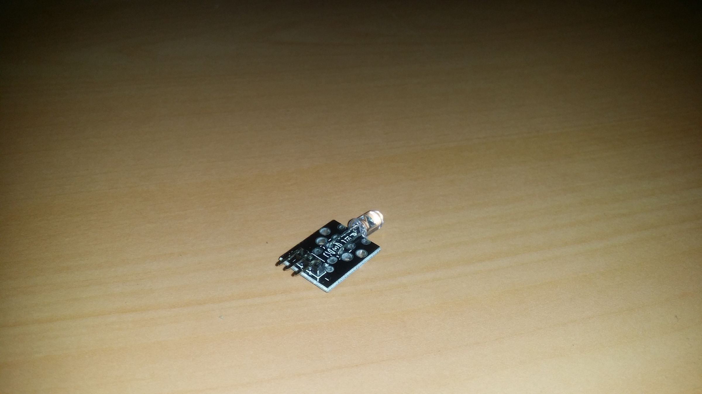
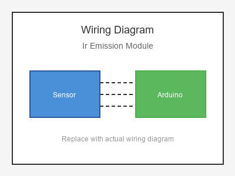

# KY-005 --- IR Emitter Module

## รายละเอียด

IR Emission Module เป็นโมดูลส่งสัญญาณอินฟราเรด ใช้ IR LED ส่งสัญญาณความถี่ 38 kHz สำหรับควบคุมอุปกรณ์ต่างๆ เช่น ทีวี, แอร์ หรือใช้คู่กับ IR Receiver

## คุณสมบัติ

- แรงดันไฟฟ้า: 3.3V - 5V DC
- ใช้ IR LED ส่งสัญญาณ 940 nm
- ควบคุมด้วย Digital
- มีตัวต้านทานจำกัดกระแสในตัว

## ขาของโมดูล

| ขา (Module) | สีสาย | เชื่อมต่อกับ (Lotus Nano Bot) |
|-------------|-------|------------------------------|
| VCC (+)     | แดง   | 5V                           |
| GND (-)     | ดำ/น้ำตาล | GND                       |
| S (Signal)  | เหลือง | D3 หรือ D5/D6/D9 (PWM)     |

## การต่อสายไฟ

```
IR Emission Module       Lotus Nano Bot
━━━━━━━━━━━━━━━━━━━━━━━━━━━━━━━━━━━━━━━━
VCC (+) ───────────────► 5V
GND (-) ───────────────► GND
S     ────────────────► D3
```

### ภาพการต่อสาย (Text Diagram)

```
        +------------------+
        |  IR Emission     |
        |  Module          |
        |    ◉ (IR LED)    |
        |                  |
   +----+----+   +----+----+   +----+----+
   |  VCC    |   |  GND    |   |    S    |
   |   (+)   |   |   (-)   |   | (Sig)   |
   +----+----+   +----+----+   +----+----+
        |             |             |
        |             |             |
   +----+----+   +----+----+   +----+----+
   |   5V    |   |  GND    |   |   D3    |
   |         |   |         |   |         |
   |  Lotus  |   |  Nano   |   |  Bot    |
   +---------+   +---------+   +---------+
```

## โค้ดตัวอย่าง

```cpp
// IR Emission Module Example for Lotus Nano Bot
// S -> D3

#define IR_LED_PIN 3

void setup() {
  Serial.begin(9600);
  pinMode(IR_LED_PIN, OUTPUT);
  Serial.println("IR Emission Module Test Started");
}

void loop() {
  // ส่งสัญญาณ IR (ตัวอย่างพื้นฐาน)
  Serial.println("📡 Sending IR Signal");
  
  // ส่งสัญญาณ 38 kHz เป็นเวลา 1 วินาที
  for (int i = 0; i < 100; i++) {
    digitalWrite(IR_LED_PIN, HIGH);
    delayMicroseconds(13);  // ประมาณ 38 kHz
    digitalWrite(IR_LED_PIN, LOW);
    delayMicroseconds(13);
  }
  
  delay(1000);
}
```

## โค้ดตัวอย่างใช้ IRremote library

```cpp
#include <IRremote.h>

#define IR_SEND_PIN 3

IRsend irsend;

void setup() {
  Serial.begin(9600);
  irsend.begin();
  Serial.println("IR Transmitter Ready");
}

void loop() {
  // ส่งสัญญาณ NEC รหัสตัวอย่าง
  Serial.println("Sending NEC: 0xFFA25D");
  irsend.sendNEC(0xFFA25D, 32);
  delay(5000);
}
```

## หมายเหตุ

- IR LED ส่งแสงที่มองไม่เห็น (Infrared)
- ต้องส่งสัญญาณที่ความถี่ 38 kHz สำหรับรีโมททั่วไป
- ใช้ IRremote library เพื่อความสะดวกในการส่งสัญญาณต่างๆ
- บน Lotus Nano Bot ใช้ D3 หรือ D5, D6, D9 (PWM) ได้

## รูปภาพ





