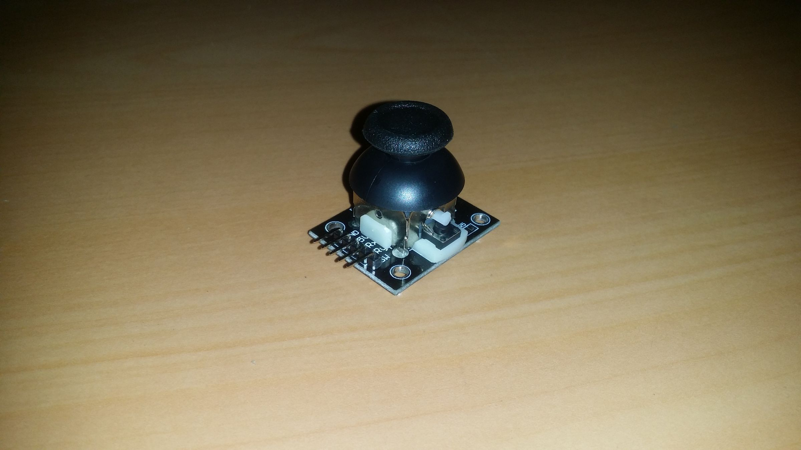
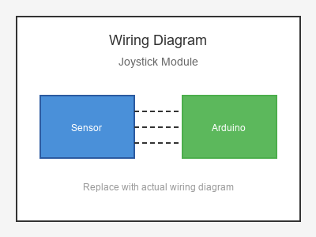

# KY-023 --- Joystick Module

## รายละเอียด

Joystick Module เป็นโมดูลจอยสติ๊กแบบ Analog 2 แกน (X, Y) พร้อมปุ่มกด (Z/Button) ใช้ตัวต้านทานปรับค่าได้ 2 ตัวตามแกน X และ Y

## คุณสมบัติ

- แรงดันไฟฟ้า: 5V DC
- แกน X, Y: Analog (0-1023)
- ปุ่ม Z: Digital (Active Low)
- ใช้ตัวต้านทานปรับค่าได้ 2 ตัว (10KΩ)

## ขาของโมดูล

| ขา (Module) | สีสาย | เชื่อมต่อกับ (Lotus Nano Bot) |
|-------------|-------|------------------------------|
| VCC         | แดง   | 5V                           |
| GND         | ดำ/น้ำตาล | GND                       |
| VRX (X)     | เหลือง | A0                          |
| VRY (Y)     | ขาว   | A1 หรือ A2, A3, A6         |
| SW (Button) | ส้ม   | D3 หรือ A0 (D14) (INPUT_PULLUP) |

## การต่อสายไฟ

```
Joystick Module          Lotus Nano Bot
━━━━━━━━━━━━━━━━━━━━━━━━━━━━━━━━━━━━━━━━
VCC  ──────────────────► 5V
GND  ──────────────────► GND
VRX  ──────────────────► A0
VRY  ──────────────────► A1
SW   ──────────────────► D3 (INPUT_PULLUP)
```

### ภาพการต่อสาย (Text Diagram)

```
        +------------------+
        |  Joystick        |
        |   Module         |
        |     \   /        |
        |      \ /         |
        |       O  (SW)    |
   +----+----+   +----+----+   +----+----+   +----+----+   +----+----+
   |  VCC    |   |  GND    |   |  VRX    |   |  VRY    |   |  SW     |
   |   (+)   |   |   (-)   |   |   (X)   |   |   (Y)   |   | (Btn)   |
   +----+----+   +----+----+   +----+----+   +----+----+   +----+----+
        |             |             |             |             |
        |             |             |             |             |
   +----+----+   +----+----+   +----+----+   +----+----+   +----+----+
   |   5V    |   |  GND    |   |   A0    |   |   A1    |   |   D3    |
   |         |   |         |   |         |   |         |   |         |
   |  Lotus  |   |  Nano   |   |  Bot    |   |         |   |         |
   +---------+   +---------+   +---------+   +---------+   +---------+
```

## โค้ดตัวอย่าง

```cpp
// Joystick Module Example for Lotus Nano Bot
// VRX -> A0, VRY -> A1, SW -> D3

#define JOY_X_PIN A0
#define JOY_Y_PIN A1
#define JOY_SW_PIN 3

void setup() {
  Serial.begin(9600);
  pinMode(JOY_SW_PIN, INPUT_PULLUP);
  Serial.println("Joystick Test Started");
}

void loop() {
  int xValue = analogRead(JOY_X_PIN);
  int yValue = analogRead(JOY_Y_PIN);
  int buttonState = digitalRead(JOY_SW_PIN);
  
  Serial.print("X: ");
  Serial.print(xValue);
  Serial.print(" | Y: ");
  Serial.print(yValue);
  Serial.print(" | Button: ");
  Serial.println(buttonState == LOW ? "PRESSED" : "RELEASED");
  
  // แปลงค่าเป็นทิศทาง
  if (xValue < 400) {
    Serial.println("⬅️  Left");
  } else if (xValue > 600) {
    Serial.println("➡️  Right");
  }
  
  if (yValue < 400) {
    Serial.println("⬆️  Up");
  } else if (yValue > 600) {
    Serial.println("⬇️  Down");
  }
  
  delay(200);
}
```

## โค้ดตัวอย่างควบคุมมอเตอร์ Lotus Nano Bot

```cpp
#define JOY_X_PIN A0
#define JOY_Y_PIN A1

// Motor pins (Lotus Nano Bot)
#define DL1  9
#define DL2  4
#define PWML 5
#define DR1  7
#define DR2  8
#define PWMR 6

void setup() {
  Serial.begin(9600);
  
  pinMode(DL1, OUTPUT);
  pinMode(DL2, OUTPUT);
  pinMode(PWML, OUTPUT);
  pinMode(DR1, OUTPUT);
  pinMode(DR2, OUTPUT);
  pinMode(PWMR, OUTPUT);
}

void loop() {
  int x = analogRead(JOY_X_PIN);
  int y = analogRead(JOY_Y_PIN);
  
  // แปลงเป็น -100 ถึง 100
  int leftSpeed = map(y, 0, 1023, -100, 100);
  int rightSpeed = map(y, 0, 1023, -100, 100);
  
  // เลี้ยวด้วยแกน X
  int turn = map(x, 0, 1023, -50, 50);
  leftSpeed += turn;
  rightSpeed -= turn;
  
  // จำกัดค่า
  leftSpeed = constrain(leftSpeed, -100, 100);
  rightSpeed = constrain(rightSpeed, -100, 100);
  
  run(leftSpeed, rightSpeed);
  delay(50);
}

void run(int spl, int spr) {
  if (spl > 0) {
    digitalWrite(DL1, LOW); digitalWrite(DL2, HIGH); analogWrite(PWML, spl);
  } else if (spl < 0) {
    digitalWrite(DL1, HIGH); digitalWrite(DL2, LOW); analogWrite(PWML, -spl);
  } else {
    digitalWrite(DL1, LOW); digitalWrite(DL2, LOW);
  }
  
  if (spr > 0) {
    digitalWrite(DR1, LOW); digitalWrite(DR2, HIGH); analogWrite(PWMR, spr);
  } else if (spr < 0) {
    digitalWrite(DR1, HIGH); digitalWrite(DR2, LOW); analogWrite(PWMR, -spr);
  } else {
    digitalWrite(DR1, LOW); digitalWrite(DR2, LOW);
  }
}
```

## หมายเหตุ

- ค่ากลางประมาณ 512 (2.5V) ทั้งแกน X และ Y
- ปุ่ม SW ต้องใช้ `INPUT_PULLUP` เพราะไม่มีตัวต้านทาน Pull-up ในตัว
- ใช้ได้กับการควบคุมหุ่นยนต์, เกม, หรือ Servo
- บน Lotus Nano Bot ใช้ A0-A3, A6 สำหรับอนาลอก และ D3 สำหรับปุ่ม

## รูปภาพ





