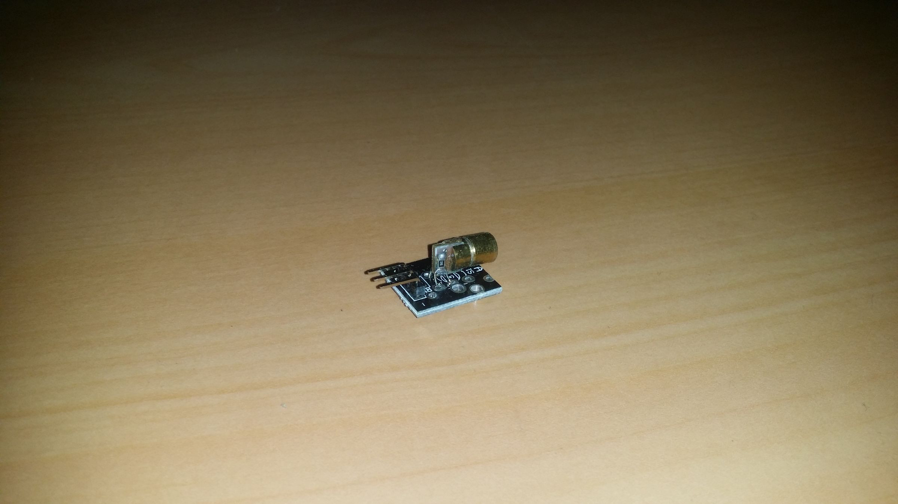
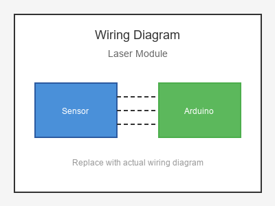

# KY-008 --- Laser Transmitter Module

## รายละเอียด

Laser Module เป็นโมดูล Laser Diode ความแรงต่ำ (มักเป็น 5mW, 650nm สีแดง) ใช้สำหรับการชี้หรือทดสอบเซนเซอร์ต่างๆ ต้องใช้ความระมัดระวังในการใช้งาน

## คุณสมบัติ

- แรงดันไฟฟ้า: 5V DC
- ความยาวคลื่น: 650 nm (สีแดง)
- กำลัง: ~5 mW
- ควบคุมด้วย Digital (ON/OFF)

## ขาของโมดูล

| ขา (Module) | สีสาย | เชื่อมต่อกับ (Lotus Nano Bot) |
|-------------|-------|------------------------------|
| VCC (+)     | แดง   | 5V                           |
| GND (-)     | ดำ/น้ำตาล | GND                       |
| S (Signal)  | เหลือง | D3 หรือ A0 (D14)          |

## การต่อสายไฟ

```
Laser Module             Lotus Nano Bot
━━━━━━━━━━━━━━━━━━━━━━━━━━━━━━━━━━━━━━━━
VCC (+) ───────────────► 5V
GND (-) ───────────────► GND
S     ────────────────► D3
```

### ภาพการต่อสาย (Text Diagram)

```
        +------------------+
        |   Laser Module   |
        |    (5mW 650nm)   |
        |     ◉            |
        |                  |
   +----+----+   +----+----+   +----+----+
   |  VCC    |   |  GND    |   |    S    |
   |   (+)   |   |   (-)   |   | (Sig)   |
   +----+----+   +----+----+   +----+----+
        |             |             |
        |             |             |
   +----+----+   +----+----+   +----+----+
   |   5V    |   |  GND    |   |   D3    |
   |         |   |         |   |         |
   |  Lotus  |   |  Nano   |   |  Bot    |
   +---------+   +---------+   +---------+
```

## โค้ดตัวอย่าง

```cpp
// Laser Module Example for Lotus Nano Bot
// S -> D3

#define LASER_PIN 3

void setup() {
  Serial.begin(9600);
  pinMode(LASER_PIN, OUTPUT);
  digitalWrite(LASER_PIN, LOW);
  Serial.println("Laser Module Test Started");
}

void loop() {
  Serial.println("🔴 Laser ON");
  digitalWrite(LASER_PIN, HIGH);
  delay(2000);
  
  Serial.println("🔴 Laser OFF");
  digitalWrite(LASER_PIN, LOW);
  delay(2000);
}
```

## โค้ดตัวอย่างกระพริบ (Blinking)

```cpp
#define LASER_PIN 3

void setup() {
  pinMode(LASER_PIN, OUTPUT);
}

void loop() {
  // กระพริบเร็ว
  for (int i = 0; i < 10; i++) {
    digitalWrite(LASER_PIN, HIGH);
    delay(100);
    digitalWrite(LASER_PIN, LOW);
    delay(100);
  }
  
  delay(2000);
}
```

## หมายเหตุสำคัญ

- **⚠️ คำเตือน:** อย่าส่อง Laser เข้าตา! อาจทำให้ตาบอดได้
- ใช้ Laser 5mW หรือต่ำกว่าเท่านั้น
- ไม่ควรส่อง Laser ไปที่กล้องหรือเซนเซอร์รูปภาพ
- ใช้ได้กับการทดสอบ Avoidance Sensor, Photoresistor หรือ Line Tracking
- บน Lotus Nano Bot ใช้ D3 หรือ A0-A3 (เป็น Digital Output) ได้

## รูปภาพ





