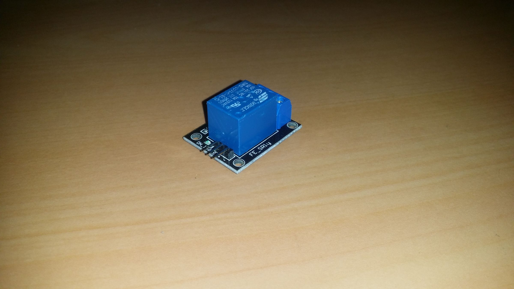
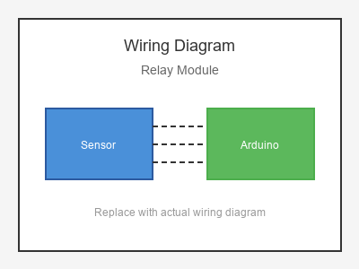

# KY-019 --- Relay Module

## รายละเอียด

Relay Module เป็นโมดูลสวิตช์ควบคุมด้วยไฟฟ้า ใช้เปิด/ปิดวงจรไฟฟ้ากระแสสูง (220V AC) ด้วยสัญญาณจาก Arduino (5V DC) มี Optocoupler แยกวงจรควบคุมและวงจรกำลัง

## คุณสมบัติ

- แรงดันไฟฟ้าควบคุม: 5V DC
- แรงดันไฟฟ้ารีเลย์: 10A 250V AC / 10A 30V DC
- มี Optocoupler แยกวงจร
- มี LED แสดงสถานะ
- แบบ 1 Channel, 2 Channel, 4 Channel, 8 Channel

## ขาของโมดูล (1 Channel)

| ขา (Module) | สีสาย | เชื่อมต่อกับ (Lotus Nano Bot) |
|-------------|-------|------------------------------|
| VCC         | แดง   | 5V                           |
| GND         | ดำ/น้ำตาล | GND                       |
| IN (Signal) | เหลือง | D3 หรือ A0 (D14)          |
| NC          | -     | โหลด (Normally Closed)      |
| NO          | -     | โหลด (Normally Open)         |
| COM         | -     | แหล่งจ่ายไฟ AC/DC             |

## การต่อสายไฟ

```
Relay Module             Lotus Nano Bot
━━━━━━━━━━━━━━━━━━━━━━━━━━━━━━━━━━━━━━━━
VCC  ──────────────────► 5V
GND  ──────────────────► GND
IN   ──────────────────► D3
```

### ภาพการต่อสาย (Text Diagram)

```
        +------------------+
        |  Relay Module    |
        |   (1 Channel)    |
        |                  |
   +----+----+   +----+----+   +----+----+
   |  VCC    |   |  GND    |   |   IN    |
   |   (+)   |   |   (-)   |   | (Sig)   |
   +----+----+   +----+----+   +----+----+
        |             |             |
        |             |             |
   +----+----+   +----+----+   +----+----+
   |   5V    |   |  GND    |   |   D3    |
   |         |   |         |   |         |
   |  Lotus  |   |  Nano   |   |  Bot    |
   +---------+   +---------+   +---------+

   +--------------------------------------+
   |  Load (e.g., Lamp)                   |
   |     ──── NC                         |
   |     │                                |
   |   COM ──── 220V AC / DC Source       |
   |     │                                |
   |     ──── NO                         |
   +--------------------------------------+
```

## โค้ดตัวอย่าง

```cpp
// Relay Module Example for Lotus Nano Bot
// IN -> D3

#define RELAY_PIN 3

void setup() {
  Serial.begin(9600);
  pinMode(RELAY_PIN, OUTPUT);
  digitalWrite(RELAY_PIN, HIGH);  // เริ่มต้นปิดรีเลย์ (Active Low)
  Serial.println("Relay Module Test Started");
}

void loop() {
  Serial.println("🔌 Relay ON");
  digitalWrite(RELAY_PIN, LOW);   // Active Low
  delay(3000);
  
  Serial.println("🔌 Relay OFF");
  digitalWrite(RELAY_PIN, HIGH);
  delay(3000);
}
```

## โค้ดตัวอย่างควบคุมหลอดไฟด้วยเวลา

```cpp
#define RELAY_PIN 3

void setup() {
  pinMode(RELAY_PIN, OUTPUT);
  digitalWrite(RELAY_PIN, HIGH);  // ปิด
}

void loop() {
  unsigned long hour = millis() / 1000 / 60 / 60;
  
  // เปิดไฟ 18:00 - 06:00 (สมมติ)
  if (hour >= 18 || hour < 6) {
    digitalWrite(RELAY_PIN, LOW);   // ON
  } else {
    digitalWrite(RELAY_PIN, HIGH);  // OFF
  }
  
  delay(60000);  // ตรวจสอบทุกนาที
}
```

## หมายเหตุสำคัญ

- **⚠️ อันตรายจากไฟฟ้า:** 220V AC อันตรายถึงชีวิต! ต้องระมัดระวังเมื่อต่อไฟ AC
- บางโมดูลเป็น Active Low (LOW = ON, HIGH = OFF)
- บางโมดูลเป็น Active High ให้ทดสอบก่อนใช้งานจริง
- มี Optocoupler แยกวงจรควบคุมออกจากวงจรกำลัง
- บน Lotus Nano Bot ใช้ D3 หรือ A0-A3 (เป็น Digital Output) ได้

## รูปภาพ





