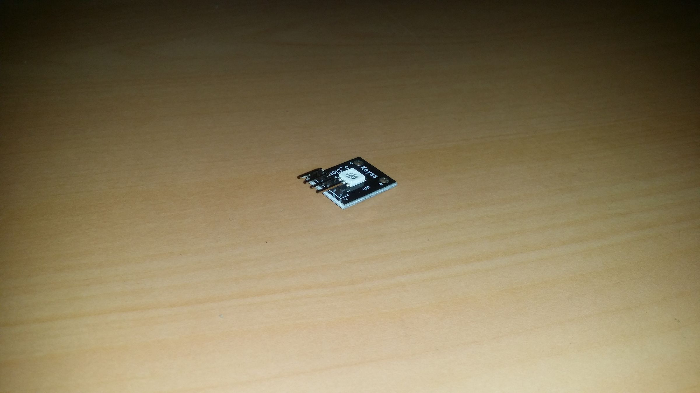
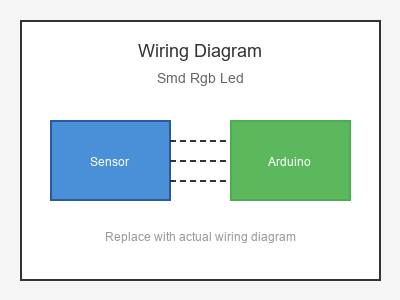

# KY-009 --- SMD RGB LED Module

## รายละเอียด

SMD RGB LED Module เป็นโมดูล LED RGB แบบ SMD (Surface Mount Device) ขนาดเล็ก มี LED Red, Green, Blue ในหลอดเดียว ควบคุมด้วย PWM

## คุณสมบัติ

- แรงดันไฟฟ้า: 3.3V - 5V DC
- ควบคุมด้วย PWM (3 ขา: R, G, B)
- มีตัวต้านทานจำกัดกระแสในตัว
- ขนาดเล็กกว่า RGB LED ทั่วไป

## ขาของโมดูล

| ขา (Module) | สีสาย | เชื่อมต่อกับ (Lotus Nano Bot) |
|-------------|-------|------------------------------|
| VCC หรือ - | แดง   | 5V หรือ GND (ขึ้นอยู่กับรุ่น) |
| R (Red)     | เหลือง | D3 หรือ D5/D6/D9 (PWM)     |
| G (Green)   | เขียว | D3 หรือ D5/D6/D9 (PWM)     |
| B (Blue)    | น้ำเงิน | D3 หรือ D5/D6/D9 (PWM)    |

## การต่อสายไฟ (Common Cathode)

```
SMD RGB LED              Lotus Nano Bot
━━━━━━━━━━━━━━━━━━━━━━━━━━━━━━━━━━━━━━━━
VCC (-) ───────────────► GND
R ─────────────────────► D5 (PWM)
G ─────────────────────► D6 (PWM)
B ─────────────────────► D9 (PWM)
```

### ภาพการต่อสาย (Text Diagram)

```
        +------------------+
        |   SMD RGB LED    |
        |   Module         |
        |    [*] (SMD)     |
        |                  |
   +----+----+   +----+----+   +----+----+   +----+----+
   |  VCC    |   |   R     |   |   G     |   |   B     |
   |   (-)   |   |  (PWM)  |   |  (PWM)  |   |  (PWM)  |
   +----+----+   +----+----+   +----+----+   +----+----+
        |             |             |             |
        |             |             |             |
   +----+----+   +----+----+   +----+----+   +----+----+
   |  GND    |   |   D5    |   |   D6    |   |   D9    |
   |         |   |         |   |         |   |         |
   |  Lotus  |   |  Nano   |   |  Bot    |   |         |
   +---------+   +---------+   +---------+   +---------+
```

## โค้ดตัวอย่าง

```cpp
// SMD RGB LED Example for Lotus Nano Bot
// Common Cathode: R->D5, G->D6, B->D9

#define RED_PIN 5
#define GREEN_PIN 6
#define BLUE_PIN 9

void setup() {
  Serial.begin(9600);
  pinMode(RED_PIN, OUTPUT);
  pinMode(GREEN_PIN, OUTPUT);
  pinMode(BLUE_PIN, OUTPUT);
  Serial.println("SMD RGB LED Test Started");
}

void loop() {
  // Red
  setColor(255, 0, 0);
  delay(1000);
  
  // Green
  setColor(0, 255, 0);
  delay(1000);
  
  // Blue
  setColor(0, 0, 255);
  delay(1000);
}

void setColor(int red, int green, int blue) {
  analogWrite(RED_PIN, red);
  analogWrite(GREEN_PIN, green);
  analogWrite(BLUE_PIN, blue);
}
```

## หมายเหตุ

- SMD RGB LED ทำงานเหมือน RGB LED ทั่วไปแต่ขนาดเล็กกว่า
- ตรวจสอบว่าเป็น Common Cathode หรือ Common Anode
- บน Lotus Nano Bot ใช้ D5, D6, D9 สำหรับ PWM (แต่เป็นขามอเตอร์/เซอร์โว)
- ใช้ D3 ได้แต่ต้องระวังเพราะต่อกับบัซเซอร์

## รูปภาพ





