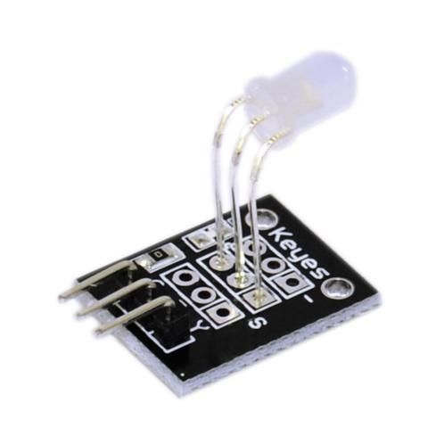
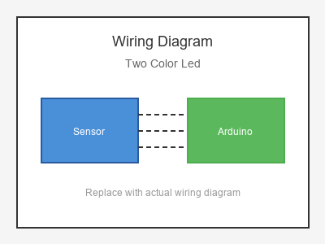

# KY-011 --- Two-color LED Module

## รายละเอียด

Two-color LED Module เป็นโมดูล LED 2 สี (มักเป็น Red และ Green) มีขา 3 ขา (Common Cathode หรือ Common Anode) สามารถแสดงสีแดง เขียว และส้ม (ผสม) ได้

## คุณสมบัติ

- แรงดันไฟฟ้า: 3.3V - 5V DC
- สี: Red และ Green (ผสมได้ Orange)
- ควบคุมด้วย PWM หรือ Digital
- มีตัวต้านทานจำกัดกระแสในตัว

## ขาของโมดูล

| ขา (Module) | สีสาย | เชื่อมต่อกับ (Lotus Nano Bot) |
|-------------|-------|------------------------------|
| VCC หรือ - | แดง   | 5V หรือ GND (ขึ้นอยู่กับรุ่น) |
| R (Red)     | เหลือง | D3 หรือ D5/D6/D9 (PWM)     |
| G (Green)   | เขียว | D3 หรือ D5/D6/D9 (PWM)     |

## การต่อสายไฟ (Common Cathode)

```
Two-color LED            Lotus Nano Bot
━━━━━━━━━━━━━━━━━━━━━━━━━━━━━━━━━━━━━━━━
VCC (-) ───────────────► GND
R ─────────────────────► D5 (PWM)
G ─────────────────────► D6 (PWM)
```

### ภาพการต่อสาย (Text Diagram)

```
        +------------------+
        |  Two-color LED   |
        |    Module        |
        |     [*]          |
        |                  |
   +----+----+   +----+----+   +----+----+
   |  VCC    |   |   R     |   |   G     |
   |   (-)   |   |  (PWM)  |   |  (PWM)  |
   +----+----+   +----+----+   +----+----+
        |             |             |
        |             |             |
   +----+----+   +----+----+   +----+----+
   |  GND    |   |   D5    |   |   D6    |
   |         |   |         |   |         |
   |  Lotus  |   |  Nano   |   |  Bot    |
   +---------+   +---------+   +---------+
```

## โค้ดตัวอย่าง

```cpp
// Two-color LED Example for Lotus Nano Bot
// R->D5, G->D6

#define RED_PIN 5
#define GREEN_PIN 6

void setup() {
  Serial.begin(9600);
  pinMode(RED_PIN, OUTPUT);
  pinMode(GREEN_PIN, OUTPUT);
  Serial.println("Two-color LED Test Started");
}

void loop() {
  // Red
  digitalWrite(RED_PIN, HIGH);
  digitalWrite(GREEN_PIN, LOW);
  delay(1000);
  
  // Green
  digitalWrite(RED_PIN, LOW);
  digitalWrite(GREEN_PIN, HIGH);
  delay(1000);
  
  // Orange (Red + Green)
  digitalWrite(RED_PIN, HIGH);
  digitalWrite(GREEN_PIN, HIGH);
  delay(1000);
  
  // Off
  digitalWrite(RED_PIN, LOW);
  digitalWrite(GREEN_PIN, LOW);
  delay(1000);
}
```

## โค้ดตัวอย่าง PWM (ปรับความสว่าง)

```cpp
#define RED_PIN 5
#define GREEN_PIN 6

void setup() {
  pinMode(RED_PIN, OUTPUT);
  pinMode(GREEN_PIN, OUTPUT);
}

void loop() {
  // ไล่สีจากแดงไปเขียว
  for (int i = 0; i <= 255; i++) {
    analogWrite(RED_PIN, 255 - i);
    analogWrite(GREEN_PIN, i);
    delay(20);
  }
  
  // ไล่สีจากเขียวไปแดง
  for (int i = 0; i <= 255; i++) {
    analogWrite(RED_PIN, i);
    analogWrite(GREEN_PIN, 255 - i);
    delay(20);
  }
}
```

## หมายเหตุ

- ตรวจสอบว่าเป็น Common Cathode หรือ Common Anode
- Common Cathode: VCC -> GND, R/G -> PWM HIGH
- Common Anode: VCC -> 5V, R/G -> PWM LOW
- บน Lotus Nano Bot ใช้ D5, D6, D9 สำหรับ PWM (แต่เป็นขามอเตอร์/เซอร์โว)
- ใช้ D3 ได้แต่ต้องระวังเพราะต่อกับบัซเซอร์

## รูปภาพ





