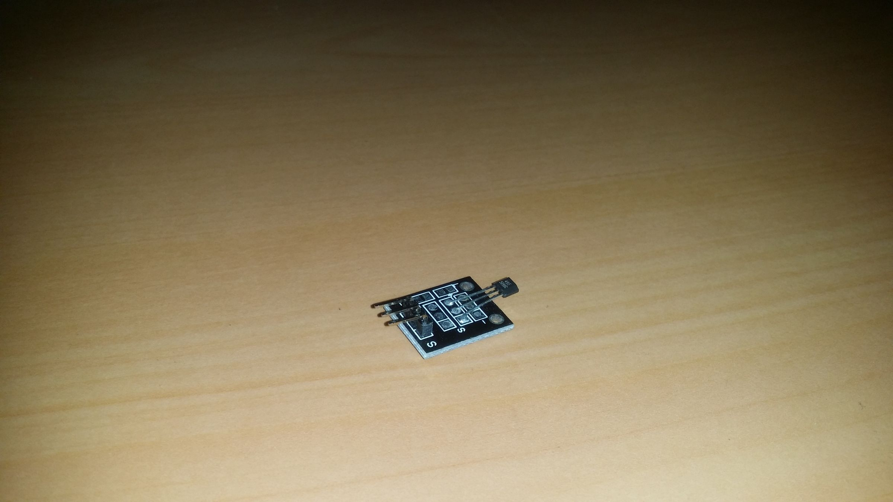
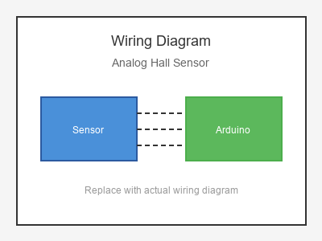

# KY-035 --- Analog Hall Sensor

## รายละเอียด

Analog Hall Sensor เป็นเซนเซอร์แม่เหล็กแบบอนาลอก ให้ค่าแรงดันเปลี่ยนไปตามความเข้มของสนามแม่เหล็ก สามารถวัดทิศทางและความแรงของแม่เหล็กได้

## คุณสมบัติ

- แรงดันไฟฟ้า: 3.3V - 5V DC
- เอาต์พุต: Digital (DO) และ Analog (AO)
- มี LED แสดงสถานะ
- มีตัวปรับค่า (Potentiometer)

## ขาของเซนเซอร์

| ขา (Sensor) | สีสาย | เชื่อมต่อกับ (Lotus Nano Bot) |
|-------------|-------|------------------------------|
| VCC         | แดง   | 5V                           |
| GND         | ดำ/น้ำตาล | GND                       |
| DO (Digital)| เหลือง | D3 หรือ A0 (D14)          |
| AO (Analog) | ขาว   | A0, A1, A2, A3 หรือ A6     |

## การต่อสายไฟ

```
Analog Hall Sensor       Lotus Nano Bot
━━━━━━━━━━━━━━━━━━━━━━━━━━━━━━━━━━━━━━━━
VCC  ──────────────────► 5V
GND  ──────────────────► GND
DO   ──────────────────► D3 (optional)
AO   ──────────────────► A0
```

### ภาพการต่อสาย (Text Diagram)

```
        +------------------+
        |  Analog Hall     |
        |  Sensor          |
        |                  |
   +----+----+   +----+----+   +----+----+   +----+----+
   |  VCC    |   |  GND    |   |  DO     |   |  AO     |
   |   (+)   |   |   (-)   |   | (Digi)  |   | (Anlg)  |
   +----+----+   +----+----+   +----+----+   +----+----+
        |             |             |             |
        |             |             |             |
   +----+----+   +----+----+   +----+----+   +----+----+
   |   5V    |   |  GND    |   |   D3    |   |   A0    |
   |         |   |         |   |         |   |         |
   |  Lotus  |   |  Nano   |   |  Bot    |   |         |
   +---------+   +---------+   +---------+   +---------+
```

## โค้ดตัวอย่าง

```cpp
// Analog Hall Sensor Example for Lotus Nano Bot
// AO -> A0, DO -> D3 (optional)

#define HALL_ANALOG_PIN A0
#define HALL_DIGITAL_PIN 3
#define LED_PIN 13

void setup() {
  Serial.begin(9600);
  pinMode(HALL_DIGITAL_PIN, INPUT);
  pinMode(LED_PIN, OUTPUT);
  Serial.println("Analog Hall Sensor Test Started");
}

void loop() {
  int analogValue = analogRead(HALL_ANALOG_PIN);
  float voltage = analogValue * (5.0 / 1023.0);
  int digitalValue = digitalRead(HALL_DIGITAL_PIN);
  
  Serial.print("Analog: ");
  Serial.print(analogValue);
  Serial.print(" (");
  Serial.print(voltage);
  Serial.print(" V) | Digital: ");
  Serial.println(digitalValue);
  
  // ค่าปกติประมาณ 2.5V (512)
  // แม่เหล็ก N เข้าใกล้: ค่าสูงขึ้น
  // แม่เหล็ก S เข้าใกล้: ค่าต่ำลง
  if (analogValue > 600 || analogValue < 400) {
    digitalWrite(LED_PIN, HIGH);
    Serial.println("🧲 Strong Magnetic Field!");
  } else {
    digitalWrite(LED_PIN, LOW);
  }
  
  delay(200);
}
```

## โค้ดตัวอย่างนับรอบมอเตอร์

```cpp
#define HALL_PIN A0

int count = 0;
int lastState = 0;

void setup() {
  Serial.begin(9600);
}

void loop() {
  int value = analogRead(HALL_PIN);
  int threshold = 512;
  
  int state = value > threshold ? HIGH : LOW;
  
  if (state != lastState) {
    count++;
    Serial.print("Count: ");
    Serial.println(count);
  }
  
  lastState = state;
  delay(10);
}
```

## หมายเหตุ

- ค่า Analog ปกติประมาณ 2.5V (512 ใน 10-bit ADC)
- เมื่อมีแม่เหล็กขั้ว N เข้าใกล้ ค่าอาจสูงขึ้น
- เมื่อมีแม่เหล็กขั้ว S เข้าใกล้ ค่าอาจต่ำลง
- ใช้ได้กับการนับรอบของมอเตอร์ที่มีแม่เหล็กติดอยู่
- บน Lotus Nano Bot ใช้ A0-A3, A6 สำหรับอ่านค่าอนาลอก

## รูปภาพ





