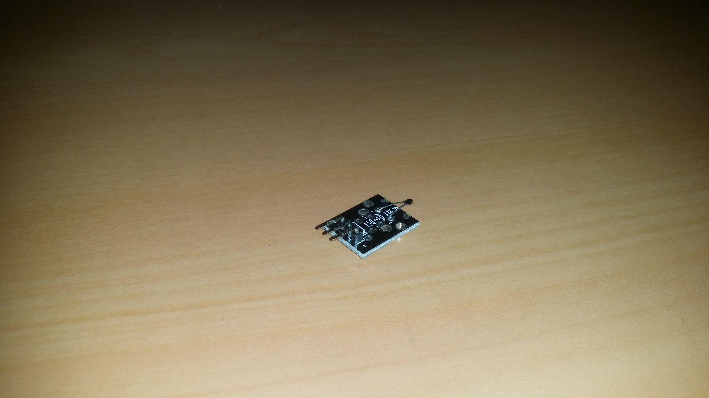
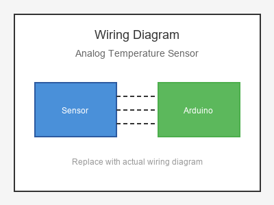

# KY-013 --- Analog Temperature Sensor

## รายละเอียด

Analog Temperature Sensor เป็นโมดูลที่ใช้ Thermistor (NTC) วัดอุณหภูมิ ให้เอาต์พุตเป็นสัญญาณอนาลอก มีทั้งเอาต์พุต Digital (DO) และ Analog (AO) พร้อมตัวปรับค่าความไว

## คุณสมบัติ

- แรงดันไฟฟ้า: 3.3V - 5V DC
- เอาต์พุต: Digital (DO) และ Analog (AO)
- ช่วงวัดอุณหภูมิ: -55°C ถึง +125°C (ขึ้นอยู่กับ Thermistor)
- มีตัวปรับค่า (Potentiometer)

## ขาของเซนเซอร์

| ขา (Sensor) | สีสาย | เชื่อมต่อกับ (Lotus Nano Bot) |
|-------------|-------|------------------------------|
| VCC         | แดง   | 5V                           |
| GND         | ดำ/น้ำตาล | GND                       |
| DO (Digital)| เหลือง | D2 หรือ D3                  |
| AO (Analog) | ขาว   | A0 หรือ A1                  |

## การต่อสายไฟ

```
Analog Temp Sensor       Lotus Nano Bot
━━━━━━━━━━━━━━━━━━━━━━━━━━━━━━━━━━━━━━━━
VCC  ──────────────────► 5V
GND  ──────────────────► GND
DO   ──────────────────► D2 (optional)
AO   ──────────────────► A0
```

### ภาพการต่อสาย (Text Diagram)

```
        +------------------+
        |  Analog Temp     |
        |  Sensor          |
        |  (Thermistor)    |
        |                  |
   +----+----+   +----+----+   +----+----+   +----+----+
   |  VCC    |   |  GND    |   |  DO     |   |  AO     |
   |   (+)   |   |   (-)   |   | (Digi)  |   | (Anlg)  |
   +----+----+   +----+----+   +----+----+   +----+----+
        |             |             |             |
        |             |             |             |
   +----+----+   +----+----+   +----+----+   +----+----+
   |   5V    |   |  GND    |   |   D2    |   |   A0    |
   |         |   |         |   |         |   |         |
   |  Lotus  |   |  Nano   |   |  Bot    |   |         |
   +---------+   +---------+   +---------+   +---------+
```

## โค้ดตัวอย่าง

```cpp
// Analog Temperature Sensor Example
// สำหรับ Lotus Nano Bot
// AO -> A0

#define TEMP_ANALOG_PIN A0
#define LED_PIN 13

void setup() {
  Serial.begin(9600);
  pinMode(LED_PIN, OUTPUT);
  Serial.println("Analog Temperature Sensor Test Started");
}

void loop() {
  int rawValue = analogRead(TEMP_ANALOG_PIN);
  
  // แปลงค่า Analog เป็นอุณหภูมิ (สำหรับ Thermistor ทั่วไป)
  // สูตรนี้เป็นค่าประมาณ อาจต้องปรับตามค่า B-coefficient ของ Thermistor
  float voltage = rawValue * (5.0 / 1023.0);
  float resistance = (5.0 / voltage - 1.0) * 10000;  // 10K pull-up
  float temperature = resistance / 10000.0;
  temperature = log(temperature);
  temperature = 1.0 / (0.001129148 + (0.000234125 * temperature) + (0.0000000876741 * temperature * temperature * temperature));
  temperature = temperature - 273.15;  // Kelvin to Celsius
  
  Serial.print("Raw: ");
  Serial.print(rawValue);
  Serial.print(" | Voltage: ");
  Serial.print(voltage);
  Serial.print(" V | Temp: ");
  Serial.print(temperature);
  Serial.println(" °C");
  
  if (temperature > 30.0) {
    digitalWrite(LED_PIN, HIGH);
  } else {
    digitalWrite(LED_PIN, LOW);
  }
  
  delay(1000);
}
```

## โค้ดตัวอย่างแบบง่าย (ไม่ต้องคำนวณ)

```cpp
// อ่านค่าอนาลอกพื้นฐาน
#define TEMP_PIN A0

void setup() {
  Serial.begin(9600);
}

void loop() {
  int rawValue = analogRead(TEMP_PIN);
  float voltage = rawValue * (5.0 / 1023.0);
  
  Serial.print("Raw Value: ");
  Serial.print(rawValue);
  Serial.print(" | Voltage: ");
  Serial.print(voltage);
  Serial.println(" V");
  
  // ค่ายิ่งต่ำ = อุณหภูมิยิ่งสูง (NTC Thermistor)
  // ค่ายิ่งสูง = อุณหภูมิยิ่งต่ำ
  
  delay(1000);
}
```

## หมายเหตุ

- ต้องปรับค่า B-coefficient ให้ตรงกับ Thermistor ที่ใช้
- สามารถหมุนตัวปรับค่าเพื่อเปลี่ยนเกณฑ์ของเอาต์พุตดิจิตอล
- ความแม่นยำน้อยกว่า DS18B20 แต่ใช้งานง่ายกว่า
- ควร calibrate กับเครื่องมือวัดอุณหภูมิที่แม่นยำ

## รูปภาพ





