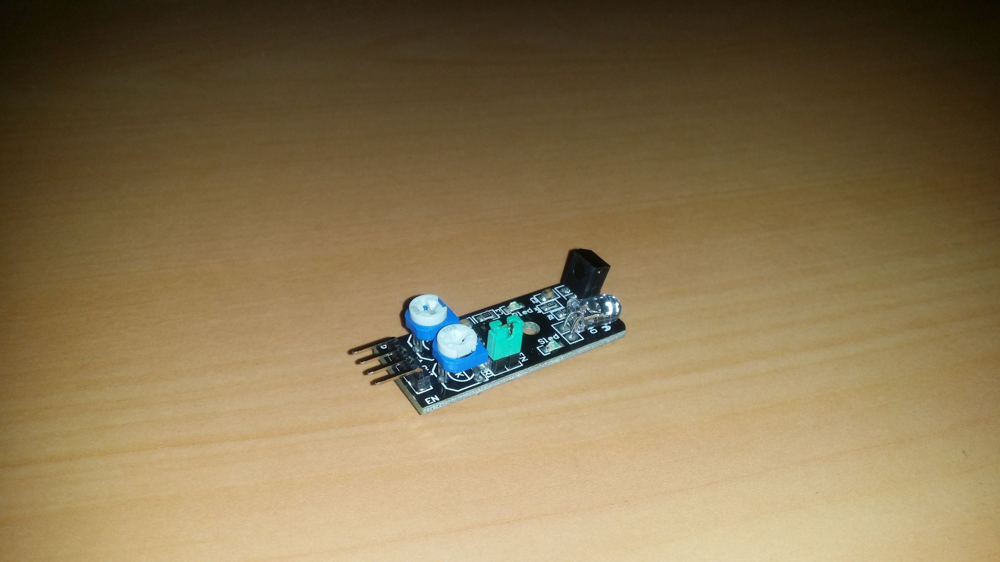
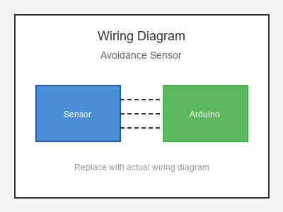

# KY-032 --- Obstacle Avoidance Sensor

## รายละเอียด

Avoidance Sensor หรือ Infrared Obstacle Avoidance Sensor เป็นเซนเซอร์ตรวจจับสิ่งกีดขวางโดยใช้คลื่นอินฟราเรด (IR) มีทั้ง IR LED และ IR Photodiode อยู่ในตัว สามารถปรับความไวในการตรวจจับได้ผ่านตัวต้านทานปรับค่าได้ (Potentiometer)

## คุณสมบัติ

- แรงดันไฟฟ้า: 3.3V - 5V DC
- ระยะตรวจจับ: 2 - 30 cm (ปรับได้)
- มุมตรวจจับ: 35°
- เอาต์พุต: Digital (High/Low)

## ขาของเซนเซอร์

| ขา (Sensor) | สีสาย | เชื่อมต่อกับ (Lotus Nano Bot) |
|-------------|-------|------------------------------|
| VCC         | แดง   | 5V                           |
| GND         | ดำ/น้ำตาล | GND                       |
| OUT         | เหลือง/ส้ม | D3 หรือ A0 (D14)        |

> **หมายเหตุ:** บน Lotus Nano Bot พอร์ต Digital ภายนอกมี D0, D1, D3 โดย D0/D1 ใช้กับ Bluetooth/Serial ส่วน D3 ใช้กับบัซเซอร์บนบอร์ด หากต้องการพอร์ต Digital เพิ่มสามารถใช้ A0-A3 เป็น Digital ได้ (A0=Pin14, A1=Pin15, A2=Pin16, A3=Pin17)

## การต่อสายไฟ

```
Avoidance Sensor          Lotus Nano Bot
━━━━━━━━━━━━━━━━━━━━━━━━━━━━━━━━━━━━━━━━
VCC  ───────────────────► 5V
GND  ───────────────────► GND
OUT  ───────────────────► D3 หรือ A0 (D14)
```

### ภาพการต่อสาย (Text Diagram)

```
         +------------------+
         |  Avoidance       |
         |  Sensor          |
         |                  |
    +----+----+   +----+----+   +----+----+
    |  VCC    |   |  GND    |   |  OUT    |
    |   (+)   |   |   (-)   |   |  (Sig)  |
    +----+----+   +----+----+   +----+----+
         |             |             |
         |             |             |
         |             |             |
    +----+----+   +----+----+   +----+----+
    |   5V    |   |  GND    |   |   D3    |
    |         |   |         |   |         |
    |  Lotus  |   |  Nano   |   |  Bot    |
    |  Nano   |   |  Bot    |   |         |
    +---------+   +---------+   +---------+
```

## โค้ดตัวอย่าง

```cpp
// Avoidance Sensor Example for Lotus Nano Bot
// ต่อ OUT เข้าที่ขา D2

#define AVOIDANCE_PIN 3  // หรือ 14 (A0)
#define LED_PIN 13

void setup() {
  Serial.begin(9600);
  pinMode(AVOIDANCE_PIN, INPUT);
  pinMode(LED_PIN, OUTPUT);
  Serial.println("Avoidance Sensor Test Started");
}

void loop() {
  int detected = digitalRead(AVOIDANCE_PIN);
  
  if (detected == LOW) {  // ส่วนใหญ่จะเป็น Active Low เมื่อตรวจพบ
    Serial.println("⚠️ Obstacle Detected!");
    digitalWrite(LED_PIN, HIGH);
  } else {
    Serial.println("✅ No Obstacle");
    digitalWrite(LED_PIN, LOW);
  }
  
  delay(200);
}
```

## หมายเหตุ

- บางรุ่นอาจให้ค่า HIGH เมื่อตรวจพบสิ่งกีดขวาง ให้ทดสอบก่อนใช้งานจริง
- สามารถหมุนตัวปรับค่า (Potentiometer) เพื่อกำหนดระยะตรวจจับ
- ผิวสีดำอาจดูดซับ IR ทำให้ตรวจจับได้ยากกว่าผิวสีอ่อน
- แสงอาทิตย์จัดอาจรบกวนการทำงานของ IR sensor

## รูปภาพ





