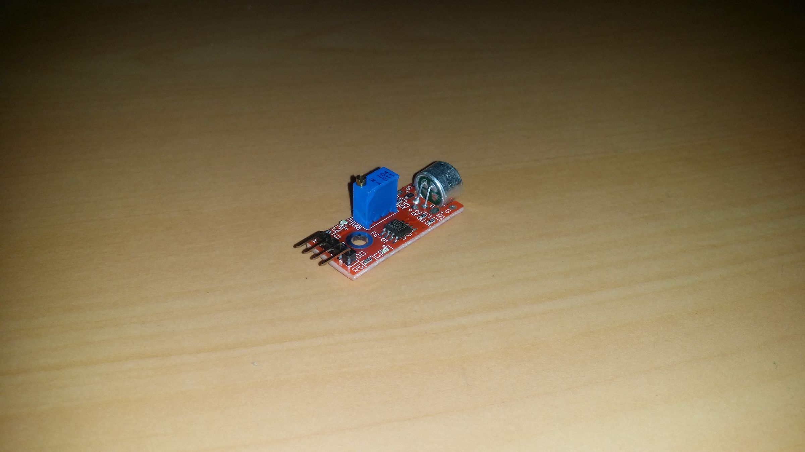
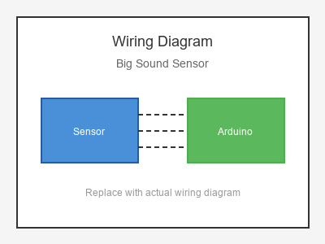

# KY-037 --- Big Sound Sensor

## รายละเอียด

Big Sound Sensor เป็นโมดูลตรวจจับเสียงขนาดใหญ่ ใช้ Microphone Electret พร้อมวงจรขยายสัญญาณ LM393 มีเอาต์พุต Digital และ Analog

## คุณสมบัติ

- แรงดันไฟฟ้า: 3.3V - 5V DC
- เอาต์พุต: Digital (DO) และ Analog (AO)
- มีตัวปรับความไว (Potentiometer)
- มี LED แสดงสถานะ

## ขาของโมดูล

| ขา (Module) | สีสาย | เชื่อมต่อกับ (Lotus Nano Bot) |
|-------------|-------|------------------------------|
| VCC         | แดง   | 5V                           |
| GND         | ดำ/น้ำตาล | GND                       |
| DO (Digital)| เหลือง | D3 หรือ A0 (D14)          |
| AO (Analog) | ขาว   | A0, A1, A2, A3 หรือ A6     |

## การต่อสายไฟ

```
Big Sound Sensor         Lotus Nano Bot
━━━━━━━━━━━━━━━━━━━━━━━━━━━━━━━━━━━━━━━━
VCC  ──────────────────► 5V
GND  ──────────────────► GND
DO   ──────────────────► D3
AO   ──────────────────► A0 (optional)
```

### ภาพการต่อสาย (Text Diagram)

```
        +------------------+
        |   Big Sound      |
        |   Sensor         |
        |    (o)           |
        |  Microphone      |
   +----+----+   +----+----+   +----+----+   +----+----+
   |  VCC    |   |  GND    |   |  DO     |   |  AO     |
   |   (+)   |   |   (-)   |   | (Digi)  |   | (Anlg)  |
   +----+----+   +----+----+   +----+----+   +----+----+
        |             |             |             |
        |             |             |             |
   +----+----+   +----+----+   +----+----+   +----+----+
   |   5V    |   |  GND    |   |   D3    |   |   A0    |
   |         |   |         |   |         |   |         |
   |  Lotus  |   |  Nano   |   |  Bot    |   |         |
   +---------+   +---------+   +---------+   +---------+
```

## โค้ดตัวอย่าง

```cpp
// Big Sound Sensor Example for Lotus Nano Bot
// DO -> D3, AO -> A0

#define SOUND_DIGITAL_PIN 3
#define SOUND_ANALOG_PIN A0

void setup() {
  Serial.begin(9600);
  pinMode(SOUND_DIGITAL_PIN, INPUT);
  Serial.println("Big Sound Sensor Test Started");
}

void loop() {
  int soundDetected = digitalRead(SOUND_DIGITAL_PIN);
  int soundLevel = analogRead(SOUND_ANALOG_PIN);
  
  Serial.print("Digital: ");
  Serial.print(soundDetected);
  Serial.print(" | Analog: ");
  Serial.println(soundLevel);
  
  if (soundDetected == LOW) {  // ตรวจพบเสียง (Active Low)
    Serial.println("🔊 Loud Sound Detected!");
    delay(300);
  }
  
  delay(50);
}
```

## โค้ดตัวอย่างตรวจจับเสียงรอบข้าง

```cpp
#define SOUND_PIN A0
#define BUZZER_PIN 3  // บัซเซอร์บนบอร์ด

int threshold = 600;

void setup() {
  Serial.begin(9600);
}

void loop() {
  int level = analogRead(SOUND_PIN);
  
  Serial.print("Sound Level: ");
  Serial.println(level);
  
  if (level > threshold) {
    Serial.println("🔊 Noise Alert!");
    tone(BUZZER_PIN, 2000, 200);
  }
  
  delay(100);
}
```

## หมายเหตุ

- หมุนตัวปรับค่าเพื่อกำหนดเกณฑ์เสียง
- Big Sound Sensor มีวงจรขยายสัญญาณมากกว่า Small Sound Sensor
- ใช้ได้กับการตรวจจับเสียงรอบข้าง, การตบมือ
- บน Lotus Nano Bot ใช้ D3 หรือ A0-A3 (เป็น Digital) ได้

## รูปภาพ





