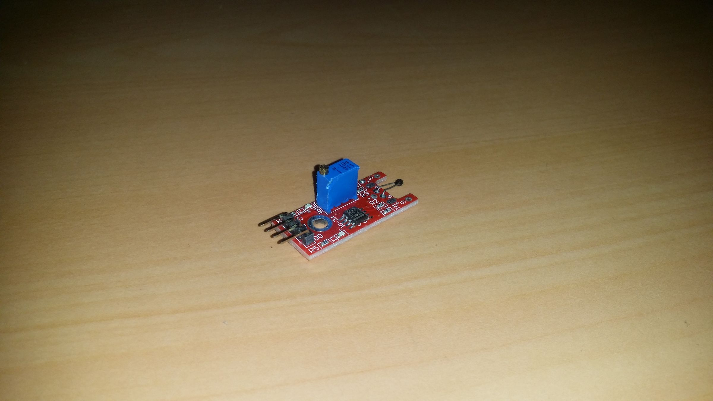
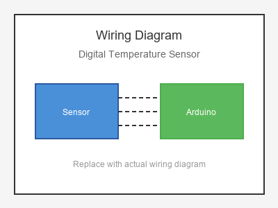

# KY-028 --- Digital Temperature Sensor

## รายละเอียด

Digital Temperature Sensor Module เป็นโมดูลที่ใช้ Thermistor แปลงค่าอุณหภูมิเป็นสัญญาณดิจิตอล มีวงจรเปรียบเทียบในตัว ให้เอาต์พุต Digital เมื่ออุณหภูมิเกินค่าที่ตั้งไว้ พร้อมเอาต์พุต Analog สำหรับอ่านค่าละเอียด

## คุณสมบัติ

- แรงดันไฟฟ้า: 3.3V - 5V DC
- เอาต์พุต: Digital (DO) และ Analog (AO)
- มีตัวปรับเกณฑ์ (Potentiometer)
- มี LED แสดงสถานะ

## ขาของโมดูล

| ขา (Module) | สีสาย | เชื่อมต่อกับ (Lotus Nano Bot) |
|-------------|-------|------------------------------|
| VCC         | แดง   | 5V                           |
| GND         | ดำ/น้ำตาล | GND                       |
| DO (Digital)| เหลือง | D3 หรือ A0 (D14)          |
| AO (Analog) | ขาว   | A0, A1, A2, A3 หรือ A6     |

## การต่อสายไฟ

```
Digital Temp Sensor      Lotus Nano Bot
━━━━━━━━━━━━━━━━━━━━━━━━━━━━━━━━━━━━━━━━
VCC  ──────────────────► 5V
GND  ──────────────────► GND
DO   ──────────────────► D3 (optional)
AO   ──────────────────► A0
```

### ภาพการต่อสาย (Text Diagram)

```
        +------------------+
        |  Digital Temp    |
        |  Sensor          |
        |                  |
   +----+----+   +----+----+   +----+----+   +----+----+
   |  VCC    |   |  GND    |   |  DO     |   |  AO     |
   |   (+)   |   |   (-)   |   | (Digi)  |   | (Anlg)  |
   +----+----+   +----+----+   +----+----+   +----+----+
        |             |             |             |
        |             |             |             |
   +----+----+   +----+----+   +----+----+   +----+----+
   |   5V    |   |  GND    |   |   D3    |   |   A0    |
   |         |   |         |   |         |   |         |
   |  Lotus  |   |  Nano   |   |  Bot    |   |         |
   +---------+   +---------+   +---------+   +---------+
```

## โค้ดตัวอย่าง

```cpp
// Digital Temperature Sensor Example for Lotus Nano Bot
// AO -> A0, DO -> D3 (optional)

#define TEMP_ANALOG_PIN A0
#define TEMP_DIGITAL_PIN 3

void setup() {
  Serial.begin(9600);
  pinMode(TEMP_DIGITAL_PIN, INPUT);
  Serial.println("Digital Temperature Sensor Test Started");
}

void loop() {
  int analogValue = analogRead(TEMP_ANALOG_PIN);
  int digitalValue = digitalRead(TEMP_DIGITAL_PIN);
  
  float voltage = analogValue * (5.0 / 1023.0);
  
  Serial.print("Analog: ");
  Serial.print(analogValue);
  Serial.print(" (");
  Serial.print(voltage);
  Serial.print(" V) | Digital: ");
  Serial.println(digitalValue);
  
  // Digital: 0 = อุณหภูมิเกินเกณฑ์, 1 = ปกติ
  if (digitalValue == LOW) {
    Serial.println("🔥 Temperature Threshold Exceeded!");
  }
  
  delay(1000);
}
```

## โค้ดตัวอย่างสัญญาณเตือนอุณหภูมิ

```cpp
#define TEMP_DIGITAL_PIN 3
#define BUZZER_PIN 3  // บัซเซอร์บนบอร์ด Lotus Nano Bot

void setup() {
  Serial.begin(9600);
  pinMode(TEMP_DIGITAL_PIN, INPUT);
}

void loop() {
  if (digitalRead(TEMP_DIGITAL_PIN) == LOW) {
    Serial.println("🚨 Over Temperature!");
    tone(BUZZER_PIN, 2000, 500);
    delay(1000);
  } else {
    Serial.println("✅ Temperature Normal");
  }
  
  delay(500);
}
```

## หมายเหตุ

- หมุนตัวปรับค่าเพื่อตั้งเกณฑ์อุณหภูมิที่ต้องการ
- Digital Output จะเป็น LOW เมื่ออุณหภูมิเกินเกณฑ์
- ใช้ Analog Output เพื่ออ่านค่าอุณหภูมิโดยประมาณ
- บน Lotus Nano Bot ใช้ A0-A3, A6 สำหรับอ่านค่าอนาลอก

## รูปภาพ





