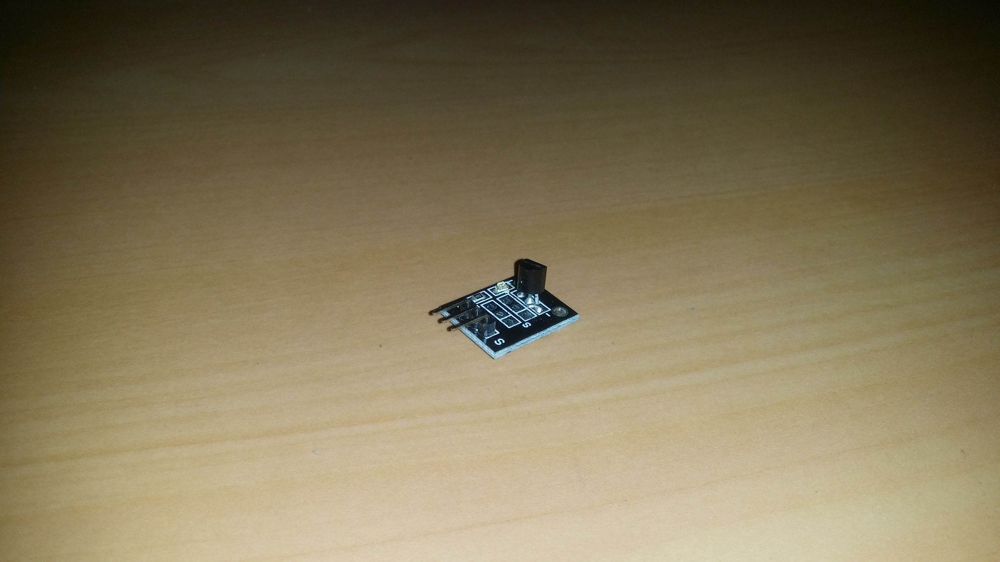
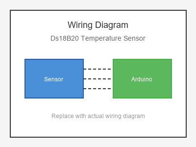

# KY-001 --- DS18B20 Temperature Sensor

## รายละเอียด

DS18B20 เป็นเซนเซอร์วัดอุณหภูมิดิจิตอลแบบ One-Wire จาก Maxim Integrated มีความแม่นยำสูง (±0.5°C) และสามารถต่อหลายตัวบนสายเดียวกันได้ (One-Wire Bus)

## คุณสมบัติ

- แรงดันไฟฟ้า: 3.0V - 5.5V DC
- ช่วงวัดอุณหภูมิ: -55°C ถึง +125°C
- ความแม่นยำ: ±0.5°C (ที่ -10°C ถึง +85°C)
- ความละเอียด: 9-12 bit (ปรับได้)
- สื่อสารแบบ 1-Wire Protocol

## ขาของเซนเซอร์

| ขา (Sensor) | สีสาย | เชื่อมต่อกับ (Lotus Nano Bot) |
|-------------|-------|------------------------------|
| VDD (VCC)   | แดง   | 5V                           |
| GND (DQ)    | ดำ   | GND                           |
| DQ (Data)   | เหลือง | D4 หรือ D7                  |

> **สำคัญ:** ต้องต่อตัวต้านทาน Pull-up 4.7KΩ ระหว่าง DQ และ VDD

## การต่อสายไฟ

```
DS18B20                  Lotus Nano Bot
━━━━━━━━━━━━━━━━━━━━━━━━━━━━━━━━━━━━━━━━
VDD  ──────────────────► 5V
GND  ──────────────────► GND
DQ   ──────────────────► D4

(ต่อตัวต้านทาน 4.7KΩ ระหว่าง DQ และ VDD)
```

### ภาพการต่อสาย (Text Diagram)

```
              +------------------+
              |    DS18B20       |
              |  Temperature     |
              |    Sensor        |
              |                  |
         +----+----+   +----+----+   +----+----+
         |  VDD    |   |  DQ     |   |  GND    |
         |   (+)   |   | (Data)  |   |   (-)   |
         +----+----+   +----+----+   +----+----+
              |             |             |
              |             |             |
         +----+----+   +----+----+   +----+----+
         |   5V    |   |   D4    |   |  GND    |
         |         |   |         |   |         |
         |  Lotus  |   |  Nano   |   |  Bot    |
         +---------+   +----+----+   +---------+
                            |
                       [4.7KΩ] |
                            |
                       +----+----+
                       |   5V    |
                       +---------+
```

## โค้ดตัวอย่าง

```cpp
// DS18B20 Temperature Sensor Example
// สำหรับ Lotus Nano Bot
// DQ -> D4 (ใช้ไลบรารี OneWire และ DallasTemperature)

#include <OneWire.h>
#include <DallasTemperature.h>

#define ONE_WIRE_BUS 4

OneWire oneWire(ONE_WIRE_BUS);
DallasTemperature sensors(&oneWire);

void setup() {
  Serial.begin(9600);
  sensors.begin();
  Serial.println("DS18B20 Temperature Sensor Test Started");
}

void loop() {
  sensors.requestTemperatures();
  float tempC = sensors.getTempCByIndex(0);
  
  if (tempC == DEVICE_DISCONNECTED_C) {
    Serial.println("❌ Sensor disconnected!");
  } else {
    Serial.print("🌡️  Temperature: ");
    Serial.print(tempC);
    Serial.println(" °C");
    
    float tempF = sensors.getTempFByIndex(0);
    Serial.print("🌡️  Temperature: ");
    Serial.print(tempF);
    Serial.println(" °F");
  }
  
  delay(1000);
}
```

## โค้ดตัวอย่างหลายเซนเซอร์บน One-Wire Bus

```cpp
#include <OneWire.h>
#include <DallasTemperature.h>

#define ONE_WIRE_BUS 4

OneWire oneWire(ONE_WIRE_BUS);
DallasTemperature sensors(&oneWire);

void setup() {
  Serial.begin(9600);
  sensors.begin();
  
  Serial.print("Found ");
  Serial.print(sensors.getDeviceCount());
  Serial.println(" sensor(s).");
}

void loop() {
  sensors.requestTemperatures();
  
  for (int i = 0; i < sensors.getDeviceCount(); i++) {
    float temp = sensors.getTempCByIndex(i);
    Serial.print("Sensor ");
    Serial.print(i);
    Serial.print(": ");
    Serial.print(temp);
    Serial.println(" °C");
  }
  
  Serial.println("---");
  delay(1000);
}
```

## วิธีติดตั้งไลบรารี

1. เปิด Arduino IDE
2. ไปที่ **Sketch > Include Library > Manage Libraries...**
3. ติดตั้ง **OneWire** โดย Paul Stoffregen
4. ติดตั้ง **DallasTemperature** โดย Miles Burton

## หมายเหตุ

- อย่าลืมต่อตัวต้านทาน Pull-up 4.7KΩ บน One-Wire Bus
- สามารถต่อหลายตัวได้บนสายเดียวกัน (Parasitic Mode ก็ทำได้โดยต่อ VDD กับ GND)
- แต่ละ DS18B20 มี Address ที่ไม่ซ้ำกัน (64-bit ROM)
- เวลาอ่านค่าขึ้นอยู่กับความละเอียดที่ตั้งไว้ (9-bit = 93ms, 12-bit = 750ms)

## รูปภาพ





