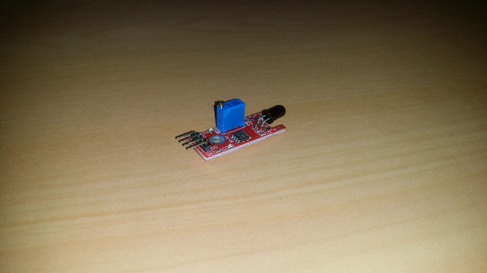
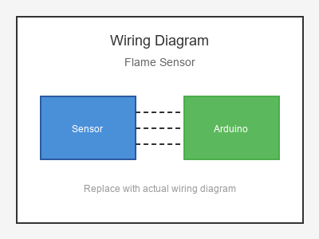

# KY-026 --- Flame Sensor

## รายละเอียด

Flame Sensor เป็นเซนเซอร์ตรวจจับเปลวไฟโดยใช้ Photodiode ที่ไวต่อแสงอินฟราเรด (IR) ความยาวคลื่น 760-1100 nm สามารถตรวจจับเปลวไฟจากระยะ 20-100 cm

## คุณสมบัติ

- แรงดันไฟฟ้า: 3.3V - 5V DC
- เอาต์พุต: Digital (DO) และ Analog (AO)
- ช่วงตรวจจับ: 760 - 1100 nm (แสง IR)
- ระยะตรวจจับ: 20 - 100 cm
- มีตัวปรับความไว (Potentiometer)

## ขาของเซนเซอร์

| ขา (Sensor) | สีสาย | เชื่อมต่อกับ (Lotus Nano Bot) |
|-------------|-------|------------------------------|
| VCC         | แดง   | 5V                           |
| GND         | ดำ/น้ำตาล | GND                       |
| DO (Digital)| เหลือง | D3 หรือ A0 (D14)          |
| AO (Analog) | ขาว   | A0, A1, A2, A3 หรือ A6     |

## การต่อสายไฟ

```
Flame Sensor             Lotus Nano Bot
━━━━━━━━━━━━━━━━━━━━━━━━━━━━━━━━━━━━━━━━
VCC  ──────────────────► 5V
GND  ──────────────────► GND
DO   ──────────────────► D3
AO   ──────────────────► A0 (optional)
```

### ภาพการต่อสาย (Text Diagram)

```
        +------------------+
        |   Flame Sensor   |
        |   (Fire IR)      |
        |    /\\\           |
        |   /  \\\          |
   +----+----+   +----+----+   +----+----+   +----+----+
   |  VCC    |   |  GND    |   |  DO     |   |  AO     |
   |   (+)   |   |   (-)   |   | (Digi)  |   | (Anlg)  |
   +----+----+   +----+----+   +----+----+   +----+----+
        |             |             |             |
        |             |             |             |
   +----+----+   +----+----+   +----+----+   +----+----+
   |   5V    |   |  GND    |   |   D3    |   |   A0    |
   |         |   |         |   |         |   |         |
   |  Lotus  |   |  Nano   |   |  Bot    |   |         |
   +---------+   +---------+   +---------+   +---------+
```

## โค้ดตัวอย่าง

```cpp
// Flame Sensor Example for Lotus Nano Bot
// DO -> D3, AO -> A0

#define FLAME_DIGITAL_PIN 3
#define FLAME_ANALOG_PIN A0
#define BUZZER_PIN 3  // บัซเซอร์บนบอร์ด Lotus Nano Bot

void setup() {
  Serial.begin(9600);
  pinMode(FLAME_DIGITAL_PIN, INPUT);
  Serial.println("Flame Sensor Test Started");
}

void loop() {
  int flameDigital = digitalRead(FLAME_DIGITAL_PIN);
  int flameAnalog = analogRead(FLAME_ANALOG_PIN);
  
  Serial.print("Digital: ");
  Serial.print(flameDigital);
  Serial.print(" | Analog: ");
  Serial.println(flameAnalog);
  
  // Digital: ปกติ HIGH, ตรวจพบไฟ = LOW (Active Low)
  if (flameDigital == LOW) {
    Serial.println("🔥 FLAME DETECTED!");
    tone(BUZZER_PIN, 2000, 200);
    delay(300);
  }
  
  delay(100);
}
```

## โค้ดตัวอย่างระบบป้องกันอัคคีภัย

```cpp
#define FLAME_ANALOG_PIN A0
#define FLAME_DIGITAL_PIN 3
#define BUZZER_PIN 3

void setup() {
  Serial.begin(9600);
  pinMode(FLAME_DIGITAL_PIN, INPUT);
}

void loop() {
  int flameLevel = analogRead(FLAME_ANALOG_PIN);
  
  Serial.print("Flame Level: ");
  Serial.println(flameLevel);
  
  // ค่ายิ่งต่ำ = ไฟยิ่งแรง (เพราะเป็น IR Photodiode)
  if (flameLevel < 500) {
    Serial.println("🔥 FIRE ALERT!");
    
    // สัญญาณเตือน
    for (int i = 0; i < 3; i++) {
      tone(BUZZER_PIN, 3000, 300);
      delay(400);
    }
  }
  
  delay(200);
}
```

## หมายเหตุ

- หมุนตัวปรับค่าเพื่อกำหนดความไวในการตรวจจับ
- ตรวจจับเฉพาะแสง IR จากเปลวไฟ ไม่ตอบสนองแสงปกติ
- แสงอาทิตย์มี IR อาจรบกวนการทำงาน
- **⚠️ คำเตือน:** เซนเซอร์นี้ใช้สำหรับตรวจจับเบื้องต้นเท่านั้น ไม่ใช่อุปกรณ์ป้องกันอัคคีภัยมาตรฐาน
- บน Lotus Nano Bot ใช้ D3 หรือ A0-A3 (เป็น Digital) และ A0-A3, A6 (Analog) ได้

## รูปภาพ





