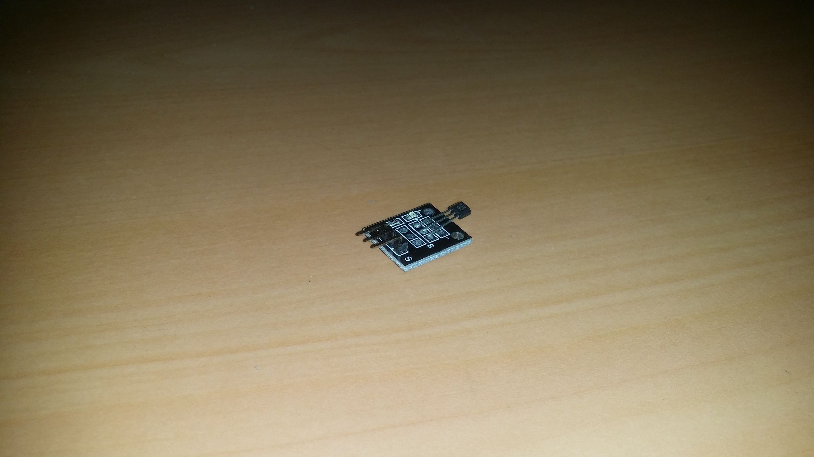
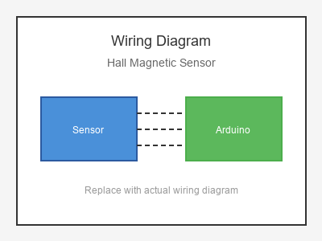

# KY-003 --- Hall Magnetic Sensor

## รายละเอียด

Hall Magnetic Sensor (Digital) เป็นเซนเซอร์ที่ใช้เอฟเฟกต์ฮอลล์ (Hall Effect) ตรวจจับสนามแม่เหล็ก ให้เอาต์พุตเป็นดิจิตอล HIGH/LOW เมื่อมีสนามแม่เหล็กเข้าใกล้เกินค่าที่กำหนด

## คุณสมบัติ

- แรงดันไฟฟ้า: 3.3V - 5V DC
- เอาต์พุต: Digital (DO) และ Analog (AO)
- มี LED แสดงสถานะ
- ตรวจจับขั้ว N และ S ของแม่เหล็ก

## ขาของเซนเซอร์

| ขา (Sensor) | สีสาย | เชื่อมต่อกับ (Lotus Nano Bot) |
|-------------|-------|------------------------------|
| VCC         | แดง   | 5V                           |
| GND         | ดำ/น้ำตาล | GND                       |
| DO (Digital)| เหลือง | D3 หรือ A0 (D14)          |
| AO (Analog) | ขาว   | A0, A1, A2, A3 หรือ A6     |

> **หมายเหตุ:** บน Lotus Nano Bot พอร์ต Digital ภายนอกมี D0, D1, D3 โดย D0/D1 ใช้กับ Bluetooth/Serial ส่วน D3 ใช้กับบัซเซอร์บนบอร์ด หากต้องการพอร์ต Digital เพิ่มสามารถใช้ A0-A3 เป็น Digital ได้ (A0=Pin14, A1=Pin15, A2=Pin16, A3=Pin17)

## การต่อสายไฟ

```
Hall Sensor              Lotus Nano Bot
━━━━━━━━━━━━━━━━━━━━━━━━━━━━━━━━━━━━━━━━
VCC  ──────────────────► 5V
GND  ──────────────────► GND
DO   ──────────────────► D3 หรือ A0 (D14)
AO   ──────────────────► A0 (optional)
```

### ภาพการต่อสาย (Text Diagram)

```
        +------------------+
        |  Hall Magnetic   |
        |  Sensor          |
        |                  |
   +----+----+   +----+----+   +----+----+   +----+----+
   |  VCC    |   |  GND    |   |  DO     |   |  AO     |
   |   (+)   |   |   (-)   |   | (Digi)  |   | (Anlg)  |
   +----+----+   +----+----+   +----+----+   +----+----+
        |             |             |             |
        |             |             |             |
   +----+----+   +----+----+   +----+----+   +----+----+
   |   5V    |   |  GND    |   |   D3    |   |   A0    |
   |         |   |         |   |         |   |         |
   |  Lotus  |   |  Nano   |   |  Bot    |   |         |
   +---------+   +---------+   +---------+   +---------+
```

## โค้ดตัวอย่าง

```cpp
// Hall Magnetic Sensor Example for Lotus Nano Bot
// DO -> D3

#define HALL_PIN 3  // หรือ 14 (A0)
#define LED_PIN 13

void setup() {
  Serial.begin(9600);
  pinMode(HALL_PIN, INPUT);
  pinMode(LED_PIN, OUTPUT);
  Serial.println("Hall Magnetic Sensor Test Started");
}

void loop() {
  int state = digitalRead(HALL_PIN);
  
  if (state == LOW) {  // แม่เหล็กเข้าใกล้ (Active Low)
    Serial.println("🧲 Magnet Detected!");
    digitalWrite(LED_PIN, HIGH);
  } else {
    Serial.println("❌ No Magnet");
    digitalWrite(LED_PIN, LOW);
  }
  
  delay(200);
}
```

## โค้ดตัวอย่างแบบ Analog

```cpp
// Hall Sensor Analog Reading
// AO -> A0

#define HALL_ANALOG_PIN A0
#define LED_PIN 13

void setup() {
  Serial.begin(9600);
  pinMode(LED_PIN, OUTPUT);
}

void loop() {
  int rawValue = analogRead(HALL_ANALOG_PIN);
  float voltage = rawValue * (5.0 / 1023.0);
  
  Serial.print("Raw Value: ");
  Serial.print(rawValue);
  Serial.print(" | Voltage: ");
  Serial.print(voltage);
  Serial.println(" V");
  
  // ค่าปกติประมาณ 2.5V, เมื่อมีแม่เหล็กจะเปลี่ยนไป
  if (rawValue > 600 || rawValue < 400) {
    digitalWrite(LED_PIN, HIGH);
  } else {
    digitalWrite(LED_PIN, LOW);
  }
  
  delay(200);
}
```

## หมายเหตุ

- ตรวจสอบว่าเซนเซอร์เป็น Active High หรือ Active Low ก่อนใช้งาน
- สามารถปรับความไวได้ที่ตัวปรับค่า (Potentiometer) บางรุ่น
- ใช้ได้กับการนับรอบของมอเตอร์ที่มีแม่เหล็กติดอยู่
- ระยะตรวจจับขึ้นอยู่กับความแรงของแม่เหล็ก

## รูปภาพ





