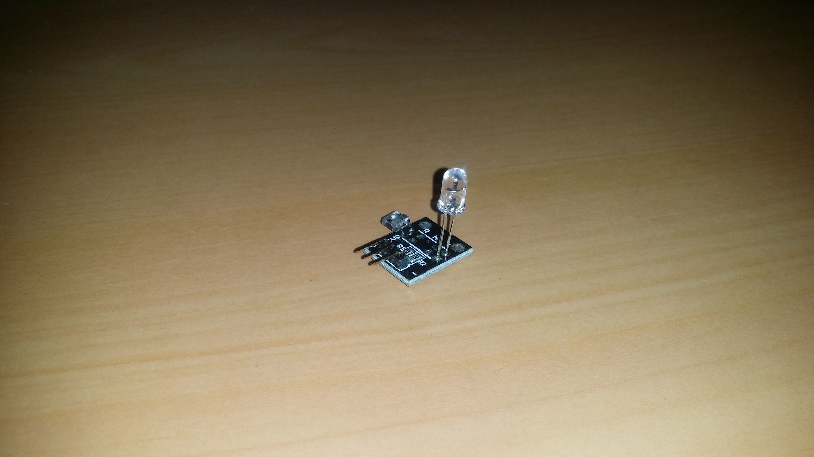
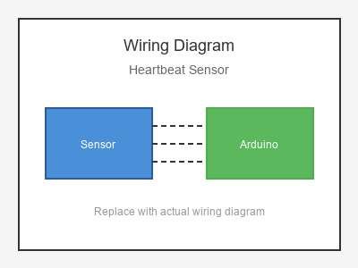

# KY-039 --- Heartbeat Sensor

## รายละเอียด

Heartbeat Sensor หรือ Pulse Sensor เป็นเซนเซอร์ที่ใช้ตรวจจับอัตราการเต้นของหัวใจผ่านการวัดการไหลเวียนของเลือด โดยใช้แสง LED สีเขียวและ Photodiode ตรวจจับการเปลี่ยนแปลงของแสงที่สะท้อนกลับจากผิวหนัง

## คุณสมบัติ

- แรงดันไฟฟ้า: 3.3V - 5V DC
- เอาต์พุต: Analog (AO) และ Digital (DO)
- ใช้ LED สีเขียวที่มีความยาวคลื่น 525 nm
- มีตัวปรับความไว (Potentiometer)

## ขาของเซนเซอร์

| ขา (Sensor) | สีสาย | เชื่อมต่อกับ (Lotus Nano Bot) |
|-------------|-------|------------------------------|
| VCC         | แดง   | 5V หรือ 3.3V                 |
| GND         | ดำ/น้ำตาล | GND                       |
| DO (Digital)| เหลือง | D3 (optional)             |
| AO (Analog) | ม่วง  | A0, A1, A2, A3 หรือ A6    |

> **หมายเหตุ:** บน Lotus Nano Bot พอร์ต Digital ภายนอกมี D0, D1, D3 โดย D0/D1 ใช้กับ Bluetooth/Serial ส่วน D3 ใช้กับบัซเซอร์บนบอร์ด หากต้องการพอร์ต Digital เพิ่มสามารถใช้ A0-A3 เป็น Digital ได้ (A0=Pin14, A1=Pin15, A2=Pin16, A3=Pin17)

## การต่อสายไฟ

```
Heartbeat Sensor         Lotus Nano Bot
━━━━━━━━━━━━━━━━━━━━━━━━━━━━━━━━━━━━━━━━
VCC  ──────────────────► 5V
GND  ──────────────────► GND
AO   ──────────────────► A0
DO   ──────────────────► D3 (optional)
```

### ภาพการต่อสาย (Text Diagram)

```
        +------------------+
        |  Heartbeat       |
        |  Sensor          |
        |   (o o)          |
        |                  |
   +----+----+   +----+----+   +----+----+   +----+----+
   |  VCC    |   |  GND    |   |  AO     |   |  DO     |
   |   (+)   |   |   (-)   |   | (Anlg)  |   | (Digi)  |
   +----+----+   +----+----+   +----+----+   +----+----+
        |             |             |             |
        |             |             |             |
   +----+----+   +----+----+   +----+----+   +----+----+
   |   5V    |   |  GND    |   |   A0    |   |   D3    |
   |         |   |         |   |         |   |         |
   |  Lotus  |   |  Nano   |   |  Bot    |   |         |
   +---------+   +---------+   +---------+   +---------+
```

## โค้ดตัวอย่าง (พื้นฐาน)

```cpp
// Heartbeat Sensor Basic Example for Lotus Nano Bot
// AO -> A0

#define HEARTBEAT_PIN A0
#define LED_PIN 13

void setup() {
  Serial.begin(9600);
  pinMode(LED_PIN, OUTPUT);
  Serial.println("Heartbeat Sensor Test Started");
}

void loop() {
  int rawValue = analogRead(HEARTBEAT_PIN);
  
  Serial.println(rawValue);
  
  // ค่าปกติอยู่ที่ประมาณ 500-600
  // เมื่อมี pulse จะมีค่าสูงขึ้น
  if (rawValue > 600) {
    digitalWrite(LED_PIN, HIGH);
  } else {
    digitalWrite(LED_PIN, LOW);
  }
  
  delay(20);  // อ่านค่าทุก 20 ms (50 Hz)
}
```

## โค้ดตัวอย่างคำนวณ BPM (Beats Per Minute)

```cpp
// Heartbeat BPM Calculation
// AO -> A0

#define HEARTBEAT_PIN A0
#define LED_PIN 13

int previousValue = 0;
unsigned long lastBeatTime = 0;
int bpm = 0;
bool pulseDetected = false;

void setup() {
  Serial.begin(9600);
  pinMode(LED_PIN, OUTPUT);
  Serial.println("Heartbeat BPM Monitor");
}

void loop() {
  int rawValue = analogRead(HEARTBEAT_PIN);
  
  // หาจุดสูงสุด (Peak detection)
  if (rawValue > 600 && !pulseDetected) {
    pulseDetected = true;
    
    unsigned long currentTime = millis();
    unsigned long beatInterval = currentTime - lastBeatTime;
    lastBeatTime = currentTime;
    
    // คำนวณ BPM
    if (beatInterval > 0) {
      bpm = 60000 / beatInterval;
      
      if (bpm > 40 && bpm < 200) {  // กรองค่าที่ไม่สมจริง
        Serial.print("❤️  BPM: ");
        Serial.println(bpm);
        digitalWrite(LED_PIN, HIGH);
      }
    }
  }
  
  if (rawValue < 550) {
    pulseDetected = false;
    digitalWrite(LED_PIN, LOW);
  }
  
  previousValue = rawValue;
  delay(20);
}
```

## วิธีใช้งาน

1. วางนิ้วชี้บนเซนเซอร์ให้เบาๆ
2. ไม่ควรกดแรงเกินไป (อาจทำให้เลือดไหลไม่สะดวก)
3. รอ 5-10 วินาทีเพื่อให้เซนเซอร์ stabilize
4. หมุนตัวปรับค่าให้ LED บนโมดูลกระพริบตามจังหวะการเต้นของหัวใจ

## หมายเหตุ

- ค่าที่วัดได้อาจไม่แม่นยำเท่าอุปกรณ์ทางการแพทย์
- การเคลื่อนไหวของนิ้วอาจทำให้ค่าผิดพลาด
- แนะนำให้ใช้ไลบรารี `PulseSensor Playground` สำหรับโครงการจริง

## รูปภาพ





