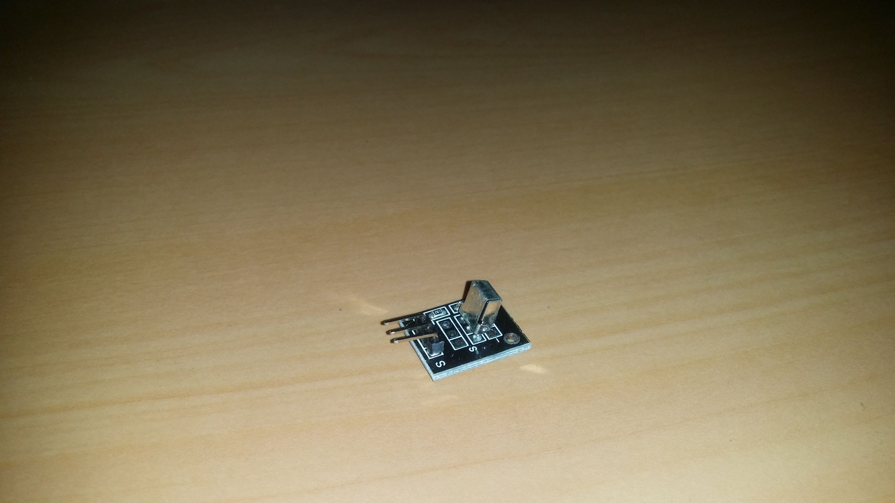
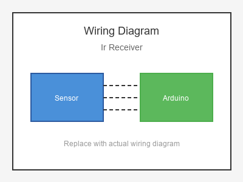

# KY-022 --- IR Receiver Module

## รายละเอียด

IR Receiver Module เป็นเซนเซอร์รับสัญญาณอินฟราเรด ใช้ตรวจจับสัญญาณจากรีโมทคอนโทรล IR โดยทั่วไป มี Demodulator ในตัวสำหรับความถี่ 38 kHz

## คุณสมบัติ

- แรงดันไฟฟ้า: 3.3V - 5V DC
- ความถี่รับ: 38 kHz (มาตรฐาน)
- เอาต์พุต: Digital (Active LOW)
- มีตัวกรองแสงรบกวน

## ขาของ IR Receiver

| ขา (Module) | สีสาย | เชื่อมต่อกับ (Lotus Nano Bot) |
|-------------|-------|------------------------------|
| VCC         | แดง   | 5V                           |
| GND         | ดำ/น้ำตาล | GND                       |
| OUT (DATA)  | เหลือง | D3 หรือ A0 (D14)            |

> **⚠️ หมายเหตุ:** D3 ใช้โดย Onboard Buzzer ของ Lotus Nano Bot หากต้องการหลีกเลี่ยงให้ใช้ A0 (D14)

## การต่อสายไฟ

```
IR Receiver              Lotus Nano Bot
━━━━━━━━━━━━━━━━━━━━━━━━━━━━━━━━━━━━━━━━
VCC  ──────────────────► 5V
GND  ──────────────────► GND
OUT  ──────────────────► D3
```

### ภาพการต่อสาย (Text Diagram)

```
        +------------------+
        |  IR Receiver     |
        |  Module          |
        |    [=]           |
        |                  |
   +----+----+   +----+----+   +----+----+
   |  VCC    |   |  GND    |   |  OUT    |
   |   (+)   |   |   (-)   |   | (Data)  |
   +----+----+   +----+----+   +----+----+
        |             |             |
        |             |             |
   +----+----+   +----+----+   +----+----+
   |   5V    |   |  GND    |   |   D3    |
   |         |   |         |   |         |
   |  Lotus  |   |  Nano   |   |  Bot    |
   +---------+   +---------+   +---------+
```

## โค้ดตัวอย่าง

```cpp
// IR Receiver Example for Lotus Nano Bot
// OUT -> D3

#include <IRremote.h>

#define IR_RECEIVE_PIN 3

IRrecv irrecv(IR_RECEIVE_PIN);
decode_results results;

void setup() {
  Serial.begin(9600);
  irrecv.enableIRIn();
  Serial.println("IR Receiver Test Started");
  Serial.println("Point remote at sensor and press buttons...");
}

void loop() {
  if (irrecv.decode(&results)) {
    Serial.print("📡 IR Code: 0x");
    Serial.print(results.value, HEX);
    Serial.print(" (DEC: ");
    Serial.print(results.value);
    Serial.println(")");
    
    irrecv.resume();
  }
  
  delay(100);
}
```

## โค้ดตัวอย่างควบคุม LED ด้วยรีโมท

```cpp
#include <IRremote.h>

#define IR_RECEIVE_PIN 3
#define LED_PIN 13

IRrecv irrecv(IR_RECEIVE_PIN);
decode_results results;

bool ledState = false;

void setup() {
  Serial.begin(9600);
  irrecv.enableIRIn();
  pinMode(LED_PIN, OUTPUT);
}

void loop() {
  if (irrecv.decode(&results)) {
    unsigned long code = results.value;
    
    // ตัวอย่างรหัสรีโมท (รหัสจริงอาจแตกต่างกัน)
    switch (code) {
      case 0xFFA25D:  // ปุ่ม ON/OFF (ตัวอย่าง)
        ledState = !ledState;
        digitalWrite(LED_PIN, ledState);
        Serial.println(ledState ? "LED ON" : "LED OFF");
        break;
        
      case 0xFF629D:  // ปุ่ม Vol+ (ตัวอย่าง)
        Serial.println("Volume Up");
        break;
        
      case 0xFFE21D:  // ปุ่ม Vol- (ตัวอย่าง)
        Serial.println("Volume Down");
        break;
    }
    
    irrecv.resume();
  }
}
```

## วิธีติดตั้งไลบรารี

1. เปิด Arduino IDE
2. ไปที่ **Sketch > Include Library > Manage Libraries...**
3. ค้นหา "IRremote" โดย shirriff / z3t0
4. คลิก **Install**

## หมายเหตุ

- รหัสปุ่มรีโมทแต่ละยี่ห้อจะแตกต่างกัน ให้ใช้โค้ดตัวอย่างแรกเพื่ออ่านรหัสก่อน
- ต้องใช้รีโมทที่ส่งสัญญาณ 38 kHz (รีโมททีวี/แอร์ส่วนใหญ่)
- หากใช้ IRremote เวอร์ชันใหม่ (v3.0+) ให้ใช้ `#include <IRremote.hpp>`
- ระยะรับสัญญาณประมาณ 5-10 เมตร (ขึ้นอยู่กับรีโมท)

## รูปภาพ





