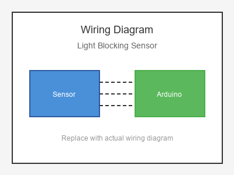

# KY-010 --- Light Blocking Sensor

## รายละเอียด

Light Blocking Sensor หรือ Slot-type IR Sensor เป็นเซนเซอร์ที่มีช่องว่างระหว่าง IR LED และ IR Receiver เมื่อมีวัตถุเข้ามาบดบังช่องว่าง เอาต์พุตจะเปลี่ยนสถานะ ใช้นับจำนวนวัตถุหรือตรวจจับการหมุน

## คุณสมบัติ

- แรงดันไฟฟ้า: 3.3V - 5V DC
- เอาต์พุต: Digital (DO) และ Analog (AO)
- มี LED แสดงสถานะ
- มีตัวปรับความไว (Potentiometer)

## ขาของเซนเซอร์

| ขา (Sensor) | สีสาย | เชื่อมต่อกับ (Lotus Nano Bot) |
|-------------|-------|------------------------------|
| VCC         | แดง   | 5V                           |
| GND         | ดำ/น้ำตาล | GND                       |
| DO (Digital)| เหลือง | D3 หรือ A0 (D14)          |
| AO (Analog) | ขาว   | A0 (optional)              |

## การต่อสายไฟ

```
Light Blocking Sensor    Lotus Nano Bot
━━━━━━━━━━━━━━━━━━━━━━━━━━━━━━━━━━━━━━━━
VCC  ──────────────────► 5V
GND  ──────────────────► GND
DO   ──────────────────► D3
AO   ──────────────────► A0 (optional)
```

### ภาพการต่อสาย (Text Diagram)

```
        +------------------+
        |  Light Blocking  |
        |  Sensor          |
        |   [= =]          |
        |  Slot Type       |
   +----+----+   +----+----+   +----+----+   +----+----+
   |  VCC    |   |  GND    |   |  DO     |   |  AO     |
   |   (+)   |   |   (-)   |   | (Digi)  |   | (Anlg)  |
   +----+----+   +----+----+   +----+----+   +----+----+
        |             |             |             |
        |             |             |             |
   +----+----+   +----+----+   +----+----+   +----+----+
   |   5V    |   |  GND    |   |   D3    |   |   A0    |
   |         |   |         |   |         |   |         |
   |  Lotus  |   |  Nano   |   |  Bot    |   |         |
   +---------+   +---------+   +---------+   +---------+
```

## โค้ดตัวอย่าง

```cpp
// Light Blocking Sensor Example for Lotus Nano Bot
// DO -> D3

#define BLOCKING_PIN 3

int count = 0;
int lastState = HIGH;

void setup() {
  Serial.begin(9600);
  pinMode(BLOCKING_PIN, INPUT);
  Serial.println("Light Blocking Sensor Test Started");
}

void loop() {
  int state = digitalRead(BLOCKING_PIN);
  
  if (state != lastState && state == LOW) {
    count++;
    Serial.print("🚫 Object Detected! Count: ");
    Serial.println(count);
  }
  
  lastState = state;
  delay(10);
}
```

## โค้ดตัวอย่างนับรอบมอเตอร์ (Encoder)

```cpp
#define BLOCKING_PIN 3

volatile int count = 0;

void setup() {
  Serial.begin(9600);
  pinMode(BLOCKING_PIN, INPUT);
  attachInterrupt(digitalPinToInterrupt(BLOCKING_PIN), countPulse, FALLING);
}

void loop() {
  Serial.print("Rotations: ");
  Serial.println(count / 20);  // สมมติ 20 รูต่อรอบ
  delay(500);
}

void countPulse() {
  count++;
}
```

## หมายเหตุ

- ใช้ attachInterrupt ที่ D3 (Interrupt 1 บน Nano) เพื่อนับแม่นยำ
- วางวงแหวนรูระหว่างช่องเซนเซอร์เพื่อนับรอบมอเตอร์
- หมุนตัวปรับค่าให้ LED เปลี่ยนสถานะตรงจุดที่ต้องการ
- บน Lotus Nano Bot D3 รองรับ Interrupt (INT1)

## รูปภาพ




