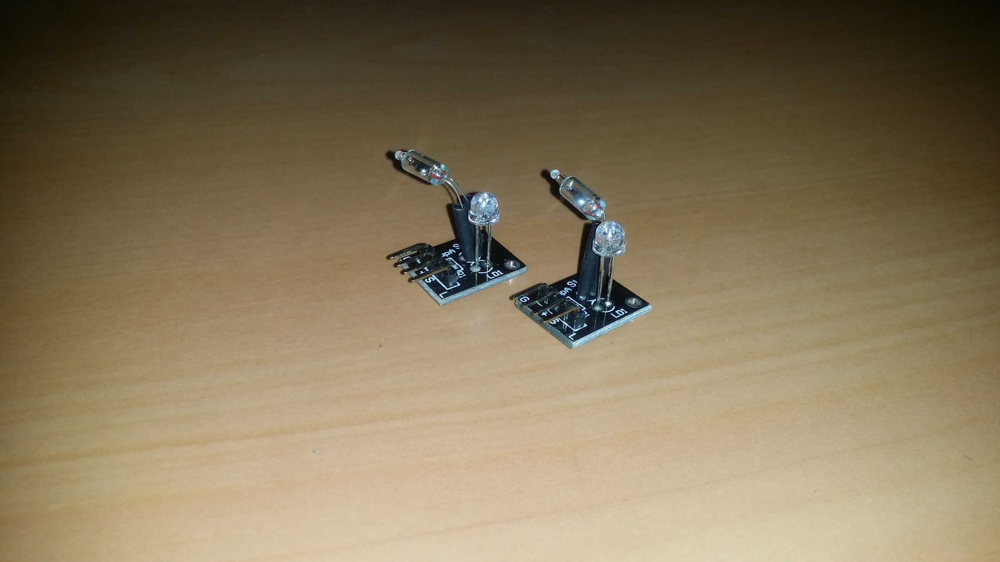
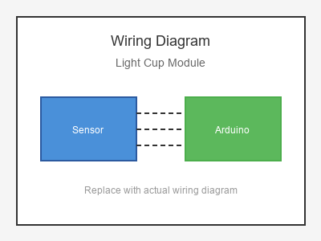

# KY-027 --- Magic Light Cup Module

## รายละเอียด

Light Cup Module เป็นโมดูลประกอบด้วย Photoresistor (LDR) อยู่ภายในถ้วยสีดำ เพื่อป้องกันแสงรบกวนจากด้านข้าง ใช้ตรวจจับแสงที่ตกกระทบจากด้านบนโดยตรง

## คุณสมบัติ

- แรงดันไฟฟ้า: 3.3V - 5V DC
- เอาต์พุต: Digital (DO) และ Analog (AO)
- มีตัวปรับความไว (Potentiometer) ในตัว
- ถ้วยสีดำช่วยลดแสงรบกวน

## ขาของโมดูล

| ขา (Module) | สีสาย | เชื่อมต่อกับ (Lotus Nano Bot) |
|-------------|-------|------------------------------|
| VCC         | แดง   | 5V                           |
| GND         | ดำ/น้ำตาล | GND                       |
| DO (Digital)| เหลือง | D3 หรือ A0 (D14)          |
| AO (Analog) | ขาว   | A0, A1, A2, A3 หรือ A6     |

> **หมายเหตุ:** บน Lotus Nano Bot พอร์ต Digital ภายนอกมี D0, D1, D3 โดย D0/D1 ใช้กับ Bluetooth/Serial ส่วน D3 ใช้กับบัซเซอร์บนบอร์ด หากต้องการพอร์ต Digital เพิ่มสามารถใช้ A0-A3 เป็น Digital ได้ (A0=Pin14, A1=Pin15, A2=Pin16, A3=Pin17)

## การต่อสายไฟ

```
Light Cup Module         Lotus Nano Bot
━━━━━━━━━━━━━━━━━━━━━━━━━━━━━━━━━━━━━━━━
VCC  ──────────────────► 5V
GND  ──────────────────► GND
DO   ──────────────────► D3 หรือ A0 (D14)
AO   ──────────────────► A0 (optional)
```

### ภาพการต่อสาย (Text Diagram)

```
        +------------------+
        |    Light Cup     |
        |    Module        |
        |   (  LDR  )      |
        |    \   /         |
   +----+----+   +----+----+   +----+----+   +----+----+
   |  VCC    |   |  GND    |   |  DO     |   |  AO     |
   |   (+)   |   |   (-)   |   | (Digi)  |   | (Anlg)  |
   +----+----+   +----+----+   +----+----+   +----+----+
        |             |             |             |
        |             |             |             |
   +----+----+   +----+----+   +----+----+   +----+----+
   |   5V    |   |  GND    |   |   D3    |   |   A0    |
   |         |   |         |   |         |   |         |
   |  Lotus  |   |  Nano   |   |  Bot    |   |         |
   +---------+   +---------+   +---------+   +---------+
```

## โค้ดตัวอย่าง

```cpp
// Light Cup Module Example for Lotus Nano Bot
// DO -> D3, AO -> A0

#define LIGHT_CUP_DIGITAL_PIN 3  // หรือ 14 (A0)
#define LIGHT_CUP_ANALOG_PIN A0
#define LED_PIN 13

void setup() {
  Serial.begin(9600);
  pinMode(LIGHT_CUP_DIGITAL_PIN, INPUT);
  pinMode(LED_PIN, OUTPUT);
  Serial.println("Light Cup Module Test Started");
}

void loop() {
  int digitalValue = digitalRead(LIGHT_CUP_DIGITAL_PIN);
  int analogValue = analogRead(LIGHT_CUP_ANALOG_PIN);
  
  Serial.print("Digital: ");
  Serial.print(digitalValue);
  Serial.print(" | Analog: ");
  Serial.println(analogValue);
  
  // Digital: ปกติ HIGH, เมื่อแสงน้อยเกินเกณฑ์จะเป็น LOW
  if (digitalValue == LOW) {
    Serial.println("🌑 Dark Detected!");
    digitalWrite(LED_PIN, HIGH);
  } else {
    Serial.println("💡 Light Present");
    digitalWrite(LED_PIN, LOW);
  }
  
  delay(200);
}
```

## โค้ดตัวอย่างอ่านค่า Lux ประมาณ

```cpp
// แปลงค่า Analog เป็นค่าความสว่างโดยประมาณ
#define LIGHT_CUP_PIN A0

void setup() {
  Serial.begin(9600);
}

void loop() {
  int rawValue = analogRead(LIGHT_CUP_PIN);
  
  // ค่ายิ่งต่ำ = แสงยิ่งน้อย, ค่ายิ่งสูง = แสงยิ่งมาก
  float brightnessPercent = map(rawValue, 0, 1023, 0, 100);
  
  Serial.print("Raw: ");
  Serial.print(rawValue);
  Serial.print(" | Brightness: ");
  Serial.print(brightnessPercent);
  Serial.println("%");
  
  delay(500);
}
```

## หมายเหตุ

- หมุนตัวปรับค่าให้ LED บนโมดูลเปลี่ยนสถานะตรงจุดที่ต้องการ
- ถ้วยสีดำช่วยให้เซนเซอร์ตอบสนองเฉพาะแสงจากด้านบน
- เหมาะสำหรับใช้ตรวจจับวัตถุที่ผ่านเข้ามาบดบังแสง

## รูปภาพ





