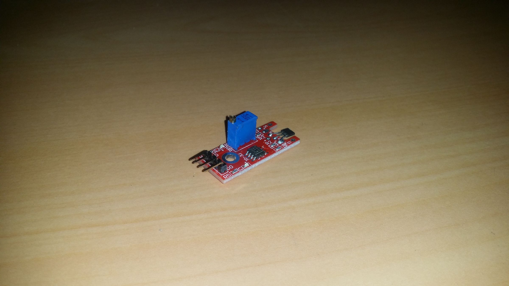
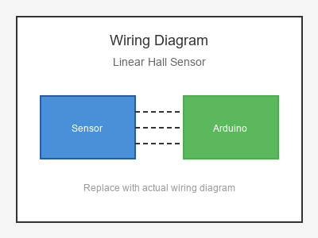

# KY-024 --- Linear Hall Sensor

## รายละเอียด

Linear Hall Sensor เป็นเซนเซอร์แม่เหล็กแบบเชิงเส้น ให้ค่าแรงดันเอาต์พุตเปลี่ยนแปลงเชิงเส้นตามความเข้มของสนามแม่เหล็ก สามารถวัดทิศทางและความแรงของแม่เหล็กได้อย่างละเอียด

## คุณสมบัติ

- แรงดันไฟฟ้า: 3.3V - 5V DC
- เอาต์พุต: Digital (DO) และ Analog (AO)
- มี LED แสดงสถานะ
- มีตัวปรับค่า (Potentiometer)

## ขาของเซนเซอร์

| ขา (Sensor) | สีสาย | เชื่อมต่อกับ (Lotus Nano Bot) |
|-------------|-------|------------------------------|
| VCC         | แดง   | 5V                           |
| GND         | ดำ/น้ำตาล | GND                       |
| DO (Digital)| เหลือง | D3 หรือ A0 (D14)          |
| AO (Analog) | ขาว   | A0, A1, A2, A3 หรือ A6     |

## การต่อสายไฟ

```
Linear Hall Sensor       Lotus Nano Bot
━━━━━━━━━━━━━━━━━━━━━━━━━━━━━━━━━━━━━━━━
VCC  ──────────────────► 5V
GND  ──────────────────► GND
DO   ──────────────────► D3 (optional)
AO   ──────────────────► A0
```

### ภาพการต่อสาย (Text Diagram)

```
        +------------------+
        |  Linear Hall     |
        |  Sensor          |
        |                  |
   +----+----+   +----+----+   +----+----+   +----+----+
   |  VCC    |   |  GND    |   |  DO     |   |  AO     |
   |   (+)   |   |   (-)   |   | (Digi)  |   | (Anlg)  |
   +----+----+   +----+----+   +----+----+   +----+----+
        |             |             |             |
        |             |             |             |
   +----+----+   +----+----+   +----+----+   +----+----+
   |   5V    |   |  GND    |   |   D3    |   |   A0    |
   |         |   |         |   |         |   |         |
   |  Lotus  |   |  Nano   |   |  Bot    |   |         |
   +---------+   +---------+   +---------+   +---------+
```

## โค้ดตัวอย่าง

```cpp
// Linear Hall Sensor Example for Lotus Nano Bot
// AO -> A0, DO -> D3 (optional)

#define HALL_ANALOG_PIN A0
#define HALL_DIGITAL_PIN 3

void setup() {
  Serial.begin(9600);
  pinMode(HALL_DIGITAL_PIN, INPUT);
  Serial.println("Linear Hall Sensor Test Started");
}

void loop() {
  int analogValue = analogRead(HALL_ANALOG_PIN);
  float voltage = analogValue * (5.0 / 1023.0);
  int digitalValue = digitalRead(HALL_DIGITAL_PIN);
  
  Serial.print("Analog: ");
  Serial.print(analogValue);
  Serial.print(" (");
  Serial.print(voltage);
  Serial.print(" V) | Digital: ");
  Serial.println(digitalValue);
  
  // ค่าปกติประมาณ 2.5V (512)
  if (analogValue > 550) {
    Serial.println("🧲 South Pole / Strong Field (+)");
  } else if (analogValue < 470) {
    Serial.println("🧲 North Pole / Strong Field (-)");
  } else {
    Serial.println("❌ No Significant Field");
  }
  
  delay(200);
}
```

## หมายเหตุ

- ค่าปกติประมาณ 2.5V (512) เมื่อไม่มีแม่เหล็ก
- ค่าสูงขึ้นเมื่อแม่เหล็กขั้ว S เข้าใกล้
- ค่าต่ำลงเมื่อแม่เหล็กขั้ว N เข้าใกล้
- ใช้ได้กับการวัดระยะทางด้วยแม่เหล็ก, นับรอบมอเตอร์
- บน Lotus Nano Bot ใช้ A0-A3, A6 สำหรับอ่านค่าอนาลอก

## รูปภาพ





