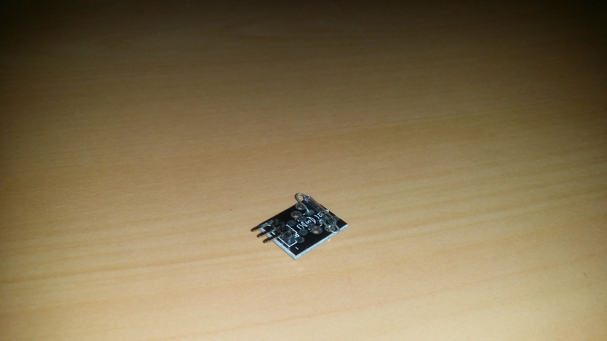
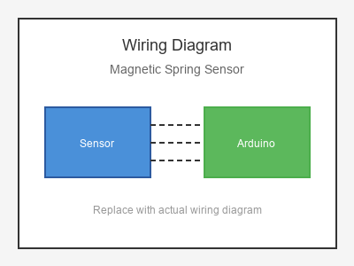

# KY-021 --- Mini Reed / Magnetic Spring Sensor

## รายละเอียด

Magnetic Spring Sensor เป็นเซนเซอร์ตรวจจับแม่เหล็กแบบ Mechanical Switch คล้าย Reed Switch แต่มี Spring ช่วยให้ตอบสนองเร็วขึ้น เหมาะสำหรับตรวจจับการเคลื่อนที่หรือการสั่นสะเทือนร่วมกับแม่เหล็ก

## คุณสมบัติ

- ไม่ใช้แรงดันไฟฟ้า (Switch แบบ Passive)
- ตรวจจับสนามแม่เหล็ก
- ตอบสนองเร็วกว่า Reed Switch ทั่วไป
- ทนทานต่อการสั่นสะเทือน

## ขาของเซนเซอร์

| ขา (Sensor) | สีสาย | เชื่อมต่อกับ (Lotus Nano Bot) |
|-------------|-------|------------------------------|
| ขา 1        | สีใดก็ได้ | D3 หรือ A0 (D14) (ผ่าน Pull-up) |
| ขา 2        | สีใดก็ได้ | GND                         |

## การต่อสายไฟ

```
Magnetic Spring Sensor   Lotus Nano Bot
━━━━━━━━━━━━━━━━━━━━━━━━━━━━━━━━━━━━━━━━
ขา 1 ──────────────────► D3 หรือ A0 (D14) (INPUT_PULLUP)
ขา 2 ──────────────────► GND
```

### ภาพการต่อสาย (Text Diagram)

```
        +------------------+
        | Magnetic Spring  |
        |    Sensor        |
        |   (Switch)       |
        +----+------+------+
             |      |
             |      |
        +----+----+  +----+----+
        |   D3    |  |  GND    |
        | (Input) |  |         |
        |  Lotus  |  |  Nano   |
        |  Nano   |  |  Bot    |
        +---------+  +---------+
```

## โค้ดตัวอย่าง

```cpp
// Magnetic Spring Sensor Example for Lotus Nano Bot
// ต่อขา 1 -> D3, ขา 2 -> GND

#define MAG_SPRING_PIN 3
#define LED_PIN 13

void setup() {
  Serial.begin(9600);
  pinMode(MAG_SPRING_PIN, INPUT_PULLUP);
  pinMode(LED_PIN, OUTPUT);
  Serial.println("Magnetic Spring Sensor Test Started");
}

void loop() {
  int state = digitalRead(MAG_SPRING_PIN);
  
  if (state == LOW) {  // แม่เหล็กเข้าใกล้
    Serial.println("🧲 Magnet Detected!");
    digitalWrite(LED_PIN, HIGH);
  } else {
    Serial.println("❌ No Magnet");
    digitalWrite(LED_PIN, LOW);
  }
  
  delay(200);
}
```

## หมายเหตุ

- ใช้ `INPUT_PULLUP` เพื่อไม่ต้องต่อตัวต้านทาน Pull-up ภายนอก
- ตอบสนองเร็วกว่า Reed Switch ทั่วไป
- เหมาะสำหรับใช้กับมอเตอร์ที่มีแม่เหล็กหมุนเร็ว
- บน Lotus Nano Bot ใช้ D3 หรือ A0-A3 (เป็น Digital) ได้

## รูปภาพ





