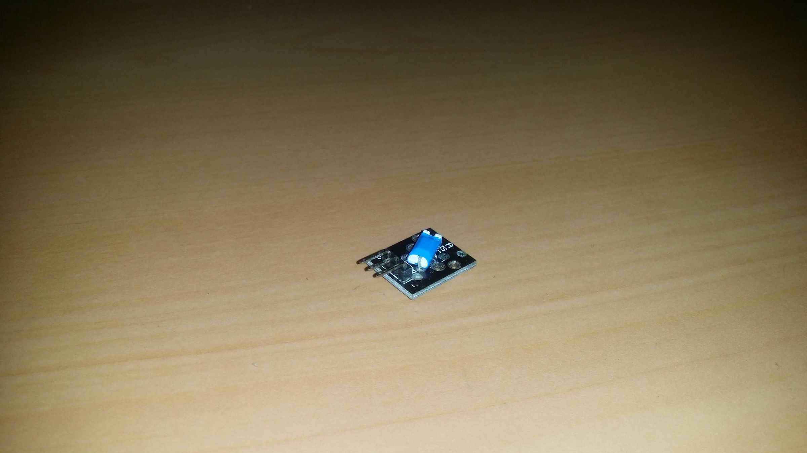
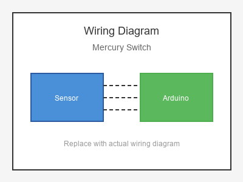

# KY-020 --- Ball Switch / Mercury Switch

## รายละเอียด

Mercury Switch หรือ Tilt Switch แบบปรอท เป็นอุปกรณ์ตรวจจับการเอียง/การสั่นสะเทือน ภายในหลอดแก้วมีหยดปรอท (Mercury) เมื่อเอียงหลอด ปรอทจะไหลไปสัมผัสขาทั้งสองทำให้เป็นตัวนำไฟฟ้า (Switch Closed)

## คุณสมบัติ

- ไม่ใช้แรงดันไฟฟ้า (Switch แบบ Passive)
- ทำงานเหมือน Switch ธรรมดา
- ตรวจจับการเอียงหรือการสั่นสะเทือน
- อายุการใช้งานยาวนาน

## ขาของ Mercury Switch

| ขา (Switch) | สีสาย | เชื่อมต่อกับ (Lotus Nano Bot) |
|-------------|-------|------------------------------|
| ขา 1        | สีใดก็ได้ | D3 หรือ A0 (D14) (ผ่าน Pull-up) |
| ขา 2        | สีใดก็ได้ | GND                             |

> **หมายเหตุ:** บน Lotus Nano Bot พอร์ต Digital ภายนอกมี D0, D1, D3 โดย D0/D1 ใช้กับ Bluetooth/Serial ส่วน D3 ใช้กับบัซเซอร์บนบอร์ด หากต้องการพอร์ต Digital เพิ่มสามารถใช้ A0-A3 เป็น Digital ได้ (A0=Pin14, A1=Pin15, A2=Pin16, A3=Pin17)

> **สำคัญ:** ต้องต่อตัวต้านทาน Pull-up 10KΩ ระหว่างขา 1 และ 5V หรือใช้ `INPUT_PULLUP`

## การต่อสายไฟ

```
Mercury Switch           Lotus Nano Bot
━━━━━━━━━━━━━━━━━━━━━━━━━━━━━━━━━━━━━━━━
ขา 1 ──────────────────► D3 (ใช้ INPUT_PULLUP)
ขา 2 ──────────────────► GND
```

### ภาพการต่อสาย (Text Diagram)

```
        +------------------+
        |  Mercury Switch  |
        |   (Tilt Switch)  |
        |    o ~~~ o       |
        |   [ Hg  ]        |
        +----+------+------+
             |      |
             |      |
        +----+----+  +----+----+
        |   D3    |  |  GND    |
        | (Input) |  |         |
        |  Lotus  |  |  Nano   |
        |  Nano   |  |  Bot    |
        +---------+  +---------+
```

## โค้ดตัวอย่าง

```cpp
// Mercury Switch / Tilt Switch Example
// สำหรับ Lotus Nano Bot
// ต่อขา 1 -> D3, ขา 2 -> GND

#define MERCURY_PIN 3  // หรือ 14 (A0)
#define LED_PIN 13

void setup() {
  Serial.begin(9600);
  pinMode(MERCURY_PIN, INPUT_PULLUP);  // ใช้ Pull-up ภายใน
  pinMode(LED_PIN, OUTPUT);
  Serial.println("Mercury Switch Test Started");
}

void loop() {
  int state = digitalRead(MERCURY_PIN);
  
  // เมื่อหลอดตรง (ปรอทไม่สัมผัส): HIGH (Pull-up)
  // เมื่อหลอดเอียง (ปรอทสัมผัส): LOW
  if (state == LOW) {
    Serial.println("⚡ Mercury Switch CLOSED (Tilted!)");
    digitalWrite(LED_PIN, HIGH);
  } else {
    Serial.println("🔌 Mercury Switch OPEN (Normal)");
    digitalWrite(LED_PIN, LOW);
  }
  
  delay(200);
}
```

## โค้ดตัวอย่างตรวจจับการสั่น (Vibration Detection)

```cpp
// Detect vibration/shake using Mercury Switch
#define MERCURY_PIN 3  // หรือ 14 (A0)
#define BUZZER_PIN 8

int shakeCount = 0;
unsigned long lastShakeTime = 0;

void setup() {
  Serial.begin(9600);
  pinMode(MERCURY_PIN, INPUT_PULLUP);
  pinMode(BUZZER_PIN, OUTPUT);
}

void loop() {
  int state = digitalRead(MERCURY_PIN);
  
  if (state == LOW) {
    if (millis() - lastShakeTime > 500) {  // นับแค่ครั้งละ 500ms
      shakeCount++;
      lastShakeTime = millis();
      Serial.print("Shake detected! Count: ");
      Serial.println(shakeCount);
      
      // สัญญาณเตือน
      digitalWrite(BUZZER_PIN, HIGH);
      delay(100);
      digitalWrite(BUZZER_PIN, LOW);
    }
  }
}
```

## หมายเหตุสำคัญ

- **⚠️ คำเตือน:** Mercury (ปรอท) เป็นสารพิษ! หากหลอดแตกให้ระมัดระวังและทำความสะอาดอย่างถูกวิธี
- ปัจจุบันมี Tilt Switch แบบไม่ใช้ปรอท (Ball Switch) ที่ปลอดภัยกว่า
- ใช้ `INPUT_PULLUP` เพื่อไม่ต้องต่อตัวต้านทาน Pull-up ภายนอก
- อาจมีการสั่นสะเทือน (Bouncing) ควรใช้ Debounce หากต้องการความแม่นยำ

## รูปภาพ





