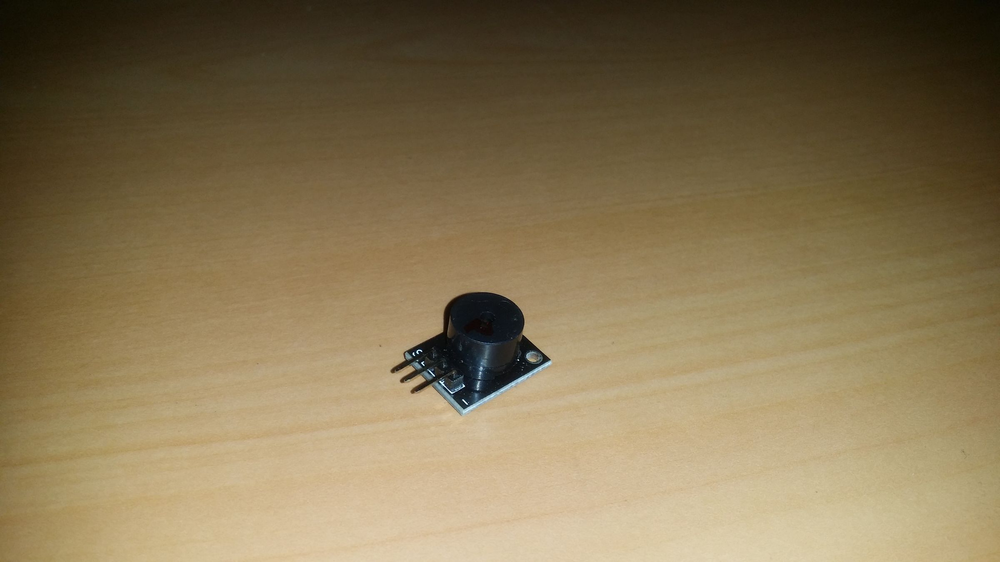
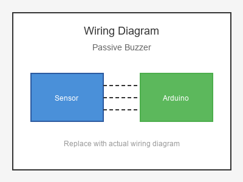

# KY-006 --- Passive Buzzer

## รายละเอียด

Passive Buzzer เป็นบัซเซอร์แบบไม่มีวงจรสั่นในตัว ต้องใส่สัญญาณ PWM (ความถี่) เพื่อให้เกิดเสียง สามารถควบคุมความถี่และโน้ตเพลงได้

> **สำคัญ:** Lotus Nano Bot มีบัซเซอร์ในตัวเชื่อมต่อที่ D3 แล้ว หากต้องการใช้บัซเซอร์ภายนอกควรใช้พอร์ตอื่น

## คุณสมบัติ

- แรงดันไฟฟ้า: 3.3V - 5V DC
- ความถี่ทำงาน: 2 kHz - 5 kHz
- ต้องใช้สัญญาณ PWM / tone()
- สามารถเล่นโน้ตเพลงได้

## ขาของ Passive Buzzer

| ขา (Buzzer) | สีสาย | เชื่อมต่อกับ (Lotus Nano Bot) |
|-------------|-------|------------------------------|
| VCC (+)     | แดง   | 5V หรือ D3/D5/D6/D9/D10/D11 |
| GND (-)     | ดำ   | GND                           |

> **หมายเหตุ:** บางรุ่นมีขา S/I/O (Signal, VCC, GND)

## การต่อสายไฟ

```
Passive Buzzer           Lotus Nano Bot
━━━━━━━━━━━━━━━━━━━━━━━━━━━━━━━━━━━━━━━━
VCC (+) ───────────────► D3 หรือ D5/D6/D9
GND (-) ───────────────► GND
```

### ภาพการต่อสาย (Text Diagram)

```
        +------------------+
        |  Passive Buzzer  |
        |    (+)  (-)      |
        +----+----+---------+
             |      |
             |      |
        +----+----+  +----+----+
        |   D3    |  |  GND    |
        | (PWM)   |  |         |
        |  Lotus  |  |  Nano   |
        |  Nano   |  |  Bot    |
        +---------+  +---------+
```

## โค้ดตัวอย่าง

```cpp
// Passive Buzzer Example for Lotus Nano Bot
// Signal -> D3 (แต่ D3 มีบัซเซอร์ในตัวอยู่แล้ว)
// หากต้องการใช้บัซเซอร์ภายนอก ใช้ D5/D6/D9/D10/D11 แทน

#define BUZZER_PIN 3  // หรือ 5, 6, 9, 10, 11

void setup() {
  Serial.begin(9600);
  pinMode(BUZZER_PIN, OUTPUT);
  Serial.println("Passive Buzzer Test Started");
}

void loop() {
  // ส่งสัญญาณความถี่ต่างๆ
  tone(BUZZER_PIN, 1000, 500);  // 1000 Hz, 500 ms
  delay(1000);
  
  tone(BUZZER_PIN, 2000, 500);  // 2000 Hz, 500 ms
  delay(1000);
  
  tone(BUZZER_PIN, 3000, 500);  // 3000 Hz, 500 ms
  delay(1000);
}
```

## โค้ดตัวอย่างเล่นเพลง

```cpp
#define BUZZER_PIN 3

// ความถี่โน้ต (Hz)
#define NOTE_C4  262
#define NOTE_D4  294
#define NOTE_E4  330
#define NOTE_F4  349
#define NOTE_G4  392
#define NOTE_A4  440
#define NOTE_B4  494
#define NOTE_C5  523

int melody[] = {
  NOTE_C4, NOTE_D4, NOTE_E4, NOTE_F4, 
  NOTE_G4, NOTE_A4, NOTE_B4, NOTE_C5
};

int noteDurations[] = {
  4, 4, 4, 4, 4, 4, 4, 4
};

void setup() {
  pinMode(BUZZER_PIN, OUTPUT);
}

void loop() {
  for (int i = 0; i < 8; i++) {
    int noteDuration = 1000 / noteDurations[i];
    tone(BUZZER_PIN, melody[i], noteDuration);
    delay(noteDuration * 1.30);
    noTone(BUZZER_PIN);
  }
  
  delay(2000);
}
```

## หมายเหตุ

- **Lotus Nano Bot มีบัซเซอร์ในตัวที่ D3** สามารถใช้ `tone(3, freq, duration)` ได้เลย
- Passive Buzzer ต่างจาก Active Buzzer: ต้องใส่สัญญาณ PWM เอง
- หากต้องการใช้บัซเซอร์ภายนอกเพิ่ม ใช้ D5/D6/D9/D10/D11 (PWM pins)
- ใช้ `noTone(pin)` เพื่อหยุดเสียง

## รูปภาพ





