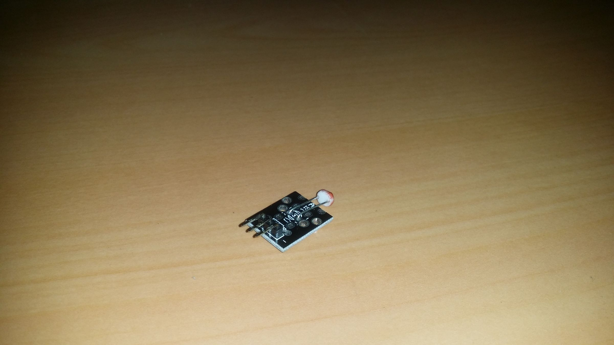
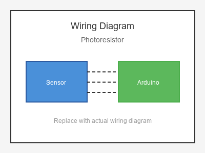

# KY-018 --- Photoresistor / LDR Sensor

## รายละเอียด

Photoresistor หรือ Light Dependent Resistor (LDR) เป็นตัวต้านทานที่มีค่าเปลี่ยนไปตามความเข้มของแสง ยิ่งแสงสว่างมาก ค่าต้านทานยิ่งต่ำ โมดูลนี้มีวงจรเปรียบเทียบในตัวเพื่อให้เอาต์พุตดิจิตอลและอนาลอก

## คุณสมบัติ

- แรงดันไฟฟ้า: 3.3V - 5V DC
- เอาต์พุต: Digital (DO) และ Analog (AO)
- มีตัวปรับความไว (Potentiometer)
- มี LED แสดงสถานะ

## ขาของโมดูล

| ขา (Module) | สีสาย | เชื่อมต่อกับ (Lotus Nano Bot) |
|-------------|-------|------------------------------|
| VCC         | แดง   | 5V                           |
| GND         | ดำ/น้ำตาล | GND                       |
| DO (Digital)| เหลือง | D3 หรือ A0 (D14)            |
| AO (Analog) | ขาว   | A0 หรือ A1                  |

> **⚠️ หมายเหตุ:** D3 ใช้โดย Onboard Buzzer ของ Lotus Nano Bot หากต้องการหลีกเลี่ยงให้ใช้ A0 (D14) สำหรับ DO

## การต่อสายไฟ

```
Photoresistor Module     Lotus Nano Bot
━━━━━━━━━━━━━━━━━━━━━━━━━━━━━━━━━━━━━━━━
VCC  ──────────────────► 5V
GND  ──────────────────► GND
DO   ──────────────────► D3 (optional)
AO   ──────────────────► A0
```

### ภาพการต่อสาย (Text Diagram)

```
        +------------------+
        |  Photoresistor   |
        |  / Light Sensor  |
        |     ____         |
        |    /    \        |
   +----+----+   +----+----+   +----+----+   +----+----+
   |  VCC    |   |  GND    |   |  DO     |   |  AO     |
   |   (+)   |   |   (-)   |   | (Digi)  |   | (Anlg)  |
   +----+----+   +----+----+   +----+----+   +----+----+
        |             |             |             |
        |             |             |             |
   +----+----+   +----+----+   +----+----+   +----+----+
   |   5V    |   |  GND    |   |   D3    |   |   A0    |
   |         |   |         |   |         |   |         |
   |  Lotus  |   |  Nano   |   |  Bot    |   |         |
   +---------+   +---------+   +---------+   +---------+
```

## โค้ดตัวอย่าง

```cpp
// Photoresistor / Light Sensor Example
// สำหรับ Lotus Nano Bot
// AO -> A0, DO -> D3

#define LIGHT_ANALOG_PIN A0
#define LIGHT_DIGITAL_PIN 3
#define LED_PIN 13

void setup() {
  Serial.begin(9600);
  pinMode(LIGHT_DIGITAL_PIN, INPUT);
  pinMode(LED_PIN, OUTPUT);
  Serial.println("Photoresistor Test Started");
}

void loop() {
  int analogValue = analogRead(LIGHT_ANALOG_PIN);
  int digitalValue = digitalRead(LIGHT_DIGITAL_PIN);
  
  Serial.print("Analog: ");
  Serial.print(analogValue);
  Serial.print(" | Digital: ");
  Serial.println(digitalValue);
  
  // ค่า Analog: แสงมาก = ค่าน้อย (ใกล้ 0), แสงน้อย = ค่ามาก (ใกล้ 1023)
  if (analogValue > 800) {  // มืด
    Serial.println("🌑 Dark Detected!");
    digitalWrite(LED_PIN, HIGH);
  } else {
    Serial.println("💡 Light Present");
    digitalWrite(LED_PIN, LOW);
  }
  
  delay(500);
}
```

## โค้ดตัวอย่างตรวจจับแสงอาทิตย์ (Sunlight Detection)

```cpp
#define LIGHT_PIN A0

void setup() {
  Serial.begin(9600);
}

void loop() {
  int lightLevel = analogRead(LIGHT_PIN);
  
  // แปลงเป็นความสว่างเปอร์เซ็นต์ (สมมติ)
  // ค่า 1023 = มืดสนิท, 0 = สว่างมาก
  int brightness = map(lightLevel, 0, 1023, 100, 0);
  
  Serial.print("Light Level: ");
  Serial.print(brightness);
  Serial.println("%");
  
  if (brightness > 80) {
    Serial.println("☀️  Bright Sunlight");
  } else if (brightness > 40) {
    Serial.println("⛅ Cloudy / Indoor");
  } else {
    Serial.println("🌑 Dark");
  }
  
  delay(500);
}
```

## หมายเหตุ

- ค่า Analog: แสงสว่าง = ค่าน้อย, แสงน้อย = ค่ามาก (เพราะเป็น Voltage Divider)
- หมุนตัวปรับค่าให้ LED เปลี่ยนสถานะตรงจุดที่ต้องการ
- ใช้ได้กับการตรวจจับความมืด/สว่าง, สวิตช์แสงอัตโนมัติ
- ตอบสนองช้ากว่า Photodiode แต่ใช้งานง่ายกว่า

## รูปภาพ





