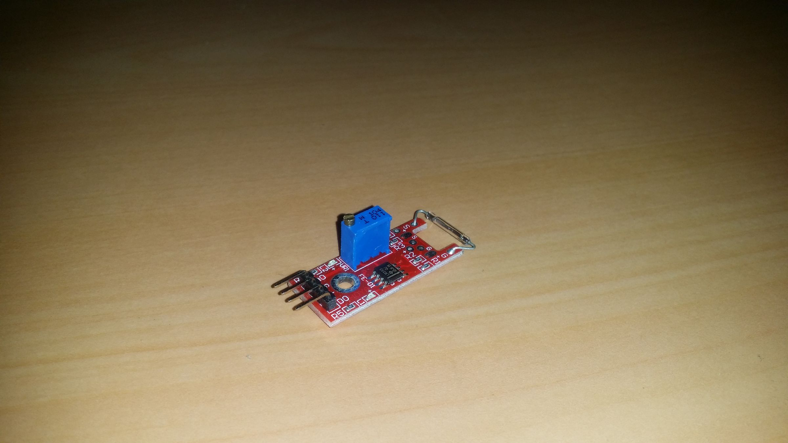
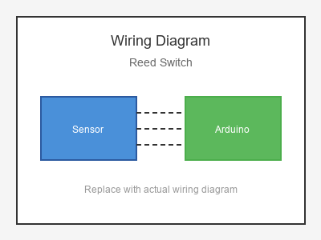

# KY-025 --- Reed Switch

## รายละเอียด

Reed Switch เป็น Switch แม่เหล็กแบบ Passive ทำงานโดยใช้แผ่นโลหะยืดหยุ่นสองแผ่นภายในหลอดแก้ว เมื่อมีสนามแม่เหล็กเข้าใกล้ แผ่นโลหะจะสัมผัสกันทำให้ไฟฟ้าไหลผ่าน

## คุณสมบัติ

- ไม่ใช้แรงดันไฟฟ้า (Switch แบบ Passive)
- ทำงานเหมือน Switch ธรรมดา
- ตรวจจับสนามแม่เหล็ก
- อายุการใช้งานยาวนาน

## ขาของ Reed Switch

| ขา (Switch) | สีสาย | เชื่อมต่อกับ (Lotus Nano Bot) |
|-------------|-------|------------------------------|
| ขา 1        | สีใดก็ได้ | D3 หรือ A0 (D14) (ผ่าน Pull-up) |
| ขา 2        | สีใดก็ได้ | GND                         |

> **หมายเหตุ:** ใช้ `INPUT_PULLUP` หรือต่อตัวต้านทาน Pull-up 10KΩ ระหว่างขา 1 และ 5V

## การต่อสายไฟ

```
Reed Switch              Lotus Nano Bot
━━━━━━━━━━━━━━━━━━━━━━━━━━━━━━━━━━━━━━━━
ขา 1 ──────────────────► D3 หรือ A0 (D14) (INPUT_PULLUP)
ขา 2 ──────────────────► GND
```

### ภาพการต่อสาย (Text Diagram)

```
        +------------------+
        |   Reed Switch    |
        |  (Magnetic)      |
        |    ====          |
        +----+------+------+
             |      |
             |      |
        +----+----+  +----+----+
        |   D3    |  |  GND    |
        | (Input) |  |         |
        |  Lotus  |  |  Nano   |
        |  Nano   |  |  Bot    |
        +---------+  +---------+
```

## โค้ดตัวอย่าง

```cpp
// Reed Switch Example for Lotus Nano Bot
// ต่อขา 1 -> D3, ขา 2 -> GND

#define REED_PIN 3
#define LED_PIN 13  // ใช้ built-in LED ของ Nano

void setup() {
  Serial.begin(9600);
  pinMode(REED_PIN, INPUT_PULLUP);
  pinMode(LED_PIN, OUTPUT);
  Serial.println("Reed Switch Test Started");
}

void loop() {
  int state = digitalRead(REED_PIN);
  
  // INPUT_PULLUP: ไม่มีแม่เหล็ก = HIGH, มีแม่เหล็ก = LOW (สัมผัส)
  if (state == LOW) {
    Serial.println("🧲 Magnet Detected! Switch CLOSED");
    digitalWrite(LED_PIN, HIGH);
  } else {
    Serial.println("❌ No Magnet - Switch OPEN");
    digitalWrite(LED_PIN, LOW);
  }
  
  delay(200);
}
```

## โค้ดตัวอย่างประตูอัจฉริยะ

```cpp
#define REED_PIN 3
#define BUZZER_PIN 3  // บัซเซอร์บนบอร์ด

bool doorOpen = false;

void setup() {
  Serial.begin(9600);
  pinMode(REED_PIN, INPUT_PULLUP);
}

void loop() {
  int state = digitalRead(REED_PIN);
  
  if (state == HIGH && !doorOpen) {
    doorOpen = true;
    Serial.println("🚪 Door OPENED!");
    tone(BUZZER_PIN, 1000, 200);
  }
  
  if (state == LOW && doorOpen) {
    doorOpen = false;
    Serial.println("🚪 Door CLOSED");
    tone(BUZZER_PIN, 500, 100);
  }
  
  delay(100);
}
```

## หมายเหตุ

- ใช้ `INPUT_PULLUP` เพื่อไม่ต้องต่อตัวต้านทาน Pull-up ภายนอก
- สนามแม่เหล็กที่ตรวจจับได้ขึ้นอยู่กับความแรงและระยะห่าง
- เหมาะสำหรับตรวจจับประตู/หน้าต่างเปิด-ปิด
- บน Lotus Nano Bot ใช้ D3 หรือ A0-A3 เป็น Digital Input ได้

## รูปภาพ





