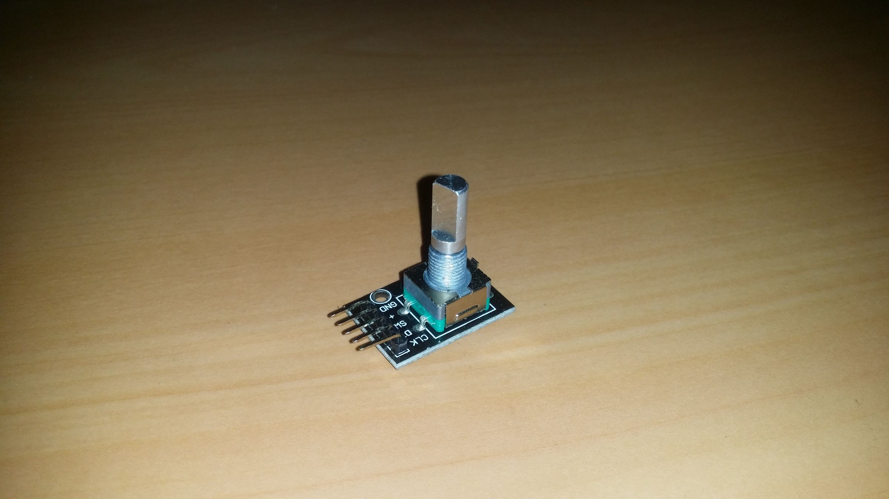
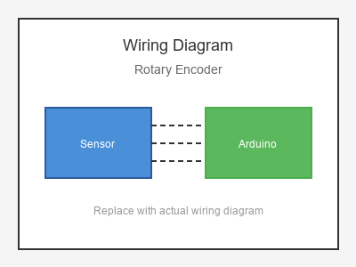

# KY-040 --- Rotary Encoder

## รายละเอียด

Rotary Encoder หรือ Encoder หมุน เป็นอุปกรณ์ที่ใช้แปลงการหมุนของแกนเป็นรหัสดิจิตอล สามารถนับทิศทางการหมุนและจำนวนรอบได้ ประกอบด้วยปุ่มกด (Push Switch) ในตัว

## คุณสมบัติ

- แรงดันไฟฟ้า: 5V DC
- การหมุนหนึ่งรอบ: 20 คลิก (PPR = 20)
- มีปุ่มกด (Push Button) ในตัว
- เอาต์พุต: Digital A, B และ Button

## ขาของ Rotary Encoder

| ขา (Encoder) | สีสาย | เชื่อมต่อกับ (Lotus Nano Bot) |
|--------------|-------|------------------------------|
| CLK (A)      | -     | D3                           |
| DT (B)       | -     | A0 (D14)                     |
| SW (Button)  | -     | A1 (D15)                     |

> **หมายเหตุ:** บน Lotus Nano Bot พอร์ต Digital ภายนอกมี D0, D1, D3 โดย D0/D1 ใช้กับ Bluetooth/Serial ส่วน D3 ใช้กับบัซเซอร์บนบอร์ด หากต้องการพอร์ต Digital เพิ่มสามารถใช้ A0-A3 เป็น Digital ได้ (A0=Pin14, A1=Pin15, A2=Pin16, A3=Pin17)
| VCC (+)      | -     | 5V                           |
| GND (-)      | -     | GND                          |

## การต่อสายไฟ

```
Rotary Encoder          Lotus Nano Bot
━━━━━━━━━━━━━━━━━━━━━━━━━━━━━━━━━━━━━━━━
CLK  (A) ──────────────► D3
DT   (B) ──────────────► A0 (D14)
SW   (Btn) ────────────► A1 (D15)
VCC  (+) ──────────────► 5V
GND  (-) ──────────────► GND
```

### ภาพการต่อสาย (Text Diagram)

```
       +------------------+
       |  Rotary Encoder  |
       |    +------+      |
       |    |      |      |
       +----+------+------+
            |  |  |  |  |
            |  |  |  |  |
        +---+---+--+--+---+---+
        |CLK|DT |SW |VCC|GND|
        |   |   |   |   |   |
        | D3|A14|A15| 5V|GND|
        |   |   |   |   |   |
        +---+---+---+---+---+
            Lotus Nano Bot
```

## โค้ดตัวอย่าง

```cpp
// Rotary Encoder Example for Lotus Nano Bot
// CLK -> D3, DT -> D4, SW -> D5

#define CLK_PIN 3
#define DT_PIN 14  // A0
#define SW_PIN 15  // A1

int counter = 0;
int currentStateCLK;
int lastStateCLK;

void setup() {
  Serial.begin(9600);
  pinMode(CLK_PIN, INPUT_PULLUP);
  pinMode(DT_PIN, INPUT_PULLUP);
  pinMode(SW_PIN, INPUT_PULLUP);
  
  lastStateCLK = digitalRead(CLK_PIN);
  Serial.println("Rotary Encoder Test Started");
}

void loop() {
  currentStateCLK = digitalRead(CLK_PIN);
  
  if (currentStateCLK != lastStateCLK && currentStateCLK == 1) {
    if (digitalRead(DT_PIN) != currentStateCLK) {
      counter++;
      Serial.print("➡️  CW | Counter: ");
    } else {
      counter--;
      Serial.print("⬅️  CCW | Counter: ");
    }
    Serial.println(counter);
  }
  lastStateCLK = currentStateCLK;
  
  if (digitalRead(SW_PIN) == LOW) {
    Serial.println("🖱️  Button Pressed!");
    counter = 0;
    delay(300);
  }
  
  delay(1);
}
```

## หมายเหตุ

- ใช้ `INPUT_PULLUP` เพื่อให้ Arduino จ่ายไฟ Pull-up ภายใน
- การอ่านค่าควรใช้ Interrupt เพื่อความแม่นยำในการนับ (ตัวอย่างด้านล่าง)
- ตัวอย่างโค้ดด้านบนเป็นแบบ Polling ง่ายต่อการเข้าใจ

### โค้ดแบบใช้ Interrupt (ขั้นสูง)

> **⚠️ คำเตือน:** บน Lotus Nano Bot D2 ใช้โดย Onboard Button และ D3 ใช้โดย Onboard Buzzer หากต้องการใช้ Interrupt โดยไม่ชนกับอุปกรณ์บนบอร์ด ให้ใช้ Pin Change Interrupt บนขาอื่นแทน (เช่น D8, D9)

```cpp
#define CLK_PIN 3  // ⚠️ D3=Buzzer, D2=Button บน Lotus Nano Bot (ชนกับ onboard)
#define DT_PIN 14  // A0

volatile int counter = 0;

void setup() {
  Serial.begin(9600);
  pinMode(CLK_PIN, INPUT_PULLUP);
  pinMode(DT_PIN, INPUT_PULLUP);
  attachInterrupt(digitalPinToInterrupt(CLK_PIN), readEncoder, CHANGE);
  Serial.println("Rotary Encoder with Interrupt");
}

void loop() {
  static int lastCounter = 0;
  if (counter != lastCounter) {
    Serial.println(counter);
    lastCounter = counter;
  }
}

void readEncoder() {
  if (digitalRead(CLK_PIN) == digitalRead(DT_PIN)) {
    counter++;
  } else {
    counter--;
  }
}
```

## รูปภาพ





