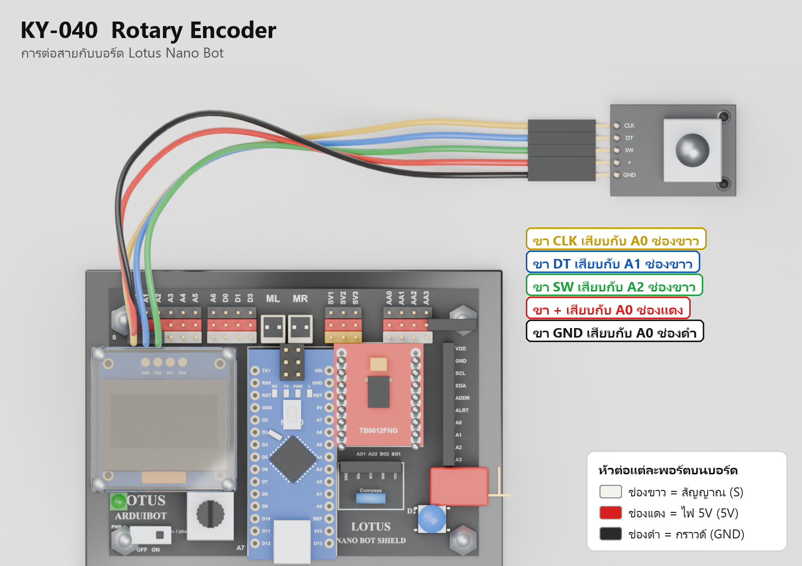
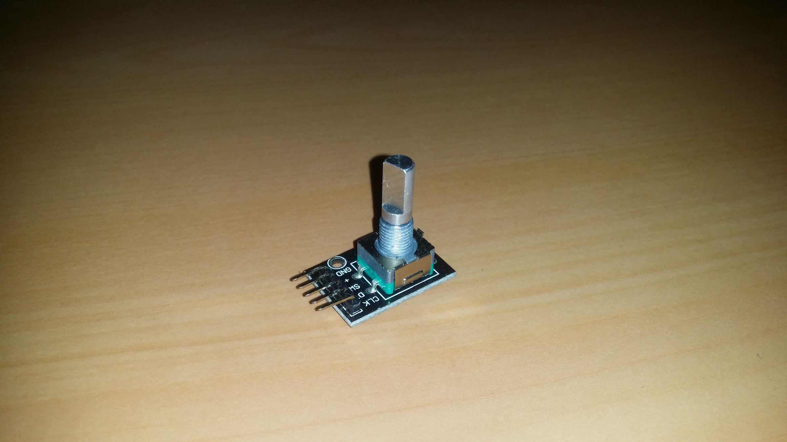

# KY-040 --- Rotary Encoder

## รายละเอียด

Rotary Encoder หรือ Encoder หมุน เป็นอุปกรณ์ที่ใช้แปลงการหมุนของแกนเป็นรหัสดิจิตอล สามารถนับทิศทางการหมุนและจำนวนรอบได้ ประกอบด้วยปุ่มกด (Push Switch) ในตัว

## คุณสมบัติ

- แรงดันไฟฟ้า: 5V DC
- การหมุนหนึ่งรอบ: 20 คลิก (PPR = 20)
- มีปุ่มกด (Push Button) ในตัว
- เอาต์พุต: Digital A, B และ Button

## ขาของ Rotary Encoder

| ขา (Encoder) | สีสาย | เชื่อมต่อกับ (Lotus Nano Bot) |
|--------------|-------|------------------------------|
| CLK (A)      | -     | A0 (D14)                     |
| DT (B)       | -     | A1 (D15)                     |
| SW (Button)  | -     | A2 (D16)                     |
| + (VCC)      | -     | 5V                           |
| GND (-)      | -     | GND                          |

> ต่อที่หัวต่อพอร์ต A0, A1 และ A2 บนบอร์ด: ช่องขาว = S (CLK เข้า A0, DT เข้า A1, SW เข้า A2), ช่องแดง = 5V, ช่องดำ = GND (ใช้ + และ GND จากพอร์ตใดพอร์ตหนึ่ง)
>
> **หมายเหตุ:** ขา A0-A3 ใช้เป็น Digital ได้ (A0=Pin14, A1=Pin15, A2=Pin16, A3=Pin17)

## การต่อสายไฟ

```
Rotary Encoder          Lotus Nano Bot
━━━━━━━━━━━━━━━━━━━━━━━━━━━━━━━━━━━━━━━━
CLK  ──────────────────► A0 (D14)
DT   ──────────────────► A1 (D15)
SW   ──────────────────► A2 (D16)
+    ──────────────────► 5V
GND  ──────────────────► GND
```

### ภาพการต่อสายกับบอร์ด



## โค้ดตัวอย่าง

```cpp
// Rotary Encoder Example for Lotus Nano Bot
// CLK -> A0 (D14), DT -> A1 (D15), SW -> A2 (D16)

#define CLK_PIN 14  // A0
#define DT_PIN 15   // A1
#define SW_PIN 16   // A2

int counter = 0;
int currentStateCLK;
int lastStateCLK;

void setup() {
  Serial.begin(9600);
  pinMode(CLK_PIN, INPUT_PULLUP);
  pinMode(DT_PIN, INPUT_PULLUP);
  pinMode(SW_PIN, INPUT_PULLUP);
  
  lastStateCLK = digitalRead(CLK_PIN);
  Serial.println("Rotary Encoder Test Started");
}

void loop() {
  currentStateCLK = digitalRead(CLK_PIN);
  
  if (currentStateCLK != lastStateCLK && currentStateCLK == 1) {
    if (digitalRead(DT_PIN) != currentStateCLK) {
      counter++;
      Serial.print("➡️  CW | Counter: ");
    } else {
      counter--;
      Serial.print("⬅️  CCW | Counter: ");
    }
    Serial.println(counter);
  }
  lastStateCLK = currentStateCLK;
  
  if (digitalRead(SW_PIN) == LOW) {
    Serial.println("🖱️  Button Pressed!");
    counter = 0;
    delay(300);
  }
  
  delay(1);
}
```

## หมายเหตุ

- ใช้ `INPUT_PULLUP` เพื่อให้ Arduino จ่ายไฟ Pull-up ภายใน
- การอ่านค่าควรใช้ Interrupt เพื่อความแม่นยำในการนับ (ตัวอย่างด้านล่างใช้ Pin Change Interrupt ของขา A0)
- ตัวอย่างโค้ดด้านบนเป็นแบบ Polling ง่ายต่อการเข้าใจ

### โค้ดแบบใช้ Interrupt (ขั้นสูง)

> **⚠️ หมายเหตุ:** Arduino Nano มี External Interrupt (`attachInterrupt()`) เฉพาะ D2/D3 ซึ่งบน Lotus Nano Bot ใช้กับปุ่มและบัซเซอร์บนบอร์ด ตัวอย่างนี้จึงใช้ **Pin Change Interrupt** ของ ATmega328P ที่ขา A0 (PCINT8) แทน โดยใช้การต่อสายเดิม

```cpp
#define CLK_PIN 14  // A0 (PCINT8)
#define DT_PIN 15   // A1

volatile int counter = 0;
volatile uint8_t lastCLK;

void setup() {
  Serial.begin(9600);
  pinMode(CLK_PIN, INPUT_PULLUP);
  pinMode(DT_PIN, INPUT_PULLUP);
  lastCLK = digitalRead(CLK_PIN);
  PCICR |= (1 << PCIE1);    // เปิด Pin Change Interrupt กลุ่มขา A0-A5
  PCMSK1 |= (1 << PCINT8);  // เลือกเฉพาะขา A0 (CLK)
  Serial.println("Rotary Encoder with Pin Change Interrupt");
}

void loop() {
  static int lastCounter = 0;
  noInterrupts();          // อ่านตัวแปร int (2 ไบต์) อย่างปลอดภัย
  int value = counter;
  interrupts();
  if (value != lastCounter) {
    Serial.println(value);  // แบบ CHANGE นับ 2 ครั้งต่อ 1 คลิก
    lastCounter = value;
  }
}

ISR(PCINT1_vect) {  // ทำงานทุกครั้งที่ขา A0 เปลี่ยนสถานะ
  uint8_t clk = digitalRead(CLK_PIN);
  if (clk != lastCLK) {
    if (clk != digitalRead(DT_PIN)) {  // ทิศทางเดียวกับโค้ด Polling (CW = +)
      counter++;
    } else {
      counter--;
    }
    lastCLK = clk;
  }
}
```

## กิจกรรมการเรียนรู้

### จุดประสงค์การเรียนรู้
1. นักเรียนสามารถอ่านสัญญาณ CLK และ DT เพื่อบอกทิศทางการหมุนของ Rotary Encoder ได้
2. นักเรียนสามารถนับจำนวนคลิกต่อรอบและใช้ปุ่ม SW รีเซ็ตค่าได้
3. นักเรียนสามารถเปรียบเทียบการอ่านค่าแบบ Polling กับแบบ Interrupt ได้

### ขั้นตอนการทดลอง
1. ต่อ CLK -> A0, DT -> A1, SW -> A2, + -> 5V, GND -> GND แล้วอัปโหลดโค้ดแบบ Polling
2. หมุนตามเข็มนาฬิกา 10 คลิก แล้วทวนเข็ม 5 คลิก บันทึกค่า Counter
3. หมุนครบ 1 รอบ นับว่าได้กี่คลิก แล้วกดปุ่มเพื่อรีเซ็ต
4. หมุนเร็วๆ 1 รอบ เปรียบเทียบผลกับการหมุนช้า
5. อัปโหลดโค้ดแบบ Interrupt แล้วทำข้อ 4 ซ้ำ เปรียบเทียบความแม่นยำ

### ตารางบันทึกผล
| ครั้งที่ | สภาวะ/การกระทำ | ค่าที่อ่านได้ | ผลที่สังเกตได้ |
|---|---|---|---|
| 1 | หมุน CW 10 คลิก | | |
| 2 | หมุน CCW 5 คลิก | | |
| 3 | หมุนครบ 1 รอบช้าๆ (Polling) | | |
| 4 | หมุนครบ 1 รอบเร็วๆ (Polling) | | |
| 5 | หมุนครบ 1 รอบเร็วๆ (Interrupt) | | |

### คำถามท้ายการทดลอง
1. Arduino รู้ทิศทางการหมุนจากสัญญาณ CLK และ DT ได้อย่างไร
2. เมื่อหมุนเร็ว แบบ Polling และแบบ Interrupt ให้ผลต่างกันอย่างไร เพราะเหตุใด
3. จะนำ Rotary Encoder ไปใช้ควบคุมหุ่นยนต์หรือเมนูบนจอได้อย่างไร

<details>
<summary>แนวคำตอบ (สำหรับครู)</summary>

1. สัญญาณ CLK และ DT ต่างเฟสกัน 90° (Quadrature) เมื่อ CLK เปลี่ยน ถ้า DT ต่างจาก CLK คือหมุนทางหนึ่ง ถ้าเท่ากันคือหมุนอีกทาง
2. แบบ Polling อาจนับตกหล่นเมื่อหมุนเร็ว เพราะ `loop()` อาจตรวจไม่ทันทุกขอบสัญญาณ แบบ Interrupt ตอบสนองทันทีจึงแม่นยำกว่า (แต่นับ 2 ครั้งต่อคลิกเพราะ Pin Change Interrupt ทำงานทั้งขอบขาขึ้นและขาลง)
3. เช่น เลือกเมนูบน OLED, ปรับความเร็วมอเตอร์, ปรับมุมเซอร์โวทีละขั้น

</details>

### ภารกิจท้าทาย
- ใช้ Rotary Encoder ปรับมุมเซอร์โวที่ D10 ทีละ 5° (จำกัด 0-180°) แสดงมุมบนจอ OLED และกดปุ่ม SW เพื่อกลับไปที่ 90°

## รูปภาพ




