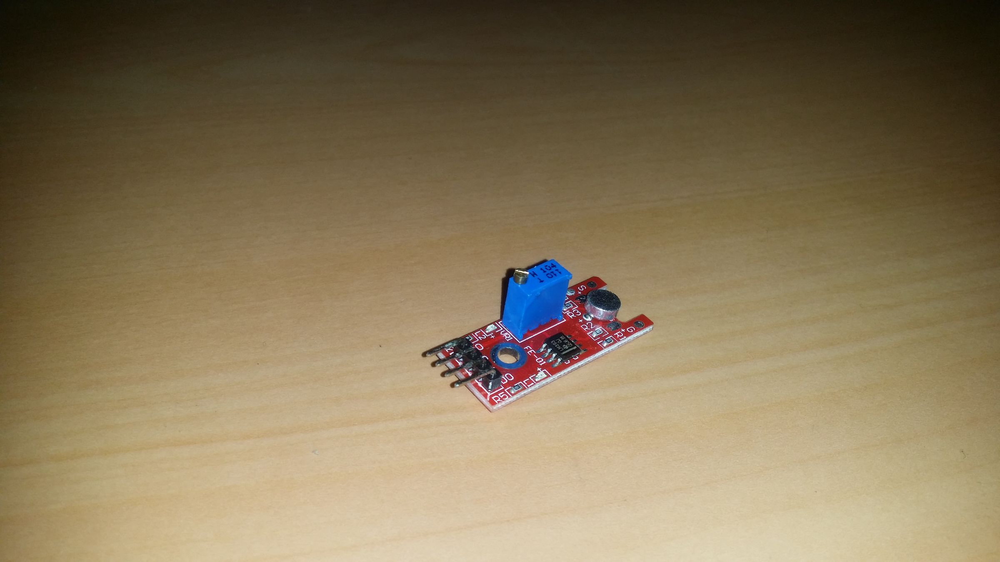
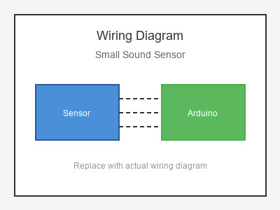

# KY-038 --- Small Sound Sensor

## รายละเอียด

Small Sound Sensor เป็นเซนเซอร์ตรวจจับเสียงขนาดเล็ก ใช้ Microphone Electret รับเสียงและแปลงเป็นสัญญาณไฟฟ้า มีวงจรเปรียบเทียบในตัว

## คุณสมบัติ

- แรงดันไฟฟ้า: 3.3V - 5V DC
- เอาต์พุต: Digital (DO) และ Analog (AO)
- มีตัวปรับความไว (Potentiometer)
- มี LED แสดงสถานะ

## ขาของเซนเซอร์

| ขา (Sensor) | สีสาย | เชื่อมต่อกับ (Lotus Nano Bot) |
|-------------|-------|------------------------------|
| VCC         | แดง   | 5V                           |
| GND         | ดำ/น้ำตาล | GND                       |
| DO (Digital)| เหลือง | D3 หรือ A0 (D14)          |
| AO (Analog) | ขาว   | A0, A1, A2, A3 หรือ A6     |

## การต่อสายไฟ

```
Small Sound Sensor       Lotus Nano Bot
━━━━━━━━━━━━━━━━━━━━━━━━━━━━━━━━━━━━━━━━
VCC  ──────────────────► 5V
GND  ──────────────────► GND
DO   ──────────────────► D3
AO   ──────────────────► A0 (optional)
```

### ภาพการต่อสาย (Text Diagram)

```
        +------------------+
        |  Small Sound     |
        |  Sensor          |
        |    (o)           |
        |  Microphone      |
   +----+----+   +----+----+   +----+----+   +----+----+
   |  VCC    |   |  GND    |   |  DO     |   |  AO     |
   |   (+)   |   |   (-)   |   | (Digi)  |   | (Anlg)  |
   +----+----+   +----+----+   +----+----+   +----+----+
        |             |             |             |
        |             |             |             |
   +----+----+   +----+----+   +----+----+   +----+----+
   |   5V    |   |  GND    |   |   D3    |   |   A0    |
   |         |   |         |   |         |   |         |
   |  Lotus  |   |  Nano   |   |  Bot    |   |         |
   +---------+   +---------+   +---------+   +---------+
```

## โค้ดตัวอย่าง

```cpp
// Small Sound Sensor Example for Lotus Nano Bot
// DO -> D3, AO -> A0

#define SOUND_DIGITAL_PIN 3
#define SOUND_ANALOG_PIN A0

void setup() {
  Serial.begin(9600);
  pinMode(SOUND_DIGITAL_PIN, INPUT);
  Serial.println("Small Sound Sensor Test Started");
}

void loop() {
  int soundDetected = digitalRead(SOUND_DIGITAL_PIN);
  int soundLevel = analogRead(SOUND_ANALOG_PIN);
  
  Serial.print("Digital: ");
  Serial.print(soundDetected);
  Serial.print(" | Analog: ");
  Serial.println(soundLevel);
  
  if (soundDetected == HIGH) {  // ตรวจพบเสียง
    Serial.println("🔊 Sound Detected!");
    delay(300);  // Debounce
  }
  
  delay(50);
}
```

## โค้ดตัวอย่าง Clap Switch (ปรบมือเปิดปิด)

```cpp
#define SOUND_PIN 3
#define LED_PIN 13

bool ledState = false;
unsigned long lastClap = 0;
int clapCount = 0;

void setup() {
  Serial.begin(9600);
  pinMode(SOUND_PIN, INPUT);
  pinMode(LED_PIN, OUTPUT);
}

void loop() {
  if (digitalRead(SOUND_PIN) == HIGH) {
    unsigned long now = millis();
    
    if (now - lastClap > 200) {
      clapCount++;
      lastClap = now;
      Serial.print("Clap #");
      Serial.println(clapCount);
      
      if (clapCount >= 2) {
        ledState = !ledState;
        digitalWrite(LED_PIN, ledState);
        Serial.println(ledState ? "💡 LED ON" : "🌑 LED OFF");
        clapCount = 0;
      }
    }
    delay(300);
  }
  
  // รีเซ็ตถ้าไม่มีเสียงนานเกิน 1 วินาที
  if (millis() - lastClap > 1000) {
    clapCount = 0;
  }
}
```

## หมายเหตุ

- หมุนตัวปรับค่าเพื่อกำหนดความไวในการตรวจจับเสียง
- ควรใช้ Debounce เพื่อป้องกันการอ่านค่าซ้ำ
- ไม่เหมาะสำหรับบันทึกเสียงคุณภาพสูง
- บน Lotus Nano Bot ใช้ D3 หรือ A0-A3 (เป็น Digital) ได้

## รูปภาพ





