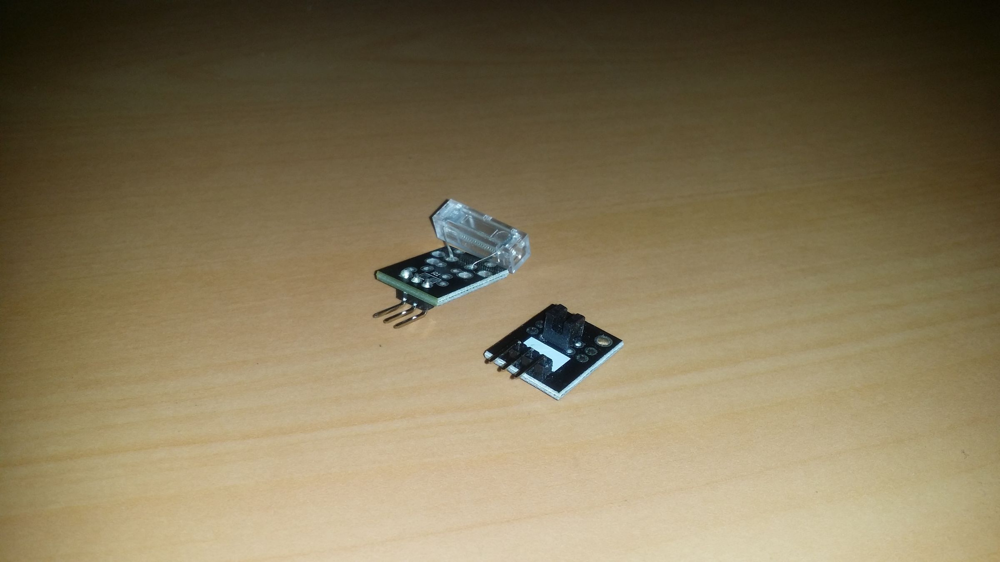
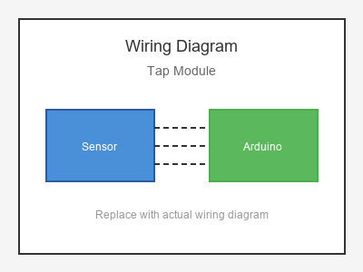

# KY-031 --- Tap Module

## รายละเอียด

Tap Module หรือ Knock Sensor เป็นเซนเซอร์ตรวจจับการเคาะ/การกระแทก ใช้ Piezo Element ตรวจจับการสั่นสะเทือนและแปลงเป็นไฟฟ้า มีวงจรเปรียบเทียบในตัว

## คุณสมบัติ

- แรงดันไฟฟ้า: 3.3V - 5V DC
- เอาต์พุต: Digital (DO) และ Analog (AO)
- มี LED แสดงสถานะ
- มีตัวปรับความไว (Potentiometer)

## ขาของโมดูล

| ขา (Module) | สีสาย | เชื่อมต่อกับ (Lotus Nano Bot) |
|-------------|-------|------------------------------|
| VCC         | แดง   | 5V                           |
| GND         | ดำ/น้ำตาล | GND                       |
| DO (Digital)| เหลือง | D3 หรือ A0 (D14)          |
| AO (Analog) | ขาว   | A0, A1, A2, A3 หรือ A6     |

## การต่อสายไฟ

```
Tap Module               Lotus Nano Bot
━━━━━━━━━━━━━━━━━━━━━━━━━━━━━━━━━━━━━━━━
VCC  ──────────────────► 5V
GND  ──────────────────► GND
DO   ──────────────────► D3
AO   ──────────────────► A0 (optional)
```

### ภาพการต่อสาย (Text Diagram)

```
        +------------------+
        |   Tap Module     |
        |  (Knock Sensor)  |
        |                  |
   +----+----+   +----+----+   +----+----+   +----+----+
   |  VCC    |   |  GND    |   |  DO     |   |  AO     |
   |   (+)   |   |   (-)   |   | (Digi)  |   | (Anlg)  |
   +----+----+   +----+----+   +----+----+   +----+----+
        |             |             |             |
        |             |             |             |
   +----+----+   +----+----+   +----+----+   +----+----+
   |   5V    |   |  GND    |   |   D3    |   |   A0    |
   |         |   |         |   |         |   |         |
   |  Lotus  |   |  Nano   |   |  Bot    |   |         |
   +---------+   +---------+   +---------+   +---------+
```

## โค้ดตัวอย่าง

```cpp
// Tap / Knock Sensor Example for Lotus Nano Bot
// DO -> D3, AO -> A0

#define TAP_DIGITAL_PIN 3
#define TAP_ANALOG_PIN A0
#define BUZZER_PIN 3  // บัซเซอร์บนบอร์ด

void setup() {
  Serial.begin(9600);
  pinMode(TAP_DIGITAL_PIN, INPUT);
  Serial.println("Tap Sensor Test Started");
}

void loop() {
  int tap = digitalRead(TAP_DIGITAL_PIN);
  int knockValue = analogRead(TAP_ANALOG_PIN);
  
  if (tap == HIGH) {  // ตรวจพบการเคาะ
    Serial.print("🔔 Knock Detected! Analog: ");
    Serial.println(knockValue);
    tone(BUZZER_PIN, 1000, 100);
    delay(300);  // Debounce
  }
  
  delay(10);
}
```

## โค้ดตัวอย่าง Knock Lock (รหัสเคาะ)

```cpp
#define TAP_PIN 3

unsigned long knockTimes[5];
int knockIndex = 0;
unsigned long lastKnock = 0;

void setup() {
  Serial.begin(9600);
  pinMode(TAP_PIN, INPUT);
  Serial.println("Knock Lock - Tap 3 times to unlock");
}

void loop() {
  if (digitalRead(TAP_PIN) == HIGH) {
    unsigned long now = millis();
    
    if (now - lastKnock > 100) {  // Debounce
      knockTimes[knockIndex] = now;
      knockIndex++;
      lastKnock = now;
      
      Serial.print("Knock #");
      Serial.println(knockIndex);
      
      if (knockIndex >= 3) {
        Serial.println("🔓 UNLOCKED!");
        tone(3, 2000, 500);
        knockIndex = 0;
      }
    }
    delay(300);
  }
}
```

## หมายเหตุ

- หมุนตัวปรับค่าเพื่อกำหนดความไวในการตรวจจับ
- ควรใช้ Debounce ในโค้ดเพื่อป้องกันการอ่านค่าซ้ำ
- วางโมดูลบนพื้นผิวที่ต้องการตรวจจับการเคาะ
- บน Lotus Nano Bot ใช้ D3 หรือ A0-A3 (เป็น Digital) ได้

## รูปภาพ





