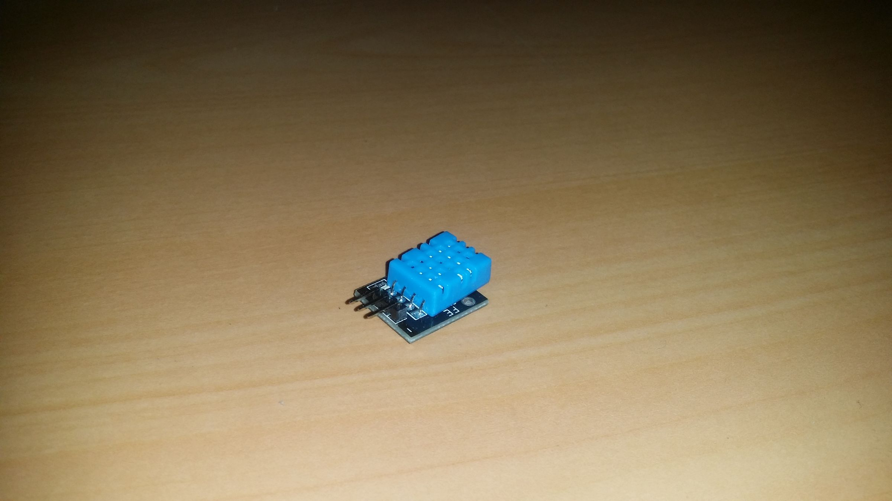
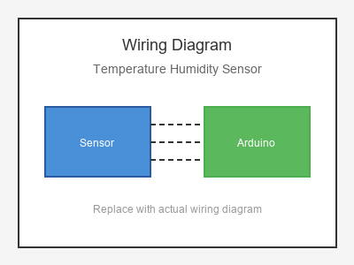

# KY-015 --- DHT11 Temperature & Humidity Sensor

## รายละเอียด

เซนเซอร์อุณหภูมิและความชื้น DHT11/DHT22 เป็นเซนเซอร์ดิจิตอลที่ใช้วัดอุณหภูมิและความชื้นสัมพัทธ์ในอากาศ DHT22 มีความแม่นยำสูงกว่า DHT11

## คุณสมบัติ

- แรงดันไฟฟ้า: 3.3V - 5V DC
- DHT11: อุณหภูมิ 0-50°C (±2°C), ความชื้น 20-90% RH (±5%)
- DHT22: อุณหภูมิ -40-80°C (±0.5°C), ความชื้น 0-100% RH (±2%)
- สื่อสารแบบ One-Wire Digital

## ขาของเซนเซอร์

| ขา (Sensor) | สีสาย | เชื่อมต่อกับ (Lotus Nano Bot) |
|-------------|-------|------------------------------|
| VCC (+)     | แดง   | 5V                           |
| GND (-)     | ดำ   | GND                           |
| DATA (OUT)  | เหลือง | D3 หรือ A0 (D14)          |

> **หมายเหตุ:** บน Lotus Nano Bot พอร์ต Digital ภายนอกมี D0, D1, D3 โดย D0/D1 ใช้กับ Bluetooth/Serial ส่วน D3 ใช้กับบัซเซอร์บนบอร์ด หากต้องการพอร์ต Digital เพิ่มสามารถใช้ A0-A3 เป็น Digital ได้ (A0=Pin14, A1=Pin15, A2=Pin16, A3=Pin17)
| NC (ไม่ใช้) | -     | -                             |

## การต่อสายไฟ

```
DHT11/DHT22              Lotus Nano Bot
━━━━━━━━━━━━━━━━━━━━━━━━━━━━━━━━━━━━━━━━
VCC  (+) ──────────────► 5V
GND  (-) ──────────────► GND
DATA (OUT) ────────────► D3 หรือ A0 (D14)
```

> **สำคัญ:** ต้องต่อตัวต้านทาน Pull-up 10KΩ ระหว่าง DATA และ VCC (บางโมดูลมีมาให้แล้ว)

### ภาพการต่อสาย (Text Diagram)

```
        +------------------+
        |  DHT11/DHT22     |
        |  Temp & Humidity |
        |                  |
   +----+----+   +----+----+   +----+----+
   |  VCC    |   |  DATA   |   |  GND    |
   |   (+)   |   | (OUT)   |   |   (-)   |
   +----+----+   +----+----+   +----+----+
        |             |             |
        |             |             |
   +----+----+   +----+----+   +----+----+
   |   5V    |   |   D3    |   |  GND    |
   |         |   |         |   |         |
   |  Lotus  |   |  Nano   |   |  Bot    |
   +---------+   +---------+   +---------+
```

## โค้ดตัวอย่าง

```cpp
// DHT Temperature & Humidity Sensor Example
// สำหรับ Lotus Nano Bot
// DATA -> D4

#include "DHT.h"

#define DHT_PIN 3  // หรือ 14 (A0)
#define DHT_TYPE DHT11  // เปลี่ยนเป็น DHT22 ถ้าใช้ DHT22

DHT dht(DHT_PIN, DHT_TYPE);

void setup() {
  Serial.begin(9600);
  dht.begin();
  Serial.println("DHT Sensor Test Started");
}

void loop() {
  // รอ 2 วินาทีระหว่างการอ่าน (DHT11 ต้องการเวลาอย่างน้อย 2 วินาที)
  delay(2000);
  
  float humidity = dht.readHumidity();
  float temperature = dht.readTemperature();
  
  if (isnan(humidity) || isnan(temperature)) {
    Serial.println("❌ Failed to read from DHT sensor!");
    return;
  }
  
  Serial.print("💧 Humidity: ");
  Serial.print(humidity);
  Serial.print(" % | ");
  Serial.print("🌡️  Temperature: ");
  Serial.print(temperature);
  Serial.println(" °C");
}
```

## วิธีติดตั้งไลบรารี

1. เปิด Arduino IDE
2. ไปที่ **Sketch > Include Library > Manage Libraries...**
3. ค้นหา "DHT sensor library" โดย Adafruit
4. คลิก **Install**
5. ติดตั้ง "Adafruit Unified Sensor" ด้วยหากยังไม่มี

## หมายเหตุ

- DHT11 ต้องรออย่างน้อย 2 วินาทีระหว่างการอ่านค่า
- DHT22 สามารถอ่านค่าได้ถี่กว่า (ประมาณทุก 2 วินาที)
- หากอ่านค่าไม่ได้ ตรวจสอบการต่อสายและตัวต้านทาน Pull-up
- หลีกเลี่ยงการวางเซนเซอร์ใกล้แหล่งความร้อน

## รูปภาพ





