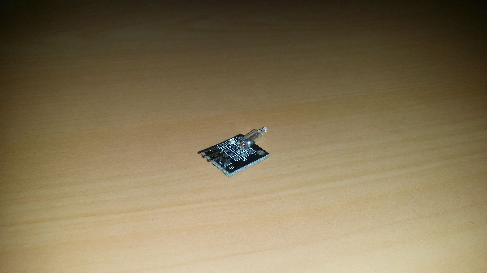
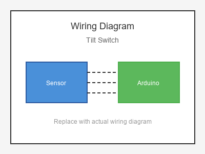

# KY-017 --- Tilt Switch

## รายละเอียด

Tilt Switch แบบ Ball เป็นอุปกรณ์ตรวจจับการเอียงโดยใช้ลูกบอลโลหะภายในหลอด มีความปลอดภัยกว่า Mercury Switch เพราะไม่มีสารพิษ เมื่อเอียงหลอด ลูกบอลจะม้วนไปสัมผัสขาทั้งสองทำให้เป็นตัวนำไฟฟ้า

## คุณสมบัติ

- ไม่ใช้แรงดันไฟฟ้า (Switch แบบ Passive)
- ทำงานเหมือน Switch ธรรมดา
- ปลอดภัย (ไม่มีปรอท)
- ตรวจจับการเอียงหรือการสั่นสะเทือน

## ขาของ Tilt Switch

| ขา (Switch) | สีสาย | เชื่อมต่อกับ (Lotus Nano Bot) |
|-------------|-------|------------------------------|
| ขา 1        | สีใดก็ได้ | D2 หรือ D3 (ผ่าน Pull-up) |
| ขา 2        | สีใดก็ได้ | GND                         |

> **สำคัญ:** ต้องต่อตัวต้านทาน Pull-up 10KΩ ระหว่างขา 1 และ 5V หรือใช้ `INPUT_PULLUP`

## การต่อสายไฟ

```
Tilt Switch              Lotus Nano Bot
━━━━━━━━━━━━━━━━━━━━━━━━━━━━━━━━━━━━━━━━
ขา 1 ──────────────────► D2 (ใช้ INPUT_PULLUP)
ขา 2 ──────────────────► GND
```

### ภาพการต่อสาย (Text Diagram)

```
        +------------------+
        |  Tilt Switch     |
        |   (Ball Type)    |
        |    o  o  o       |
        |   [Ball]         |
        +----+------+------+
             |      |
             |      |
        +----+----+  +----+----+
        |   D2    |  |  GND    |
        | (Input) |  |         |
        |  Lotus  |  |  Nano   |
        |  Nano   |  |  Bot    |
        +---------+  +---------+
```

## โค้ดตัวอย่าง

```cpp
// Tilt Switch Example for Lotus Nano Bot
// ต่อขา 1 -> D2, ขา 2 -> GND

#define TILT_PIN 2
#define LED_PIN 13

void setup() {
  Serial.begin(9600);
  pinMode(TILT_PIN, INPUT_PULLUP);  // ใช้ Pull-up ภายใน
  pinMode(LED_PIN, OUTPUT);
  Serial.println("Tilt Switch Test Started");
}

void loop() {
  int state = digitalRead(TILT_PIN);
  
  // เมื่อหลอดตรง (ลูกบอลไม่สัมผัส): HIGH (Pull-up)
  // เมื่อหลอดเอียง (ลูกบอลสัมผัส): LOW
  if (state == LOW) {
    Serial.println("⚡ Tilt Switch CLOSED (Tilted!)");
    digitalWrite(LED_PIN, HIGH);
  } else {
    Serial.println("🔌 Tilt Switch OPEN (Normal)");
    digitalWrite(LED_PIN, LOW);
  }
  
  delay(200);
}
```

## โค้ดตัวอย่าง Alarm ปลุก

```cpp
// Tilt Alarm Example
#define TILT_PIN 2
#define BUZZER_PIN 8

bool alarmActive = false;

void setup() {
  Serial.begin(9600);
  pinMode(TILT_PIN, INPUT_PULLUP);
  pinMode(BUZZER_PIN, OUTPUT);
}

void loop() {
  int state = digitalRead(TILT_PIN);
  
  if (state == LOW && !alarmActive) {
    alarmActive = true;
    Serial.println("🚨 Tilt detected! Alarm ON");
  }
  
  if (alarmActive) {
    // สัญญาณเตือน
    digitalWrite(BUZZER_PIN, HIGH);
    delay(200);
    digitalWrite(BUZZER_PIN, LOW);
    delay(200);
  }
}
```

## หมายเหตุ

- ปลอดภัยกว่า Mercury Switch เพราะไม่มีสารพิษ
- ใช้ `INPUT_PULLUP` เพื่อไม่ต้องต่อตัวต้านทาน Pull-up ภายนอก
- มุมเอียงที่ตรวจจับได้ขึ้นอยู่กับรุ่นของ Tilt Switch
- อาจมีการสั่นสะเทือน (Bouncing) ควรใช้ Debounce หากต้องการความแม่นยำ

## รูปภาพ





