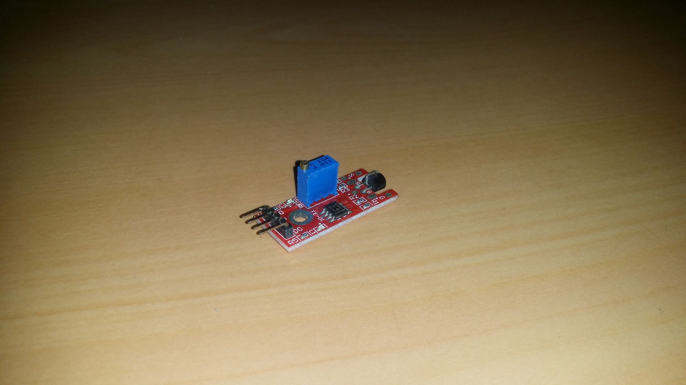
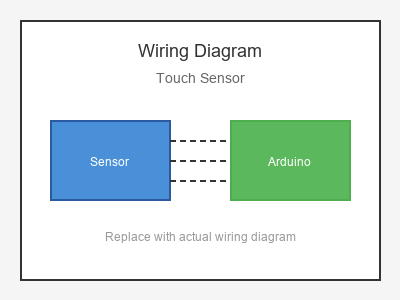

# KY-036 --- Touch Sensor

## รายละเอียด

Touch Sensor โมดูล TTP223 เป็นเซนเซอร์สัมผัสแบบ Capacitive ตรวจจับการสัมผัสของนิ้วมือ ไม่ต้องใช้แรงกด มีวงจร IC TTP223 ในตัว

## คุณสมบัติ

- แรงดันไฟฟ้า: 2.5V - 5.5V DC
- เอาต์พุต: Digital (Active High หรือ Low ปรับได้)
- กระแสทำงานต่ำ (~1.5 µA)
- ตรวจจับระยะห่าง ~5 mm

## ขาของโมดูล

| ขา (Module) | สีสาย | เชื่อมต่อกับ (Lotus Nano Bot) |
|-------------|-------|------------------------------|
| VCC         | แดง   | 5V                           |
| GND         | ดำ/น้ำตาล | GND                       |
| I/O (Signal)| เหลือง | D3 หรือ A0 (D14)          |

## การต่อสายไฟ

```
Touch Sensor             Lotus Nano Bot
━━━━━━━━━━━━━━━━━━━━━━━━━━━━━━━━━━━━━━━━
VCC  ──────────────────► 5V
GND  ──────────────────► GND
I/O  ──────────────────► D3
```

### ภาพการต่อสาย (Text Diagram)

```
        +------------------+
        |  Touch Sensor    |
        |    (TTP223)      |
        |   [====]         |
        |  Touch Area      |
   +----+----+   +----+----+   +----+----+
   |  VCC    |   |  GND    |   |  I/O    |
   |   (+)   |   |   (-)   |   | (Sig)   |
   +----+----+   +----+----+   +----+----+
        |             |             |
        |             |             |
   +----+----+   +----+----+   +----+----+
   |   5V    |   |  GND    |   |   D3    |
   |         |   |         |   |         |
   |  Lotus  |   |  Nano   |   |  Bot    |
   +---------+   +---------+   +---------+
```

## โค้ดตัวอย่าง

```cpp
// Touch Sensor Example for Lotus Nano Bot
// I/O -> D3

#define TOUCH_PIN 3
#define LED_PIN 13

void setup() {
  Serial.begin(9600);
  pinMode(TOUCH_PIN, INPUT);
  pinMode(LED_PIN, OUTPUT);
  Serial.println("Touch Sensor Test Started");
}

void loop() {
  int touched = digitalRead(TOUCH_PIN);
  
  if (touched == HIGH) {  // สัมผัสที่เซนเซอร์
    Serial.println("👆 Touch Detected!");
    digitalWrite(LED_PIN, HIGH);
  } else {
    digitalWrite(LED_PIN, LOW);
  }
  
  delay(100);
}
```

## โค้ดตัวอย่าง Toggle Switch (กดเปิด/ปิด)

```cpp
#define TOUCH_PIN 3
#define RELAY_PIN 8  // หรือใช้ D8 หากต่อบัซเซอร์/LED แทน

bool state = false;
int lastTouch = LOW;

void setup() {
  Serial.begin(9600);
  pinMode(TOUCH_PIN, INPUT);
  pinMode(RELAY_PIN, OUTPUT);
}

void loop() {
  int touch = digitalRead(TOUCH_PIN);
  
  if (touch == HIGH && lastTouch == LOW) {
    state = !state;
    digitalWrite(RELAY_PIN, state);
    Serial.println(state ? "🔵 ON" : "🔴 OFF");
    delay(300);  // Debounce
  }
  
  lastTouch = touch;
}
```

## หมายเหตุ

- ไม่ต้องกดแรง เพียงแค่สัมผัสเบาๆ หรือเข้าใกล้
- หากต้องการให้เป็น Toggle Mode (A หรือ B) ให้บัดกรีจัมเปอร์บนโมดูล
- บางรุ่นมีขา A และ B สำหรับเลือกโหมด Momentary หรือ Toggle
- บน Lotus Nano Bot ใช้ D3 หรือ A0-A3 (เป็น Digital) ได้

## รูปภาพ





