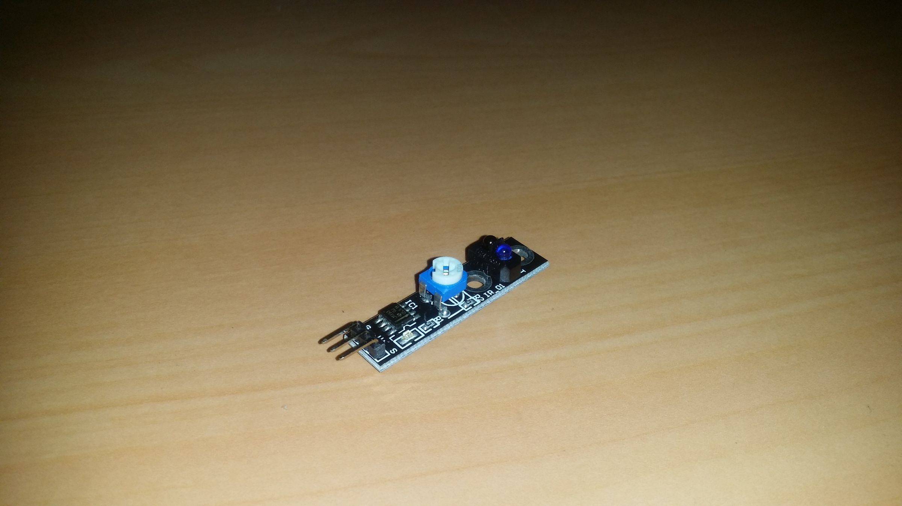
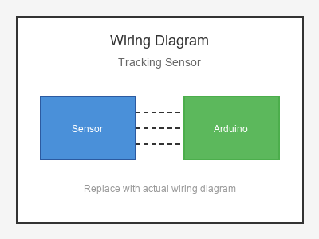

# KY-033 --- Line Tracking Sensor

## รายละเอียด

Tracking Sensor หรือ Line Tracking Sensor เป็นเซนเซอร์ตรวจจับเส้นสีดำ/ขาวบนพื้นผิว โดยใช้คลื่นอินฟราเรด (IR) ทำงานโดยส่ง IR ออกมาและวัดแสงที่สะท้อนกลับ เส้นสีดำจะดูดซับแสงทำให้ค่าต่ำ ส่วนพื้นสีขาวจะสะท้อนแสงทำให้ค่าสูง

## คุณสมบัติ

- แรงดันไฟฟ้า: 3.3V - 5V DC
- ระยะตรวจจับ: 1 - 25 mm (ปรับได้)
- เอาต์พุต: Digital (High = ขาว, Low = ดำ) และ Analog (AO)
- มี LED แสดงสถานะ

## ขาของเซนเซอร์

| ขา (Sensor) | สีสาย | เชื่อมต่อกับ (Lotus Nano Bot) |
|-------------|-------|------------------------------|
| VCC         | แดง   | 5V                           |
| GND         | ดำ/น้ำตาล | GND                       |
| DO (Digital)| เหลือง | D3 หรือ A0 (D14)          |
| AO (Analog) | ขาว/เขียว | A0, A1, A2, A3 หรือ A6    |

> **หมายเหตุ:** บน Lotus Nano Bot พอร์ต Digital ภายนอกมี D0, D1, D3 โดย D0/D1 ใช้กับ Bluetooth/Serial ส่วน D3 ใช้กับบัซเซอร์บนบอร์ด หากต้องการพอร์ต Digital เพิ่มสามารถใช้ A0-A3 เป็น Digital ได้ (A0=Pin14, A1=Pin15, A2=Pin16, A3=Pin17)

## การต่อสายไฟ

```
Tracking Sensor          Lotus Nano Bot
━━━━━━━━━━━━━━━━━━━━━━━━━━━━━━━━━━━━━━━━
VCC  ──────────────────► 5V
GND  ──────────────────► GND
DO   ──────────────────► D3 หรือ A0 (D14)
AO   ──────────────────► A0 (optional)
```

### ภาพการต่อสาย (Text Diagram)

```
        +------------------+
        |  Tracking Sensor |
        |  (TCRT5000)      |
        |                  |
   +----+----+   +----+----+   +----+----+   +----+----+
   |  VCC    |   |  GND    |   |  DO     |   |  AO     |
   |   (+)   |   |   (-)   |   | (Digi)  |   | (Anlg)  |
   +----+----+   +----+----+   +----+----+   +----+----+
        |             |             |             |
        |             |             |             |
   +----+----+   +----+----+   +----+----+   +----+----+
   |   5V    |   |  GND    |   |   D3    |   |   A0    |
   |         |   |         |   |         |   |         |
   |  Lotus  |   |  Nano   |   |  Bot    |   |         |
   +---------+   +---------+   +---------+   +---------+
```

## โค้ดตัวอย่าง

```cpp
// Tracking Sensor Example for Lotus Nano Bot
// DO -> D3, AO -> A0

#define TRACKING_DIGITAL_PIN 3  // หรือ 14 (A0)
#define TRACKING_ANALOG_PIN A0
#define LED_PIN 13

void setup() {
  Serial.begin(9600);
  pinMode(TRACKING_DIGITAL_PIN, INPUT);
  pinMode(LED_PIN, OUTPUT);
  Serial.println("Line Tracking Sensor Test Started");
}

void loop() {
  int digitalValue = digitalRead(TRACKING_DIGITAL_PIN);
  int analogValue = analogRead(TRACKING_ANALOG_PIN);
  
  Serial.print("Digital: ");
  Serial.print(digitalValue);
  Serial.print(" | Analog: ");
  Serial.println(analogValue);
  
  if (digitalValue == LOW) {  // ตรวจพบเส้นสีดำ
    Serial.println("⚫ Black Line Detected!");
    digitalWrite(LED_PIN, HIGH);
  } else {
    Serial.println("⚪ White Surface");
    digitalWrite(LED_PIN, LOW);
  }
  
  delay(200);
}
```

## โค้ดตัวอย่างสำหรับหุ่นยนต์ติดตามเส้น (Line Follower)

```cpp
// Line Follower Robot using Lotus Nano Bot
// ใช้ 2-3 Tracking Sensors

#define LEFT_TRACKER A0
#define RIGHT_TRACKER A1
#define CENTER_TRACKER A2

// Motor pins (สมมติว่าใช้ motor driver บน Lotus Nano Bot)
#define MOTOR_A1 5
#define MOTOR_A2 6
#define MOTOR_B1 9
#define MOTOR_B2 10

void setup() {
  Serial.begin(9600);
  pinMode(LEFT_TRACKER, INPUT);
  pinMode(RIGHT_TRACKER, INPUT);
  pinMode(CENTER_TRACKER, INPUT);
  
  pinMode(MOTOR_A1, OUTPUT);
  pinMode(MOTOR_A2, OUTPUT);
  pinMode(MOTOR_B1, OUTPUT);
  pinMode(MOTOR_B2, OUTPUT);
}

void loop() {
  int left = digitalRead(LEFT_TRACKER);
  int right = digitalRead(RIGHT_TRACKER);
  int center = digitalRead(CENTER_TRACKER);
  
  if (center == LOW) {        // ตรงกลางอยู่บนเส้น
    moveForward();
  } else if (left == LOW) {   // เส้นอยู่ทางซ้าย
    turnLeft();
  } else if (right == LOW) {  // เส้นอยู่ทางขวา
    turnRight();
  } else {
    stopMotors();
  }
}

void moveForward() {
  analogWrite(MOTOR_A1, 150);
  analogWrite(MOTOR_A2, 0);
  analogWrite(MOTOR_B1, 150);
  analogWrite(MOTOR_B2, 0);
}

void turnLeft() {
  analogWrite(MOTOR_A1, 0);
  analogWrite(MOTOR_A2, 100);
  analogWrite(MOTOR_B1, 150);
  analogWrite(MOTOR_B2, 0);
}

void turnRight() {
  analogWrite(MOTOR_A1, 150);
  analogWrite(MOTOR_A2, 0);
  analogWrite(MOTOR_B1, 0);
  analogWrite(MOTOR_B2, 100);
}

void stopMotors() {
  analogWrite(MOTOR_A1, 0);
  analogWrite(MOTOR_A2, 0);
  analogWrite(MOTOR_B1, 0);
  analogWrite(MOTOR_B2, 0);
}
```

## หมายเหตุ

- หมุนตัวปรับค่า (Potentiometer) ให้ LED เปลี่ยนสถานะตรงจุดที่ต้องการ
- ความสูงจากพื้นควรอยู่ที่ 5-15 mm
- ใช้เทปกาวสีดำบนพื้นสีขาว หรือใช้กระดาษขาววางบนเส้นดำ
- หลีกเลี่ยงแสงแดดจัดโดยตรง เพราะจะรบกวน IR sensor

## รูปภาพ





