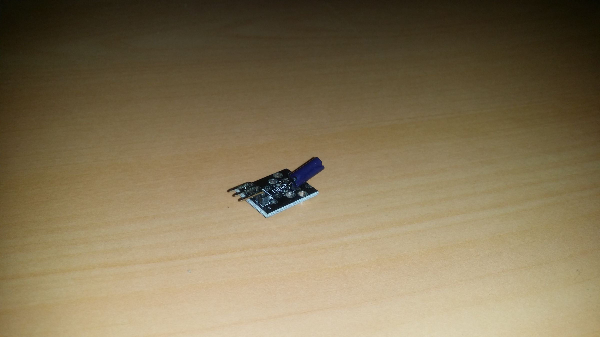
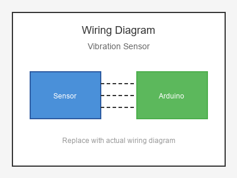

# KY-002 --- Shock / Vibration Sensor

## รายละเอียด

Vibration Sensor โมดูล SW-420 ใช้ตรวจจับการสั่นสะเทือนโดยใช้ Spring Switch ภายใน มีวงจรเปรียบเทียบในตัวเพื่อให้เอาต์พุตเป็นดิจิตอล Digital (High/Low)

## คุณสมบัติ

- แรงดันไฟฟ้า: 3.3V - 5V DC
- เอาต์พุต: Digital (DO) และ Analog (AO)
- มี LED แสดงสถานะ
- มีตัวปรับความไว (Potentiometer)

## ขาของโมดูล

| ขา (Module) | สีสาย | เชื่อมต่อกับ (Lotus Nano Bot) |
|-------------|-------|------------------------------|
| VCC         | แดง   | 5V                           |
| GND         | ดำ/น้ำตาล | GND                       |
| DO (Digital)| เหลือง | D3 หรือ A0 (D14)          |
| AO (Analog) | ขาว   | A0 (optional)              |

> **หมายเหตุ:** บน Lotus Nano Bot พอร์ต Digital ภายนอกมี D0, D1, D3 โดย D0/D1 ใช้กับ Bluetooth/Serial ส่วน D3 ใช้กับบัซเซอร์บนบอร์ด หากต้องการพอร์ต Digital เพิ่มสามารถใช้ A0-A3 เป็น Digital ได้ (A0=Pin14, A1=Pin15, A2=Pin16, A3=Pin17)

## การต่อสายไฟ

```
Vibration Sensor         Lotus Nano Bot
━━━━━━━━━━━━━━━━━━━━━━━━━━━━━━━━━━━━━━━━
VCC  ──────────────────► 5V
GND  ──────────────────► GND
DO   ──────────────────► D3 หรือ A0 (D14)
AO   ──────────────────► A0 (optional)
```

### ภาพการต่อสาย (Text Diagram)

```
        +------------------+
        |  Vibration       |
        |  Sensor (SW-420) |
        |                  |
   +----+----+   +----+----+   +----+----+   +----+----+
   |  VCC    |   |  GND    |   |  DO     |   |  AO     |
   |   (+)   |   |   (-)   |   | (Digi)  |   | (Anlg)  |
   +----+----+   +----+----+   +----+----+   +----+----+
        |             |             |             |
        |             |             |             |
   +----+----+   +----+----+   +----+----+   +----+----+
   |   5V    |   |  GND    |   |   D3    |   |   A0    |
   |         |   |         |   |         |   |         |
   |  Lotus  |   |  Nano   |   |  Bot    |   |         |
   +---------+   +---------+   +---------+   +---------+
```

## โค้ดตัวอย่าง

```cpp
// Vibration Sensor Example for Lotus Nano Bot
// DO -> D3

#define VIBRATION_PIN 3
#define LED_PIN 13  // หรือใช้บัซเซอร์ D3 (ต้องเปลี่ยนขา)

void setup() {
  Serial.begin(9600);
  pinMode(VIBRATION_PIN, INPUT);
  Serial.println("Vibration Sensor Test Started");
}

void loop() {
  int vibration = digitalRead(VIBRATION_PIN);
  
  if (vibration == HIGH) {  // ตรวจพบการสั่นสะเทือน
    Serial.println("📳 Vibration Detected!");
    delay(500);  // Debounce
  }
  
  delay(10);
}
```

## โค้ดตัวอย่าง Alarm กันขโมย

```cpp
#define VIBRATION_PIN 3

int vibrationCount = 0;
unsigned long lastVibrationTime = 0;

void setup() {
  Serial.begin(9600);
  pinMode(VIBRATION_PIN, INPUT);
}

void loop() {
  if (digitalRead(VIBRATION_PIN) == HIGH) {
    unsigned long currentTime = millis();
    
    if (currentTime - lastVibrationTime > 1000) {
      vibrationCount++;
      lastVibrationTime = currentTime;
      
      Serial.print("Vibration #");
      Serial.println(vibrationCount);
      
      if (vibrationCount >= 3) {
        Serial.println("🚨 ALARM! ALARM!");
        // ใช้ tone() ที่ D3 แต่ต้องระวังเพราะ D3 ต่อกับบัซเซอร์บนบอร์ด
        tone(3, 1000, 500);
        vibrationCount = 0;
      }
    }
  }
}
```

## หมายเหตุ

- หมุนตัวปรับค่าเพื่อกำหนดความไวในการตรวจจับ
- ควรใช้ Debounce ในโค้ดเพื่อป้องกันการอ่านค่าซ้ำ
- D3 บน Lotus Nano Bot เชื่อมต่อกับบัซเซอร์ในตัว หากต้องการใช้บัซเซอร์ควรใช้ `tone(3, frequency, duration)`
- สามารถใช้ A0-A3 เป็น Digital Input ได้หาก D3 ไม่พอ

## รูปภาพ





